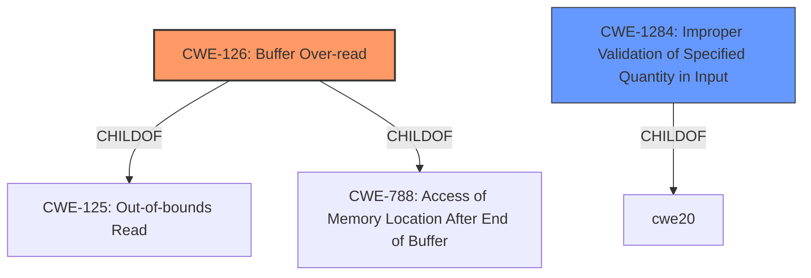

# Enhanced Analysis for CVE-2022-23547

# Summary
| CWE ID | CWE Name | Confidence | CWE Abstraction Level | CWE Vulnerability Mapping Label | CWE-Vulnerability Mapping Notes |
|---|---|---|---|---|---|
| CWE-126 | Buffer Over-read | 0.9 | Variant | Allowed | Primary CWE |
| CWE-1284 | Improper Validation of Specified Quantity in Input | 0.7 | Base | Allowed | Secondary Candidate |

## Evidence and Confidence

*   **Confidence Score:** 0.8
*   **Evidence Strength:** HIGH

## Relationship Analysis
The primary CWE identified is CWE-126 (**Buffer Over-read**). This is a variant of CWE-125 (**Out-of-bounds Read**) and CWE-788 (**Access of Memory Location After End of Buffer**). CWE-1284 (**Improper Validation of Specified Quantity in Input**) is included as a secondary candidate because the root cause involves a **missing length check** before copying the error reason string, suggesting that the specified quantity (length) in the input was not properly validated.



## Vulnerability Chain
The vulnerability chain starts with **improper validation of the input length** (CWE-1284), which leads to a **buffer over-read** (CWE-126). The impact is a potential denial of service (DoS) or remote code execution (RCE).

## Summary of Analysis
The primary weakness is a **buffer over-read** (CWE-126) in the STUN message parsing logic of PJSIP. The vulnerability description and the CVE reference links content summary both indicate a missing length check before copying data, leading to reading beyond the allocated buffer.

The evidence supporting the selection of CWE-126 includes:
- "Possible **buffer overread** when parsing a certain STUN message." (Vulnerability Description)
- "**Heap Buffer Overflow:** Specifically, the `decode_errcode_attr` function in `pjnath/src/pjnath/stun_msg.c` is vulnerable. The code does not properly validate the length of the error reason string against the available buffer, leading to a read beyond the allocated memory." (CVE Reference Links Content Summary)
- "**Missing Length Check:** The code fails to ensure that the attribute length is sufficient before attempting to copy the error reason string using `pj_strdup`." (CVE Reference Links Content Summary)

CWE-1284 (**Improper Validation of Specified Quantity in Input**) is considered as a secondary CWE because the root cause involves a **missing length check**. The code does not properly validate the length of the error reason string against the available buffer.

CWE-787 (**Out-of-bounds Write**) was not chosen because the vulnerability description and the CVE Reference Links Content Summary specifically mention a **buffer over-read**, not a write. While buffer over-reads can sometimes lead to writes, the provided information focuses on the read aspect of the vulnerability.

CWE-125 (**Out-of-bounds Read**) is a parent of CWE-126 (**Buffer Over-read**), but CWE-126 is more specific as it explicitly mentions "buffer".
The confidence level is high (0.8) because the evidence clearly points to a **buffer over-read** due to a **missing length check**. The selection of CWE-126 as the primary CWE is at the optimal level of specificity because it accurately reflects the vulnerability's characteristics.


## CWE Relationship Analysis

Current CWEs represent these abstraction levels: .


### Vulnerability Chain Analysis

**Chain starting from CWE-1284:**
- 1284 (Improper Validation of Specified Quantity in Input) - ROOT


**Chain starting from CWE-126:**
- 126 (Buffer Over-read) - ROOT


### CWE Relationship Diagram

```mermaid
graph TD
    classDef primary fill:#f96,stroke:#333,stroke-width:2px
    classDef secondary fill:#69f,stroke:#333
    classDef tertiary fill:#9e9,stroke:#333
```