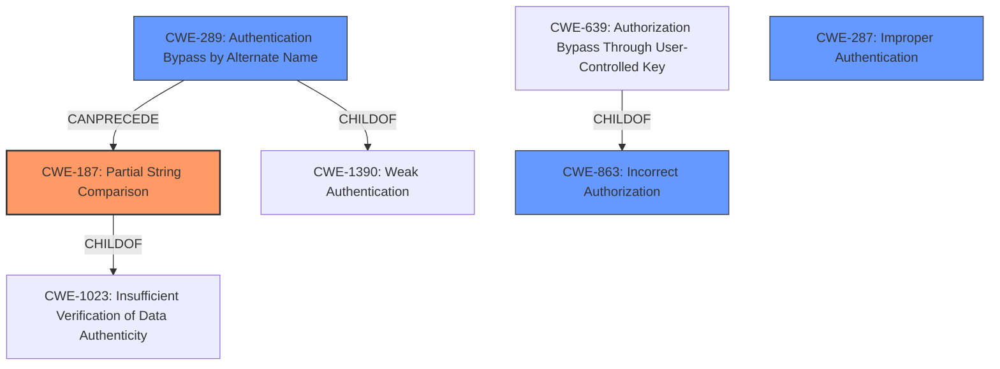

# Analysis for CVE-2022-23554

# Summary
| CWE ID | CWE Name | Confidence | CWE Abstraction Level | CWE Vulnerability Mapping Label | CWE-Vulnerability Mapping Notes |
|---|---|---|---|---|---|
| CWE-187 | Partial String Comparison | 0.9 | Variant | Allowed | Primary CWE |
| CWE-289 | Authentication Bypass by Alternate Name | 0.7 | Base | Allowed | Secondary Candidate |
| CWE-863 | Incorrect Authorization | 0.6 | Class | Allowed-with-Review | Secondary Candidate |
| CWE-287 | Improper Authentication | 0.4 | Class | Discouraged | Secondary Candidate |

## Evidence and Confidence

*   **Confidence Score:** 0.9
*   **Evidence Strength:** HIGH

## Relationship Analysis
The primary CWE is CWE-187, which is a variant of CWE-1023. CWE-289 is a base CWE and a child of CWE-1390. CWE-863 is a class CWE and parent to CWE-639. CWE-287 is a class CWE that is discouraged because more specific CWEs exist. The vulnerability uses a partial string comparison which leads to an authentication bypass. The most specific and accurate CWE is CWE-187.

## Vulnerability Chain
The vulnerability chain starts with the **reliance on request URI** for authentication, leading to a **partial string comparison** and finally results in **authentication filter bypass**.
  - The root cause is the flawed logic in the `AuthenticationFilter`.
  - The weakness is the `contains()` method that performs a partial comparison.
  - The impact is the ability to bypass authentication and access protected resources.

## Summary of Analysis
The analysis is based on the provided vulnerability description and CVE reference links. The **AuthenticationFilter relies on request URI** which does not properly validate the URI. The weakness arises from using `contains()` for authentication logic, allowing for bypass via a crafted URL.

The graph relationships helped prioritize CWE-187 due to its specific nature as a Variant and its direct relevance to the partial string comparison. The "Vulnerability Description Key Phrases" section highlights "**weakness: authentication filter bypass**" and "**rootcause: AuthenticationFilter relies on request URI**". The "CVE Reference Links Content Summary" states "The filter uses `request.getRequestUri().getPath().contains("/api/swagger")` to determine if a request is for the swagger endpoint, which should bypass authentication." Also in the content summary, "The use of `contains()` allows for a bypass by crafting a URL containing `/api/swagger` anywhere within the path. For example, `/api/foo;%2fapi%2fswagger` will match, despite not being the swagger endpoint."

CWE-187 is at the optimal level of specificity because it directly addresses the **partial string comparison** issue.

**CWE Considerations:**

*   **CWE-187 Partial String Comparison:** This is the primary CWE because the vulnerability stems directly from the use of `contains()` which performs a partial string comparison. The crafted URL `/api/foo%2fapi%2fswagger` bypasses the authentication filter because it contains `/api/swagger` anywhere in the string. This aligns perfectly with the CWE description: "The product performs a comparison that only examines a portion of a factor before determining whether there is a match...leading to resultant weaknesses."

*   **CWE-289 Authentication Bypass by Alternate Name:** This is a secondary CWE. The crafted URL can be considered an alternate name for the swagger endpoint, allowing bypass of authentication. However, the root cause is more accurately described by CWE-187.

*   **CWE-863 Incorrect Authorization:** This CWE is considered because the product does not correctly perform the authorization check. However, it is a more general description of the vulnerability, and a lower-level CWE is more appropriate.

*   **CWE-287 Improper Authentication:** This CWE is a discouraged CWE. There are more specific CWEs available such as CWE-1390 and CWE-306.

Other CWEs considered but not used:

*   CWE-303, CWE-1390, CWE-807, CWE-302, CWE-288, CWE-1391, CWE-1289, CWE-639, CWE-294, CWE-178, CWE-611, CWE-202, CWE-209, CWE-201, CWE-73, CWE-433, CWE-52, CWE-46, CWE-180, CWE-918, CWE-306 because while they might be related, they do not accurately describe the root cause of the vulnerability.