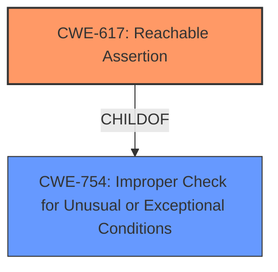

# Enhanced Analysis for CVE-2022-23572

# Summary
| CWE ID    | CWE Name                                          | Confidence | CWE Abstraction Level | CWE Vulnerability Mapping Label | CWE-Vulnerability Mapping Notes |
| --------- | ------------------------------------------------- | ---------- | ----------------------- | ------------------------------- | ------------------------------- |
| CWE-617   | Reachable Assertion                               | 0.9        | Base                    | Primary                         | Allowed                         |
| CWE-754   | Improper Check for Unusual or Exceptional Conditions | 0.7 | Class                    | Secondary                       | Allowed-with-Review                         |

## Evidence and Confidence

*   **Confidence Score:** 0.8
*   **Evidence Strength:** HIGH

## Relationship Analysis
The primary relationship that influenced the choice of CWE-617 was its direct applicability to the observed behavior: an assertion failure leading to a crash. CWE-754 was considered as a broader class related to error handling but was deemed less specific than CWE-617.



## Vulnerability Chain
The vulnerability chain involves a **type mismatch during shape inference**, leading to an assertion failure and subsequent crash.

## Summary of Analysis
The initial analysis focused on identifying the root cause and the immediate impact. The "CVE Reference Links Content Summary" section clearly indicates that the vulnerability stems from a failure to properly handle error conditions during type specialization, resulting in an assertion failure and crash. The evidence directly supports the selection of CWE-617, Reachable Assertion, as the primary CWE. The confidence level is high because the vulnerability description explicitly mentions the assertion failure and its impact.

The selection of CWE-617 is justified by the following evidence from the vulnerability description and CVE Reference Links Content Summary:

*   "In the first case execution proceeds to the `ValueOrDie` line. This results in an assertion failure as `ret` contains an error `Status`, not a value."
*   "In the second case we also get a crash due to the assertion failure."
*   "Weaknesses/Vulnerabilities: Incorrect Error Handling: The code used a `DCHECK` to verify the status of the `SpecializeType()` result. `DCHECK` is a no-op in production builds. Thus, even when an error `Status` was returned, the program would continue and attempt to extract the value using `ValueOrDie()`."
*   "Assertion Failure: In debug builds, the `DCHECK` would trigger an assertion failure, leading to a crash."
*   "Crash in Production: In production builds, `ValueOrDie()` on an error `Status` would also trigger a crash."

The choice of CWE-617 is at the optimal level of specificity, as it directly represents the vulnerability's core weakness: a reachable assertion that leads to a denial-of-service condition.

Relevant CWE Information:

# Enhanced Context (25 CWEs)

## CWE-617: Reachable Assertion
**Abstraction Level**: Base
**Similarity Score**: 0.76
**Source**: dense

**Description**:
The product contains an assert() or similar statement that can be triggered by an attacker, which leads to an application exit or other behavior that is more severe than necessary.

**Mapping Guidance**:
- Usage: Allowed
- Rationale: This CWE entry is at the Base level of abstraction, which is a preferred level of abstraction for mapping to the root causes of vulnerabilities.

## CWE-754: Improper Check for Unusual or Exceptional Conditions
**Abstraction Level**: Class
**Similarity Score**: 0.75
**Source**: dense

**Description**:
The product does not check or incorrectly checks for unusual or exceptional conditions that are not expected to occur frequently during day to day operation of the product.

**Mapping Guidance**:
- Usage: Allowed-with-Review
- Rationale: This CWE entry is a Class and might have Base-level children that would be more appropriate
**Comments:** Examine children of this entry to see if there is a better fit
**Reasons:**
- Abstraction

CWE-824, CWE-1284, CWE-681, CWE-122, CWE-1287, CWE-787, CWE-663, CWE-193, and CWE-674 were considered but not selected because they did not directly address the specific vulnerability of a reachable assertion leading to a crash. They represent different types of weaknesses, such as memory corruption, input validation issues, or concurrency problems, which are not the primary cause of this vulnerability.


## CWE Relationship Analysis

Current CWEs represent these abstraction levels: .


### Vulnerability Chain Analysis

**Chain starting from CWE-663:**
- 663 (Use of a Non-reentrant Function in a Concurrent Context) - ROOT


**Chain starting from CWE-617:**
- 617 (Reachable Assertion) - ROOT


### CWE Relationship Diagram

```mermaid
graph TD
    classDef primary fill:#f96,stroke:#333,stroke-width:2px
    classDef secondary fill:#69f,stroke:#333
    classDef tertiary fill:#9e9,stroke:#333
```