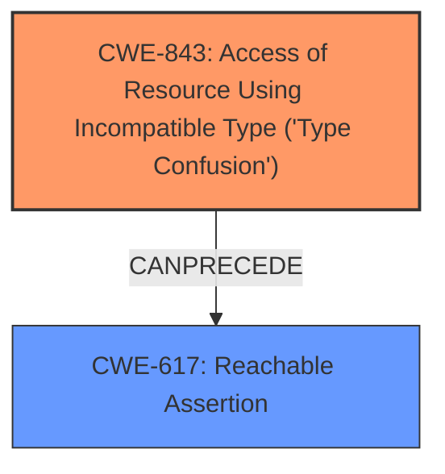

# Enhanced Analysis for CVE-2022-23583

# Summary
| CWE ID | CWE Name | Confidence | CWE Abstraction Level | CWE Vulnerability Mapping Label | CWE-Vulnerability Mapping Notes |
|---|---|---|---|---|---|
| CWE-843 | Access of Resource Using Incompatible Type ('Type Confusion') | 1.0 | Base | Allowed | Primary CWE |
| CWE-617 | Reachable Assertion | 0.7 | Base | Allowed | Secondary Candidate |

## Evidence and Confidence

*   **Confidence Score:** 0.9
*   **Evidence Strength:** HIGH

## Relationship Analysis
The primary CWE is CWE-843, which directly addresses the **type confusion** issue. CWE-617 is a secondary consideration because the **type confusion** leads to a `CHECK` failure, which is a form of assertion and results in a denial of service. The relationship between CWE-843 and CWE-617 is that the former can lead to the latter.



## Vulnerability Chain
The vulnerability chain starts with a **type confusion** (CWE-843), which then leads to a `CHECK` failure (assertion) and ultimately results in a denial of service (DoS).

## Summary of Analysis
The initial analysis correctly identified **type confusion** as the root cause. The final decision is based on the evidence provided in the vulnerability description, which clearly states that the vulnerability is caused by a **type confusion** where the `dtype` of tensor arguments does not match the expected `dtype` of an operation.

The vulnerability description states:
"This occurs when the protobuf part corresponding to the tensor arguments is modified such that the `dtype` no longer matches the `dtype` expected by the op. In that case, calling the templated binary operator for the binary op would receive corrupted data, due to the **type confusion** involved."

The CVE Reference Links Content Summary also confirms this:
"The vulnerability is caused by a **type confusion** in binary operations within TensorFlow. When the data type (`dtype`) of tensor arguments in a SavedModel is modified to not match the expected `dtype` of an operation, it leads to the `flat<*>` method interpreting the data incorrectly. This can result in a `CHECK` failure and a denial-of-service (DoS)."

CWE-843 is the most appropriate because it specifically addresses the **access of a resource using an incompatible type**, which accurately describes the vulnerability. The `CHECK` failure (assertion) leading to a denial of service (DoS) makes CWE-617 a secondary consideration but is not the direct root cause.

The selected CWEs are at the optimal level of specificity. CWE-843 is a Base level CWE, which is preferred, and directly reflects the **type confusion** issue.

Relevant CWE Information:

# Enhanced Context (25 CWEs)

## CWE-681: Incorrect Conversion between Numeric Types
**Abstraction Level**: Base
**Similarity Score**: 0.80
**Source**: dense

**Description**:
When converting from one data type to another, such as long to integer, data can be omitted or translated in a way that produces unexpected values. If the resulting values are used in a sensitive context, then dangerous behaviors may occur.

**Mapping Guidance**:
- Usage: Allowed
- Rationale: This CWE entry is at the Base level of abstraction, which is a preferred level of abstraction for mapping to the root causes of vulnerabilities.

*Not Selected:* This CWE is not selected because the issue is not necessarily an incorrect conversion between numeric types, but a more general **type confusion** where the expected type of data does not match the actual type.

## CWE-843: Access of Resource Using Incompatible Type ('Type Confusion')
**Abstraction Level**: Base
**Similarity Score**: 0.77
**Source**: dense

**Description**:
The product allocates or initializes a resource such as a pointer, object, or variable using one type, but it later accesses that resource using a type that is incompatible with the original type.

**Mapping Guidance**:
- Usage: Allowed
- Rationale: This CWE entry is at the Base level of abstraction, which is a preferred level of abstraction for mapping to the root causes of vulnerabilities.

*Selected:* This CWE is selected as the primary CWE because it directly describes the vulnerability: accessing a resource (tensor arguments) using an incompatible type (`dtype`).

## CWE-191: Integer Underflow (Wrap or Wraparound)
**Abstraction Level**: Base
**Similarity Score**: 0.77
**Source**: dense

**Description**:
The product subtracts one value from another, such that the result is less than the minimum allowable integer value, which produces a value that is not equal to the correct result.

**Mapping Guidance**:
- Usage: Allowed
- Rationale: This CWE entry is at the Base level of abstraction, which is a preferred level of abstraction for mapping to the root causes of vulnerabilities.

*Not Selected:* This CWE is not selected because the vulnerability is not related to integer underflow.

## CWE-131: Incorrect Calculation of Buffer Size
**Abstraction Level**: Base
**Similarity Score**: 0.77
**Source**: dense

**Description**:
The product does not correctly calculate the size to be used when allocating a buffer, which could lead to a buffer overflow.

**Mapping Guidance**:
- Usage: Allowed
- Rationale: This CWE entry is at the Base level of abstraction, which is a preferred level of abstraction for mapping to the root causes of vulnerabilities.

*Not Selected:* This CWE is not selected because the vulnerability is not related to incorrect calculation of buffer size.

## CWE-824: Access of Uninitialized Pointer
**Abstraction Level**: Base
**Similarity Score**: 0.76
**Source**: dense

**Description**:
The product accesses or uses a pointer that has not been initialized.

**Mapping Guidance**:
- Usage: Allowed
- Rationale: This CWE entry is at the Base level of abstraction, which is a preferred level of abstraction for mapping to the root causes of vulnerabilities.

*Not Selected:* This CWE is not selected because the vulnerability is not related to accessing an uninitialized pointer.

## CWE-197: Numeric Truncation Error
**Abstraction Level**: Base
**Similarity Score**: 0.76
**Source**: dense

**Description**:
Truncation errors occur when a primitive is cast to a primitive of a smaller size and data is lost in the conversion.

**Mapping Guidance**:
- Usage: Allowed
- Rationale: This CWE entry is at the Base level of abstraction, which is a preferred level of abstraction for mapping to the root causes of vulnerabilities.

*Not Selected:* This CWE is not selected because the vulnerability is not related to numeric truncation error.

## CWE-125: Out-of-bounds Read
**Abstraction Level**: Base
**Similarity Score**: 0.76
**Source**: dense

**Description**:
The product reads data past the end, or before the beginning, of the intended buffer.

**Mapping Guidance**:
- Usage: Allowed
- Rationale: This CWE entry is at the Base level of abstraction, which is a preferred level of abstraction for mapping to the root causes of vulnerabilities.

*Not Selected:* This CWE is not selected because the vulnerability is not directly related to an out-of-bounds read, although a **type confusion** could potentially lead to this.

## CWE-129: Improper Validation of Array Index
**Abstraction Level**: Variant
**Similarity Score**: 0.75
**Source**: dense

**Description**:
The product uses untrusted input when calculating or using an array index, but the product does not validate or incorrectly validates the index to ensure the index references a valid position within the array.

**Mapping Guidance**:
- Usage: Allowed
- Rationale: This CWE entry is at the Variant level of abstraction, which is a preferred level of abstraction for mapping to the root causes of vulnerabilities.

*Not Selected:* This CWE is not selected because the vulnerability is not directly related to improper validation of an array index.

## CWE-1289: Improper Validation of Unsafe Equivalence in Input
**Abstraction Level**: Base
**Similarity Score**: 0.75
**Source**: dense

**Description**:
The product receives an input value that is used as a resource identifier or other type of reference, but it does not validate or incorrectly validates that the input is equivalent to a potentially-unsafe value.

**Mapping Guidance**:
- Usage: Allowed
- Rationale: This CWE entry is at the Base level of abstraction, which is a preferred level of abstraction for mapping to the root causes of vulnerabilities.

*Not Selected:* This CWE is not selected because the vulnerability is not related to improper validation of unsafe equivalence in input.

## CWE-682: Incorrect Calculation
**Abstraction Level**: Pillar
**Similarity Score**: 0.75
**Source**: dense

**Description**:
The product performs a calculation that generates incorrect or unintended


## CWE Relationship Analysis

Current CWEs represent these abstraction levels: .


### Vulnerability Chain Analysis

**Chain starting from CWE-131:**
- 131 (Incorrect Calculation of Buffer Size) - ROOT


**Chain starting from CWE-617:**
- 617 (Reachable Assertion) - ROOT


### CWE Relationship Diagram

```mermaid
graph TD
    classDef primary fill:#f96,stroke:#333,stroke-width:2px
    classDef secondary fill:#69f,stroke:#333
    classDef tertiary fill:#9e9,stroke:#333
```