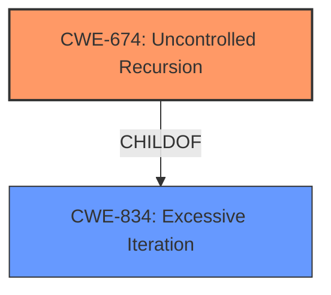

# Analysis Report for CVE-2022-23591

# Vulnerability Analysis Report: CVE-2022-23591

## Description


## Analysis (with Relationship Data)

# Summary
| CWE ID | CWE Name | Confidence | CWE Abstraction Level | CWE Vulnerability Mapping Label | CWE-Vulnerability Mapping Notes |
|---|---|---|---|---|---|
| CWE-674 | Uncontrolled Recursion | 0.8 | Class | Allowed-with-Review | Primary CWE: The vulnerability results in a stack overflow due to self-recursive functions, aligning with the concept of uncontrolled recursion.|
| CWE-834 | Excessive Iteration | 0.6 | Class | Allowed-with-Review | Secondary CWE: Uncontrolled recursion is a more specific type of excessive iteration. |

## Evidence and Confidence

*   **Confidence Score:** 0.8
*   **Evidence Strength:** MEDIUM

## Relationship Analysis
The primary CWE is CWE-674 (Uncontrolled Recursion), a Class-level CWE. While a more specific Base or Variant CWE would be ideal, none of the children of CWE-674 fit as well. CWE-674 is a child of CWE-834 (Excessive Iteration). This relationship highlights that uncontrolled recursion is a specific type of excessive iteration, where the iteration is caused by recursive function calls.



## Vulnerability Chain
The vulnerability chain involves the following steps:
1.  A malformed `GraphDef` containing a self-recursive function is crafted.
2.  Tensorflow runtime loads the `GraphDef` without proper validation.
3.  During execution, resolving each `NodeDef` leads to resolving the function itself, causing uncontrolled recursion.
4.  The uncontrolled recursion consumes excessive stack resources.
5.  The excessive stack consumption results in a **stack overflow**, leading to a denial-of-service condition.

Here, the lack of validation allows the self-recursive function to be loaded, which directly leads to uncontrolled recursion and the stack overflow.

## Summary of Analysis
The initial analysis focused on identifying the root cause of the **stack overflow**. The vulnerability description and CVE summary clearly indicate that the **stack overflow** is caused by the lack of validation for self-recursive functions within the `GraphDef` format. The runtime's incorrect assumption that `GraphDef` will not contain self-recursive functions leads to uncontrolled recursion during the resolution of nodes.

The Retriever Results suggested CWE-121 (Stack-based Buffer Overflow), CWE-190 (Integer Overflow or Wraparound), and CWE-674 (Uncontrolled Recursion) as potential candidates.

*   CWE-121 (Stack-based Buffer Overflow) was considered, but it wasn't the most accurate fit. Although a **stack overflow** occurs, it's not directly caused by writing data past the end of a buffer. Instead, it's caused by the exhaustion of stack space due to uncontrolled recursion.
*   CWE-190 (Integer Overflow or Wraparound) was also considered but deemed less relevant. There's no evidence of integer overflow being involved in this vulnerability.
*   CWE-674 (Uncontrolled Recursion) was determined to be the most appropriate primary CWE. The description of CWE-674 precisely matches the vulnerability scenario: "The product does not properly control the amount of recursion that takes place, consuming excessive resources, such as allocated memory or the program stack."
    The fix, involving a `ValidateFunctionNotRecursive` function, reinforces this mapping.

CWE-674 is a Class-level CWE, so a more specific Base or Variant CWE would be preferred. However, none of the children of CWE-674 fit as well. CWE-674 is a child of CWE-834 (Excessive Iteration). This relationship highlights that uncontrolled recursion is a specific type of excessive iteration, where the iteration is caused by recursive function calls.

I am basing my assessment primarily on the provided evidence, specifically:

*   "The `GraphDef` format in TensorFlow does not allow self recursive functions. The runtime assumes that this invariant is satisfied. However, a `GraphDef` containing a fragment such as the following can be consumed when loading a `SavedModel`. This would result in a **stack overflow** during execution as resolving each `NodeDef` means resolving the function itself and its nodes."
*   "Absence of checks for self-recursive function definitions within `GraphDef`."

These excerpts, combined with the fix involving `ValidateFunctionNotRecursive`, strongly support the selection of CWE-674 as the primary CWE.


## CWE Relationship Analysis

Current CWEs represent these abstraction levels: .


### Vulnerability Chain Analysis

**Chain starting from CWE-190:**
- 190 (Integer Overflow or Wraparound) - ROOT


**Chain starting from CWE-674:**
- 674 (Uncontrolled Recursion) - ROOT


### CWE Relationship Diagram

```mermaid
graph TD
    classDef primary fill:#f96,stroke:#333,stroke-width:2px
    classDef secondary fill:#69f,stroke:#333
    classDef tertiary fill:#9e9,stroke:#333
```


*Report generated on 2025-03-31 03:15:56*
