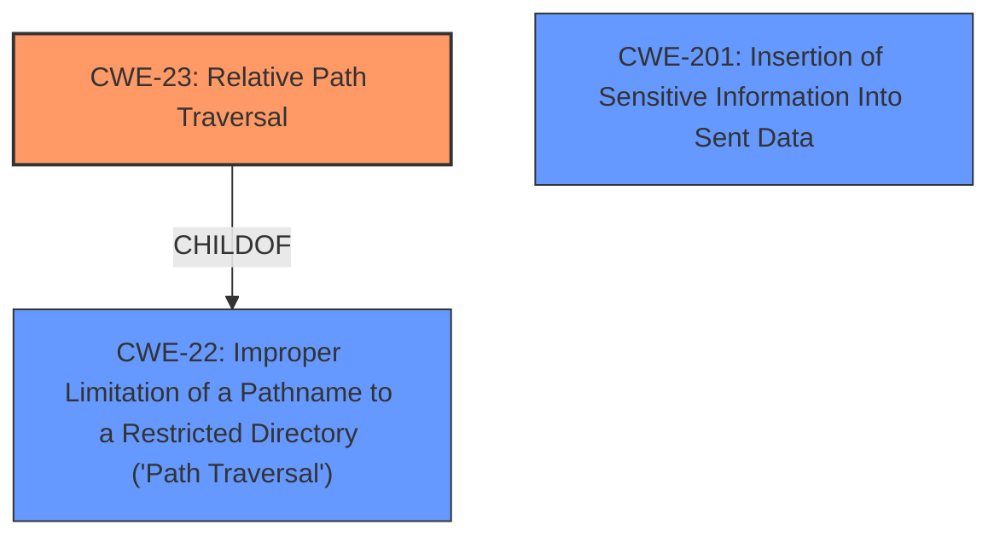

# Analysis Report for CVE-2022-23602

# Vulnerability Analysis Report: CVE-2022-23602

## Description


## Analysis (with Relationship Data)

# Summary
| CWE ID | CWE Name | Confidence | CWE Abstraction Level | CWE Vulnerability Mapping Label | CWE-Vulnerability Mapping Notes |
|---|---|---|---|---|---|
| CWE-23 | Relative Path Traversal | 0.9 | Base | Allowed | Primary CWE |
| CWE-201 | Insertion of Sensitive Information Into Sent Data | 0.7 | Base | Allowed | Secondary Candidate |

## Evidence and Confidence

*   **Confidence Score:** 0.8
*   **Evidence Strength:** HIGH

## Relationship Analysis
The primary CWE selected is CWE-23 (Relative Path Traversal), which is a Base level CWE. CWE-23 is related to CWE-22 (Improper Limitation of a Pathname to a Restricted Directory), as it is a child of CWE-22. This relationship indicates that CWE-23 is a more specific type of path traversal vulnerability. CWE-201 (Insertion of Sensitive Information Into Sent Data) is also considered due to the impact of the vulnerability, potentially leading to sensitive information disclosure.



## Vulnerability Chain
The vulnerability chain starts with the **improper access control** in the Nimforum application. An attacker can create a post with an include referencing a local file. The application then renders the file, leading to potential information disclosure.

Root Cause: **Improper access control** allowing inclusion of local files.
Weakness: Relative Path Traversal (CWE-23) allowing access to files outside the intended directory.
Impact: Insertion of Sensitive Information Into Sent Data (CWE-201) potentially leading to the exposure of sensitive information such as forum.json secrets.

## Summary of Analysis
The initial analysis focused on the **weakness** which is an **improper access control**, where any forum user can create a new thread/post with an include referencing a file local to the host operating system. The system will render the file if able. The key phrases and CVE reference summary all indicate this leads to an LFI, or Local File Inclusion vulnerability.

The Retriever Results pointed to several CWEs, but CWE-23 (Relative Path Traversal) stood out due to its direct relevance to the vulnerability description. The vulnerability allows an attacker to include local files, which directly aligns with the description of CWE-23. The vulnerability description mentions that any forum user can create a post referencing a local file. The rst parser does not properly sandbox include and code directives.

The relationship analysis reinforces this choice, as CWE-23 is a child of CWE-22, indicating a more specific type of path traversal. The ability to access files local to the host operating system makes it a relative path traversal.

CWE-201 (Insertion of Sensitive Information Into Sent Data) was also considered, as the impact of the vulnerability could be the exposure of sensitive information. However, CWE-23 is the more direct cause of the vulnerability.

The final decision is based on the provided evidence and the relationships between CWEs, selecting CWE-23 as the primary CWE due to its direct alignment with the vulnerability description and its position in the CWE hierarchy. The confidence level is high due to the clear evidence and direct match.

Relevant CWE Information:

# Enhanced Context (25 CWEs)
The following CWEs were identified as potentially relevant to this vulnerability:

## CWE-639: Authorization Bypass Through User-Controlled Key
**Abstraction Level**: Base
**Similarity Score**: 0.79
**Source**: dense

**Description**:
The system's authorization functionality does not prevent one user from gaining access to another user's data or record by modifying the key value identifying the data.

**Mapping Guidance**:
- Usage: Allowed
- Rationale: This CWE entry is at the Base level of abstraction, which is a preferred level of abstraction for mapping to the root causes of vulnerabilities.
**Why it was not selected:** The vulnerability is not about modifying a key to access another user's data, but rather about including arbitrary local files due to **improper access control**.

## CWE-23: Relative Path Traversal
**Abstraction Level**: Base
**Similarity Score**: 0.78
**Source**: dense

**Description**:
The product uses external input to construct a pathname that should be within a restricted directory, but it does not properly neutralize sequences such as ".." that can resolve to a location that is outside of that directory.

**Mapping Guidance**:
- Usage: Allowed
- Rationale: This CWE entry is at the Base level of abstraction, which is a preferred level of abstraction for mapping to the root causes of vulnerabilities.
**Why it was selected:** The vulnerability involves including local files, which aligns with the description of CWE-23.

## CWE-212: Improper Removal of Sensitive Information Before Storage or Transfer
**Abstraction Level**: Base
**Similarity Score**: 0.78
**Source**: dense

**Description**:
The product stores, transfers, or shares a resource that contains sensitive information, but it does not properly remove that information before the product makes the resource available to unauthorized actors.

**Mapping Guidance**:
- Usage: Allowed
- Rationale: This CWE entry is at the Base level of abstraction, which is a preferred level of abstraction for mapping to the root causes of vulnerabilities.
**Why it was not selected:** This CWE is related to removing sensitive information before sharing, not directly related to file inclusion.

## CWE-74: Improper Neutralization of Special Elements in Output Used by a Downstream Component ('Injection')
**Abstraction Level**: Class
**Similarity Score**: 0.78
**Source**: dense

**Description**:
The product constructs all or part of a command, data structure, or record using externally-influenced input from an upstream component, but it does not neutralize or incorrectly neutralizes special elements that could modify how it is parsed or interpreted when it is sent to a downstream component.

**Mapping Guidance**:
- Usage: Discouraged
- Rationale: CWE-74 is high-level and often misused when lower-level weaknesses are more appropriate.
**Why it was not selected:** CWE-74 is too generic and a lower-level weakness such as CWE-23 is more appropriate.

## CWE-538: Insertion of Sensitive Information into Externally-Accessible File or Directory
**Abstraction Level**: Base
**Similarity Score**: 0.78
**Source**: dense

**Description**:
The product places sensitive information into files or directories that are accessible to actors who are allowed to have access to the files, but not to the sensitive information.

**Mapping Guidance**:
- Usage: Allowed
- Rationale: This CWE entry is at the Base level of abstraction, which is a preferred level of abstraction for mapping to the root causes of vulnerabilities.
**Why it was not selected:** While sensitive information can be disclosed, the primary issue is the ability to include local files, making CWE-23 a better fit.

## CWE-668: Exposure of Resource to Wrong Sphere
**Abstraction Level**: Class
**Similarity Score**: 0.78
**Source**: dense

**Description**:
The product exposes a resource to the wrong control sphere, providing unintended actors with inappropriate access to the resource.

**Mapping Guidance**:
- Usage: Discouraged
- Rationale: CWE-668 is high-level and is often misused as a catch-all when lower-level CWE IDs might be applicable. It is sometimes used for low-information vulnerability reports [REF-1287]. It is a level-1 Class (i.e., a child of a Pillar). It is not useful for trend analysis.
**Why it was not selected:** This CWE is too broad and a more specific CWE is available.

## CWE-807: Reliance on Untrusted Inputs in a Security Decision
**Abstraction Level**: Base
**Similarity Score**: 0.78
**Source**: dense

**Description**:
The product uses a protection mechanism that relies on the existence or values of an input, but the input can be modified by an untrusted actor in a way that bypasses the protection mechanism.

**Mapping Guidance**:
- Usage: Allowed
- Rationale: This CWE entry is at the Base level of abstraction, which is a preferred level of abstraction for mapping to the root causes of vulnerabilities.
**Why it was not selected:** The vulnerability is not about relying on untrusted inputs in a security decision, but rather about the **improper access control** that allows including local files.

## CWE-1390: Weak Authentication
**Abstraction Level**: Class
**Similarity Score**: 0.77
**Source**: dense

**Description**:
The product uses an authentication mechanism to restrict access to specific users or identities, but the mechanism does not sufficiently prove that the claimed identity is correct.

**Mapping Guidance**:
- Usage: Allowed-with-Review
- R


## CWE Relationship Analysis

Current CWEs represent these abstraction levels: .


### Vulnerability Chain Analysis

**Chain starting from CWE-201:**
- 201 (Insertion of Sensitive Information Into Sent Data) - ROOT


**Chain starting from CWE-538:**
- 538 (Insertion of Sensitive Information into Externally-Accessible File or Directory) - ROOT


### CWE Relationship Diagram

```mermaid
graph TD
    classDef primary fill:#f96,stroke:#333,stroke-width:2px
    classDef secondary fill:#69f,stroke:#333
    classDef tertiary fill:#9e9,stroke:#333
```


*Report generated on 2025-03-31 13:13:58*
