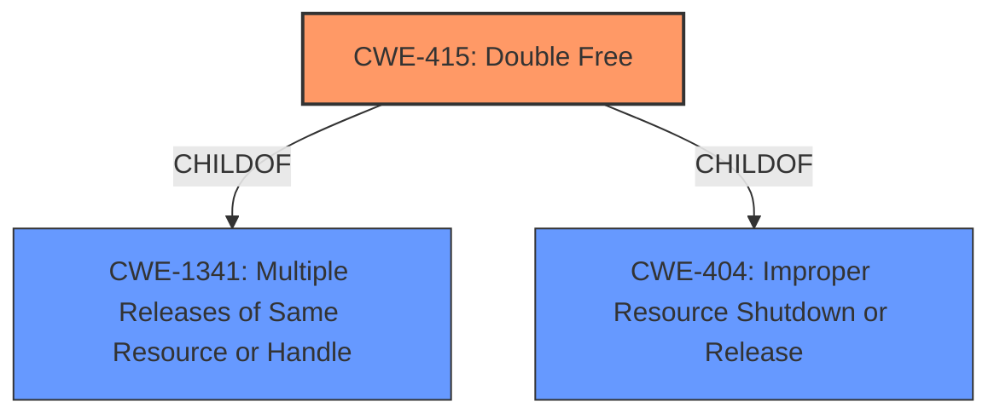

# Analysis for CVE-2022-23608

# Summary
| CWE ID | CWE Name | Confidence | CWE Abstraction Level | CWE Vulnerability Mapping Label | CWE-Vulnerability Mapping Notes |
|---|---|---|---|---|---|
| CWE-415 | Double Free | 0.9 | Variant | Allowed | Primary CWE |
| CWE-1341 | Multiple Releases of Same Resource or Handle | 0.7 | Base | Allowed | Secondary Candidate |
| CWE-404 | Improper Resource Shutdown or Release | 0.6 | Class | Allowed-with-Review | Secondary Candidate |

## Evidence and Confidence

*   **Confidence Score:** 0.9
*   **Evidence Strength:** HIGH

## Relationship Analysis
The primary CWE is CWE-415 Double Free, which is a variant of CWE-1341 Multiple Releases of Same Resource or Handle and CWE-404 Improper Resource Shutdown or Release. The vulnerability involves premature freeing of a shared hash key, leading to potential double frees and undefined behavior. The relationships highlight that the double free is a specific instance of releasing a resource multiple times, and premature release is a type of improper shutdown.

## Vulnerability Chain
The vulnerability chain starts with a **premature free** of a **shared hash key**, which leads to the possibility of a **double free**. This can result in undefined behavior, such as dialog list collision and eventually an endless loop.

## Summary of Analysis
The initial assessment identified the **premature free** of the **hash key** as the root cause. The Retriever results suggested several memory management-related CWEs, but the description points strongly towards **CWE-415 Double Free**. The analysis of the vulnerability description, CVE reference, and retriever results indicates that **CWE-415 Double Free** is the most appropriate primary CWE. The evidence specifically mentions that the **hash key can potentially be prematurely freed**. This can lead to the same memory being freed twice. CWE-415 is a Variant level CWE which is preferred, and its description accurately describes the vulnerability. CWE-1341 and CWE-404 are parent classes to CWE-415, so could also be considered but are less specific.

Relevant CWE Information:

# Enhanced Context (25 CWEs)

## CWE-415: Double Free
**Abstraction Level**: Variant
**Similarity Score**: 0.77
**Source**: dense

**Description**:
The product calls free() twice on the same memory address, potentially leading to modification of unexpected memory locations.

**Mapping Guidance**:
- Usage: Allowed
- Rationale: This CWE entry is at the Variant level of abstraction, which is a preferred level of abstraction for mapping to the root causes of vulnerabilities.

## CWE-1341: Multiple Releases of Same Resource or Handle
**Abstraction Level**: base
**Similarity Score**: 4.33
**Source**: graph

**Description**:
CWE-1341: Multiple Releases of Same Resource or Handle

**Mapping Guidance**:
- Usage: Allowed
- Rationale: This CWE entry is at the Base level of abstraction, which is a preferred level of abstraction for mapping to the root causes of vulnerabilities.

## CWE-404: Improper Resource Shutdown or Release
**Abstraction Level**: Class
**Similarity Score**: 0.76
**Source**: dense

**Description**:
The product does not release or incorrectly releases a resource before it is made available for re-use.

**Mapping Guidance**:
- Usage: Allowed-with-Review
- Rationale: This CWE entry is a Class and might have Base-level children that would be more appropriate

### CWE-415: Double Free
*   **Technical Explanation:** The vulnerability description and the CVE reference both state that the **hash key can potentially be prematurely freed** when one of the dialogs is destroyed. This can lead to the same memory being freed twice.
*   **Security Implications:** Double free vulnerabilities can lead to memory corruption, crashes, and potentially arbitrary code execution.
*   **Relationships:** **CWE-415 Double Free** is a variant of **CWE-1341 Multiple Releases of Same Resource or Handle** and **CWE-404 Improper Resource Shutdown or Release**.
*   **Primary/Secondary:** Primary
*   **Mapping Guidance:** The usage is ALLOWED, and the rationale states that the Variant level of abstraction is preferred.
*   **Evidence:**
    *   Vulnerability Description Key Phrases: "**rootcause:** **hash key shared by multiple UAC dialogs can potentially be prematurely freed**"
    *   CVE Reference Links Content Summary: "The vulnerability stems from a use-after-free condition in PJSIP when handling dialog sets in forking scenarios. Specifically, a hash key associated with a dialog set, shared by multiple User Agent Client (UAC) dialogs, can be prematurely freed when one of those dialogs is destroyed."

### CWE-1341: Multiple Releases of Same Resource or Handle
*   **Technical Explanation:** The vulnerability involves releasing the **hash key** multiple times, which falls under the category of **CWE-1341**.
*   **Security Implications:** This can lead to memory corruption, crashes, and potentially other undefined behaviors.
*   **Relationships:** **CWE-1341** is a parent of **CWE-415**, providing a broader classification for the vulnerability.
*   **Primary/Secondary:** Secondary
*   **Mapping Guidance:** The usage is ALLOWED, and the rationale states that the Base level of abstraction is preferred. However, **CWE-415** is more specific.

### CWE-404: Improper Resource Shutdown or Release
*   **Technical Explanation:** The **premature free** of the **hash key** can be seen as an improper release of a resource, making **CWE-404** a relevant consideration.
*   **Security Implications:** This can lead to memory corruption, crashes, and potentially other undefined behaviors.
*   **Relationships:** **CWE-404** is a parent of **CWE-401**, and it provides a general classification for resource release issues.
*   **Primary/Secondary:** Secondary
*   **Mapping Guidance:** The usage is ALLOWED-WITH-REVIEW, as it's a Class level CWE.

### Considered but not used:
*   CWE-667, CWE-754, CWE-407, CWE-126, CWE-1284, CWE-401, CWE-789, CWE-190, CWE-362 - These were considered but did not directly match the root cause of the vulnerability which is **premature free** of the **hash key** that can cause a **double free**. They are related to locking, checks, algorithmic complexity, buffer over-read, validation, missing release of memory, memory allocation, integer overflow, and race conditions, respectively, but do not accurately capture the specific weakness.

### Final Conclusion:
The final assessment concludes that **CWE-415 Double Free** is the most appropriate primary CWE for this vulnerability. It is at the preferred Variant level of abstraction and accurately reflects the specific weakness of prematurely freeing a **shared hash key**, leading to the potential for a **double free**. The decision is based on the vulnerability description, CVE reference, retriever results, and relationship analysis.