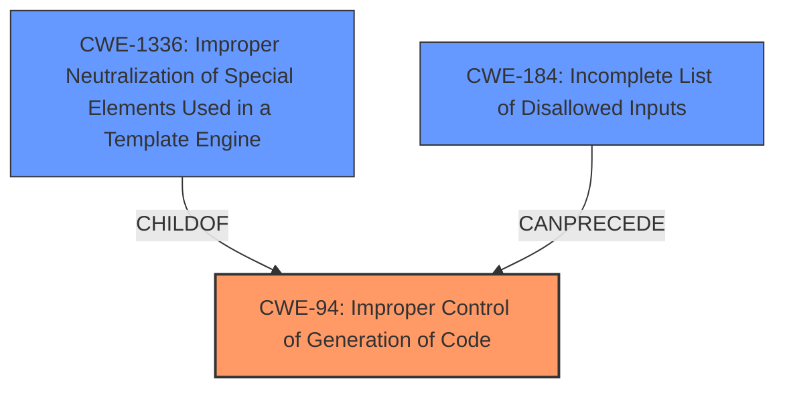

# Analysis for CVE-2022-23614

# Summary
| CWE ID | CWE Name | Confidence | CWE Abstraction Level | CWE Vulnerability Mapping Label | CWE-Vulnerability Mapping Notes |
|---|---|---|---|---|---|
| CWE-94 | Improper Control of Generation of Code ('Code Injection') | 0.9 | Base | Allowed-with-Review | Primary CWE. The product constructs a code segment using externally-influenced input, and it does not neutralize or incorrectly neutralizes special elements. |
| CWE-1336 | Improper Neutralization of Special Elements Used in a Template Engine | 0.7 | Base | Allowed | Secondary CWE. The product uses a template engine to insert or process externally-influenced input, but it does not neutralize special elements. |
| CWE-184 | Incomplete List of Disallowed Inputs | 0.6 | Base | Allowed | Secondary CWE. The product implements a protection mechanism that relies on a list of inputs that are not allowed by policy, but the list is incomplete. |

## Evidence and Confidence

*   **Confidence Score:** 0.8
*   **Evidence Strength:** HIGH

## Relationship Analysis
The primary CWE is CWE-94, "Improper Control of Generation of Code," which is a base-level CWE. CWE-1336, "Improper Neutralization of Special Elements Used in a Template Engine," is a child of CWE-94, indicating a more specific case of code injection within a template engine. CWE-184, "Incomplete List of Disallowed Inputs," can precede CWE-94, as an incomplete list of disallowed inputs can lead to code injection vulnerabilities.

## Vulnerability Chain
The vulnerability chain starts with an **improperly enforced closure constraint**, leading to a **code injection** vulnerability. This can be viewed as:
1.  **Root Cause:** Incomplete/Improper enforcement of input validation (CWE-184)
2.  **Weakness:** Code injection in template engine (CWE-1336)
3.  **Result:** Code execution (CWE-94)

## Summary of Analysis
Initially, the vulnerability description highlighted the lack of proper enforcement of closure constraints in the `sort` filter of the Twig template engine when in sandbox mode, leading to arbitrary PHP code execution. The retriever results pointed to CWE-94, CWE-1336, CWE-184, and CWE-88 as potential candidates.

CWE-94, "Improper Control of Generation of Code," is a strong candidate because the vulnerability allows for the injection and execution of arbitrary PHP code. The vulnerability description key phrases "code injection" and the CVE Reference Links Content Summary section mentioning "Arbitrary Code Execution" support this.

CWE-1336, "Improper Neutralization of Special Elements Used in a Template Engine," is also relevant because the vulnerability occurs within the Twig template engine. The **rootcause** is the **improperly enforced closure constraint** in the `sort` filter, allowing attackers to inject arbitrary template expressions that result in code execution. The CVE reference summary mentions "Template Injection" as an attack vector, further supporting this.

CWE-184, "Incomplete List of Disallowed Inputs," is also considered. The sandbox mode aims to restrict the execution of arbitrary PHP functions, but the **improperly enforced closure constraint** indicates that the list of disallowed inputs (or actions) was incomplete.

CWE-88, "Improper Neutralization of Argument Delimiters in a Command ('Argument Injection')," is less relevant because the vulnerability is not directly related to argument injection in a command-line context.

The final decision is to map the vulnerability to CWE-94 as the primary CWE because it directly addresses the **code injection** aspect. CWE-1336 is a secondary CWE as it highlights the specific context of the vulnerability within a template engine, while CWE-184 describes the underlying cause of the incomplete enforcement.

The selection is based on the evidence from the vulnerability description, the retriever results, and the CWE specifications. The relationship analysis shows how CWE-1336 is a child of CWE-94 and how CWE-184 can precede CWE-94. The mapping guidance for each CWE also supports the decision, especially considering the allowed usage for Base-level CWEs.

CWE-79, "Improper Neutralization of Input During Web Page Generation ('Cross-site Scripting')," was considered but not selected because the vulnerability does not directly involve cross-site scripting. The primary issue is **code injection** due to the **improperly enforced closure constraint**, not the improper neutralization of input for web page generation.

The selected CWEs are at the optimal level of specificity. CWE-94 is a base-level CWE that accurately describes the vulnerability. CWE-1336 and CWE-184 provide additional context and details about the vulnerability, making them suitable as secondary CWEs.