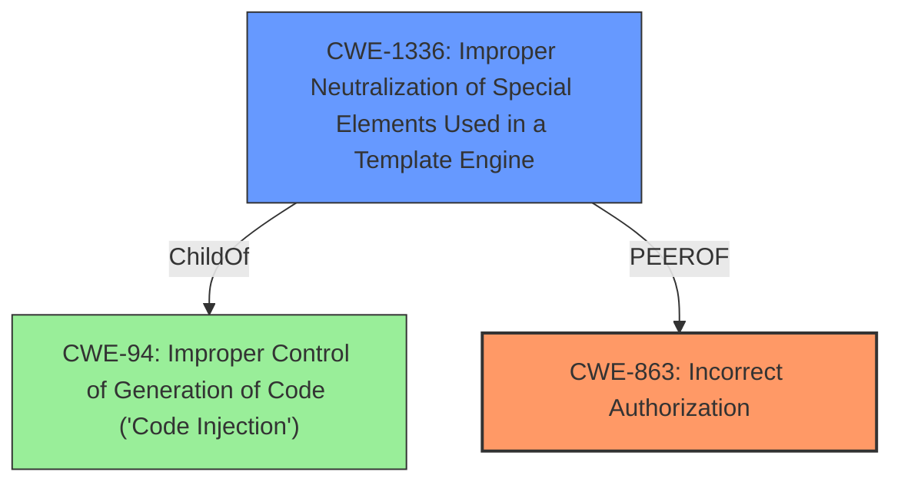

# Analysis Report for CVE-2022-23615

# Vulnerability Analysis Report: CVE-2022-23615

## Description


## Analysis (with Relationship Data)

# Summary
| CWE ID  | CWE Name | Confidence | CWE Abstraction Level | CWE Vulnerability Mapping Label | CWE-Vulnerability Mapping Notes |
|------------------|------------------------------------------------------------------------------------------------|------------|-------------------------|-----------------------------------|-------------------------------------------------------------------------------------------------------------------------------------------------------------------------------------------------------------------------------------------------------------------------------------------------------------------------------------------------------------------------------------------------------------------|
| CWE-863 | Incorrect Authorization | 1.0 | Class | Allowed-with-Review | The product performs an authorization check when an actor attempts to access a resource or perform an action, but it does not correctly perform the check. This vulnerability stems from how XWiki handles access rights when saving documents via its API. Specifically, when a user without "programming rights" saves a document, the API checks the rights of the *current user viewing the content* instead of the rights of the *script author*. |
| CWE-1336 | Improper Neutralization of Special Elements Used in a Template Engine | 0.7 | Base | Allowed | The product uses a template engine to insert or process externally-influenced input, but it does not neutralize or incorrectly neutralizes special elements or syntax that can be interpreted as template expressions or other code directives when processed by the engine. This is a secondary CWE because the vulnerability is exploited through the use of malicious Velocity scripts. |

## Evidence and Confidence

*   **Confidence Score:** 0.9
*   **Evidence Strength:** HIGH

## Relationship Analysis
The primary CWE is CWE-863 (Incorrect Authorization) because the core issue is a flaw in how XWiki performs authorization checks. A secondary CWE is CWE-1336 (Improper Neutralization of Special Elements Used in a Template Engine) because the vulnerability is exploited through the use of malicious Velocity scripts.



## Vulnerability Chain
The vulnerability chain starts with the **incorrect authorization** (CWE-863) where the system checks the wrong user's rights. This then allows an attacker to inject malicious scripts (using Velocity) due to **improper neutralization** of special elements in a template engine (CWE-1336), which can lead to the execution of arbitrary code.

## Summary of Analysis
The initial assessment pointed towards CWE-863 (Incorrect Authorization) as the primary weakness. This aligns with the vulnerability description and CVE details, which state that the system **incorrectly performs the authorization check**. The selection is further supported by the fact that the system uses the rights of the current user instead of the script author, which is a clear case of incorrect authorization.

The CVE summary highlights the following:
*   "**Incorrect Access Control:** The primary weakness is that access control checks during document saving via the API (`api.XWiki#getDocument()` and `api.Document#save()`) use the current user's rights rather than the script author's rights."

CWE-1336 is a secondary issue, as it represents the specific means of exploiting the authorization flaw. The attacker leverages Velocity scripts, which are not properly neutralized, to gain unauthorized access.

The selected CWEs are at the optimal level of specificity. CWE-863 is a Class, but it accurately captures the core issue. CWE-1336 is a Base, and it precisely describes the template engine injection.

Relevant CWE Information:

# Enhanced Context (25 CWEs)

## CWE-538: Insertion of Sensitive Information into Externally-Accessible File or Directory
**Abstraction Level**: Base
**Similarity Score**: 0.79

This CWE is not applicable because the vulnerability does not involve inserting sensitive information into externally accessible files or directories.

## CWE-74: Improper Neutralization of Special Elements in Output Used by a Downstream Component ('Injection')
**Abstraction Level**: Class
**Similarity Score**: 0.78

This CWE is too general. While the vulnerability involves injection, CWE-1336 is a more specific fit.

## CWE-212: Improper Removal of Sensitive Information Before Storage or Transfer
**Abstraction Level**: Base
**Similarity Score**: 0.77

This CWE is not applicable because the vulnerability does not involve the improper removal of sensitive information before storage or transfer.

## CWE-312: Cleartext Storage of Sensitive Information
**Abstraction Level**: Base
**Similarity Score**: 0.77

This CWE is not applicable because the vulnerability does not involve the cleartext storage of sensitive information.

## CWE-319: Cleartext Transmission of Sensitive Information
**Abstraction Level**: Base
**Similarity Score**: 0.76

This CWE is not applicable because the vulnerability does not involve the cleartext transmission of sensitive information.

## CWE-552: Files or Directories Accessible to External Parties
**Abstraction Level**: Base
**Similarity Score**: 0.76

This CWE is not applicable because the vulnerability does not directly involve making files or directories accessible to external parties.

## CWE-116: Improper Encoding or Escaping of Output
**Abstraction Level**: Class
**Similarity Score**: 0.76

CWE-116 is a more general form of CWE-1336. Since the injection occurs via a template engine, CWE-1336 is a more precise fit.

## CWE-807: Reliance on Untrusted Inputs in a Security Decision
**Abstraction Level**: Base
**Similarity Score**: 0.76

This CWE is not applicable because the vulnerability doesn't primarily involve relying on untrusted inputs in a security decision.

## CWE-41: Improper Resolution of Path Equivalence
**Abstraction Level**: Base
**Similarity Score**: 0.76

This CWE is not applicable because the vulnerability does not involve path equivalence issues.

## CWE-639: Authorization Bypass Through User-Controlled Key
**Abstraction Level**: Base
**Similarity Score**: 0.75

While the vulnerability involves authorization bypass, it's not through a user-controlled key but rather through **incorrect access control** logic.

## CWE-22: Improper Limitation of a Pathname to a Restricted Directory ('Path Traversal')
**Abstraction Level**: Base
**Similarity Score**: 6807.01

This CWE is not applicable because the vulnerability does not involve path traversal.

## CWE-328: Use of Weak Hash
**Abstraction Level**: Base
**Similarity Score**: 6868.81

This CWE is not applicable because the vulnerability does not involve weak hashing algorithms.

## CWE-201: Insertion of Sensitive Information Into Sent Data
**Abstraction Level**: base
**Similarity Score**: 5.03

This CWE is not applicable because the vulnerability does not involve the insertion of sensitive information into sent data.

## CWE-79: Improper Neutralization of Input During Web Page Generation ('Cross-site Scripting')
**Abstraction Level**: base
**Similarity Score**: 3.72

This CWE is not applicable because the vulnerability doesn't cause XSS directly, even though the attack surface is similar. The injection is happening on the server side and not on the client's browser.


## CWE Relationship Analysis

Current CWEs represent these abstraction levels: .


### Vulnerability Chain Analysis

**Chain starting from CWE-552:**
- 552 (Files or Directories Accessible to External Parties) - ROOT


**Chain starting from CWE-201:**
- 201 (Insertion of Sensitive Information Into Sent Data) - ROOT


### CWE Relationship Diagram

```mermaid
graph TD
    classDef primary fill:#f96,stroke:#333,stroke-width:2px
    classDef secondary fill:#69f,stroke:#333
    classDef tertiary fill:#9e9,stroke:#333
```


*Report generated on 2025-03-31 10:45:45*
