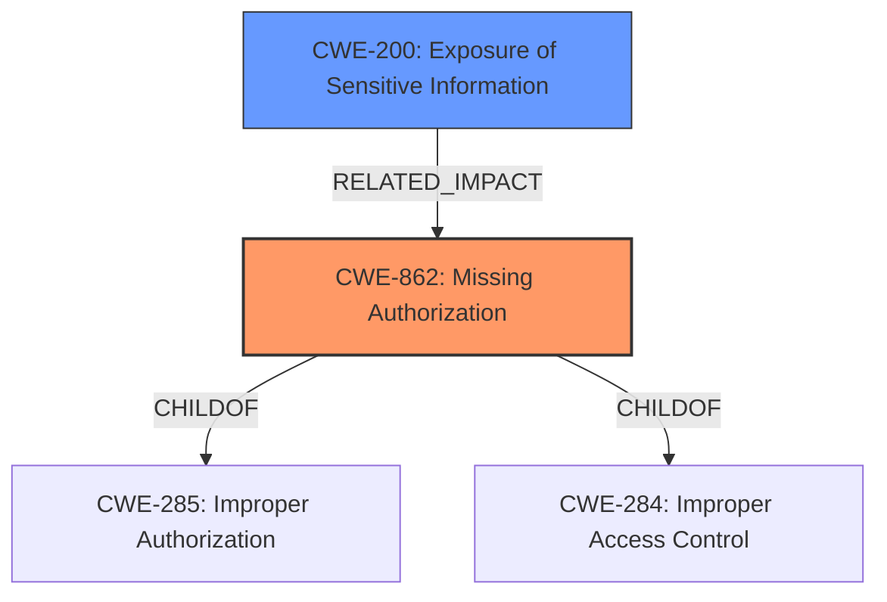

# Enhanced Analysis for CVE-2022-23617

# Summary
| CWE ID | CWE Name | Confidence | CWE Abstraction Level | CWE Vulnerability Mapping Label | CWE-Vulnerability Mapping Notes |
|---|---|---|---|---|---|
| CWE-862 | Missing Authorization | 1.0 | Class | Allowed-with-Review | Primary CWE. The **weakness** is the **lack of authorization** when copying content of a page to which the user does not have access. |
| CWE-200 | Exposure of Sensitive Information | 0.7 | Class | Allowed | Secondary CWE. The impact of the **missing authorization** is that it exposes sensitive information from the template to users who should not have access. |

## Evidence and Confidence

*   **Confidence Score:** 0.9
*   **Evidence Strength:** HIGH

## Relationship Analysis
The primary CWE is CWE-862, which is a class-level CWE describing a **missing authorization** check. The impact is information exposure, which is represented by CWE-200.



## Vulnerability Chain
The chain of events is: **Missing authorization** (CWE-862) leads to the exposure of sensitive information (CWE-200).

## Summary of Analysis
The initial assessment identified CWE-862 as the primary weakness due to the **missing authorization** check when copying page content as a template. The weakness allows any user with edit rights to copy content of a page to which they do not have access.

The analysis considered the root cause and impact. The root cause is the **missing authorization** (CWE-862) when copying the content. The impact is the exposure of sensitive information (CWE-200).

The supporting evidence is:

*   Vulnerability Description Key Phrases: "**weakness:** **copy content of a page it does not have access to**"
*   CVE Reference Links Content Summary: "**Inadequate Access Control:** The primary weakness is the lack of proper access control enforcement during the template copying process. The system should first verify if the user has permission to view the template page before copying its content."
*   CVE Reference Links Content Summary: "**Information Disclosure:** The vulnerability leads to unauthorized information disclosure, allowing users to access the content of pages they are not permitted to view by using them as templates."
*   CVE Reference Links Content Summary: "The vulnerability is identified by CWE-862 (**Missing Authorization**)."

The decision to select CWE-862 is based on the root cause description and reference to CWE-862 in the summary. The selection of CWE-200 is based on the impact of the vulnerability.

The selected CWEs are at the appropriate level of specificity because CWE-862 directly addresses the type of **missing authorization** and CWE-200 represents the resulting information exposure.

Relevant CWE Information:

*   CWE-116 (Improper Encoding or Escaping of Output): Considered, but not selected because the vulnerability is related to authorization, not encoding.
*   CWE-552 (Files or Directories Accessible to External Parties): Considered, but not selected because the vulnerability isn't about making files accessible, but rather a lack of authorization.
*   CWE-1336 (Improper Neutralization of Special Elements Used in a Template Engine): Considered, but the issue is not related to template engine, but access control before a template is used.
*   CWE-202 (Exposure of Sensitive Information Through Data Queries): Considered as a potential impact, but the sensitive information is not exposed through queries. It is exposed by copying content.
*   CWE-863 (Incorrect Authorization): Considered, but CWE-862 is more accurate since there is no authorization at all.
*   CWE-91 (XML Injection (aka Blind XPath Injection)): Considered, but not selected because XML is not part of the vulnerability.
*   CWE-74 (Improper Neutralization of Special Elements in Output Used by a Downstream Component ('Injection')): Considered, but injection is not the root cause.
*   CWE-201 (Insertion of Sensitive Information Into Sent Data): Considered, but the sensitive information is not "sent" anywhere. It is accessible in the new page.
*   CWE-328 (Use of Weak Hash): Considered, but not selected because hashing is not part of the vulnerability.


## CWE Relationship Analysis

Current CWEs represent these abstraction levels: .


### Vulnerability Chain Analysis

**Chain starting from CWE-862:**
- 862 (Missing Authorization) - ROOT


**Chain starting from CWE-552:**
- 552 (Files or Directories Accessible to External Parties) - ROOT


### CWE Relationship Diagram

```mermaid
graph TD
    classDef primary fill:#f96,stroke:#333,stroke-width:2px
    classDef secondary fill:#69f,stroke:#333
    classDef tertiary fill:#9e9,stroke:#333
```