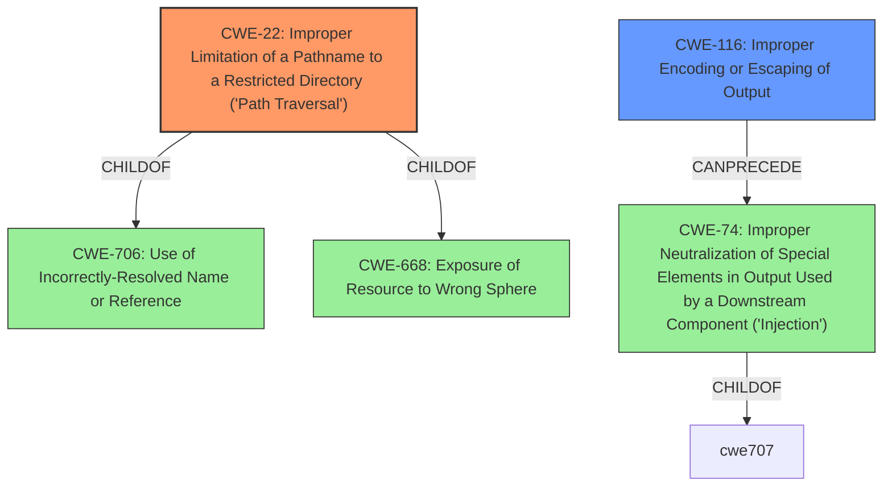

# Raw Analyzer Response for CVE-2022-23620

# Summary
| CWE ID | CWE Name | Confidence | CWE Abstraction Level | CWE Vulnerability Mapping Label | CWE-Vulnerability Mapping Notes |
|---|---|---|---|---|---|
| CWE-22 | Improper Limitation of a Pathname to a Restricted Directory ('Path Traversal') | 1.0 | Base | Primary | Allowed |
| CWE-116 | Improper Encoding or Escaping of Output | 0.7 | Class | Secondary | Allowed-with-Review |

## Evidence and Confidence

*   **Confidence Score:** 0.85
*   **Evidence Strength:** HIGH

## Relationship Analysis
The primary CWE is CWE-22, which describes the core path traversal issue. CWE-116 is a related Class-level CWE that indicates improper output handling, which could contribute to the path traversal. The hierarchical relationship of CWE-22 being a descendant of CWE-706 (Use of Incorrectly-Resolved Name or Reference) and CWE-668 (Exposure of Resource to Wrong Sphere) provides a broader context, but CWE-22 is the most specific and applicable.

## Vulnerability Chain
The vulnerability chain begins with the **failure to escape SSX document references** by `AbstractSxExportURLFactoryActionHandler#processSx` when serializing to the filesystem. This leads to reference elements containing filesystem syntax, such as "../", which enables **path traversal**. The impact is that an attacker can manipulate file paths and potentially write files to arbitrary locations, leading to possible system compromise or denial of service.

## Summary of Analysis
The initial analysis and the refined assessment both converge on CWE-22 as the primary weakness, supported by the description of the vulnerability. The vulnerability description clearly states that the **rootcause** is that the component **does not escape anything from SSX document references** which leads to file system syntax being injected, specifically "../" which is part of the definition of CWE-22.

The selection of CWE-22 is made due to its direct relevance to the vulnerability's description and the evidence extracted from the CVE Reference Links. CWE-116 is considered a secondary factor, as the **lack of escaping** can be seen as a form of improper output handling. However, the primary concern is the path traversal itself, making CWE-22 the most specific and accurate classification.

Relevant CWE Information:

# Enhanced Context (25 CWEs)
The following CWEs were identified as potentially relevant to this vulnerability:

## CWE-23: Relative Path Traversal
**Abstraction Level**: Variant
**Similarity Score**: 0.79
**Source**: dense

**Description**:
The product uses external input to construct a pathname that should be within a restricted directory, but it does not properly neutralize "../" sequences that can resolve to a location that is outside of that directory.

**Mapping Guidance**:
- Usage: Allowed
- Rationale: This CWE entry is at the Variant level of abstraction, which is a preferred level of abstraction for mapping to the root causes of vulnerabilities.

## CWE-116: Improper Encoding or Escaping of Output
**Abstraction Level**: Class
**Similarity Score**: 0.78
**Source**: dense

**Description**:
The product prepares a structured message for communication with another component, but encoding or escaping of the data is either missing or done incorrectly. As a result, the intended structure of the message is not preserved.

**Mapping Guidance**:
- Usage: Allowed-with-Review
- Rationale: This CWE entry is a Class and might have Base-level children that would be more appropriate

## CWE-22: Improper Limitation of a Pathname to a Restricted Directory ('Path Traversal')
**Abstraction Level**: Base
**Similarity Score**: 9553.92
**Source**: sparse

**Description**:
The product uses external input to construct a pathname that is intended to identify a file or directory that is located underneath a restricted parent directory, but the product does not properly neutralize special elements within the pathname that can cause the pathname to resolve to a location that is outside of the restricted directory.

**Mapping Guidance**:
- Usage: Allowed
- Rationale: This CWE entry is at the Base level of abstraction, which is a preferred level of abstraction for mapping to the root causes of vulnerabilities.

### Detailed Analysis of Selected CWEs:

*   **CWE-22: Improper Limitation of a Pathname to a Restricted Directory ('Path Traversal')**
    *   **Explanation:** The vulnerability occurs because the application **does not properly neutralize special elements** (like "../") in the pathname, allowing it to resolve outside the intended restricted directory. The **rootcause** is the **missing escaping**, and the impact is the ability to manipulate file paths.
    *   **Security Implications:** An attacker could potentially read or write arbitrary files on the system, leading to information disclosure, code execution, or denial of service.
    *   **Relationships:** CWE-22 is a Base-level CWE, making it a good fit. It is also related to CWE-706 (Use of Incorrectly-Resolved Name or Reference) and CWE-668 (Exposure of Resource to Wrong Sphere), which provide broader context.
    *   **Mapping Guidance:** Usage is ALLOWED. This aligns with the guidance that this CWE is at the Base level of abstraction.
    *   **Evidence:** The vulnerability description mentions the presence of filesystem syntax like "../" and "/" due to the **lack of escaping**. The CVE Reference Links Summary confirms that a malicious SSX/JSX reference containing "../" can manipulate the file path.
*   **CWE-116: Improper Encoding or Escaping of Output**
    *   **Explanation:** The `AbstractSxExportURLFactoryActionHandler#processSx` **does not escape anything from SSX document references**, which fits the description of CWE-116.
    *   **Security Implications:** Improper escaping of output can allow attackers to inject malicious commands, which in this case leads to path traversal.
    *   **Relationships:** CWE-116 is a Class-level CWE. Its child CWEs might be more specific, but none fit better than CWE-22 for the actual path traversal.
    *   **Mapping Guidance:** Usage is ALLOWED-WITH-REVIEW, suggesting that a more specific Base-level CWE might be better. However, in this case, the lack of escaping directly leads to the path traversal, so it's a contributing factor.
    *   **Evidence:** The vulnerability description states that the component **does not escape anything**, indicating a failure in output encoding or escaping.

### Considered but Not Used:

*   **CWE-23: Relative Path Traversal:** This is a Variant of CWE-22. The description specifically mentions "../" sequences. While the vulnerability description does mention "../", the broader description of CWE-22 covers both relative and absolute path traversal, making it a better fit.
*   **CWE-79: Improper Neutralization of Input During Web Page Generation ('Cross-site Scripting'):** While the vulnerability involves web pages, the core issue is not XSS. The problem is the ability to manipulate the file system via path traversal, not the execution of malicious scripts in a user's browser.
*   **CWE-74: Improper Neutralization of Special Elements in Output Used by a Downstream Component ('Injection'):** This is a Class-level CWE and too general. The more specific CWE-22 and CWE-116 are more appropriate.
*   **CWE-1336: Improper Neutralization of Special Elements Used in a Template Engine:** While the XWiki platform uses templates, the vulnerability is not directly related to the template engine itself, but rather the **lack of escaping** when serializing SSX documents.
*   **CWE-41: Improper Resolution of Path Equivalence:** The provided description doesn't focus on path equivalence issues or file system contents disclosure through path equivalence, so it isn't a good fit.
*   **CWE-639: Authorization Bypass Through User-Controlled Key:** This CWE is about bypassing authorization by modifying a key value. This vulnerability doesn't involve modifying a user-controlled key for authorization purposes.
*