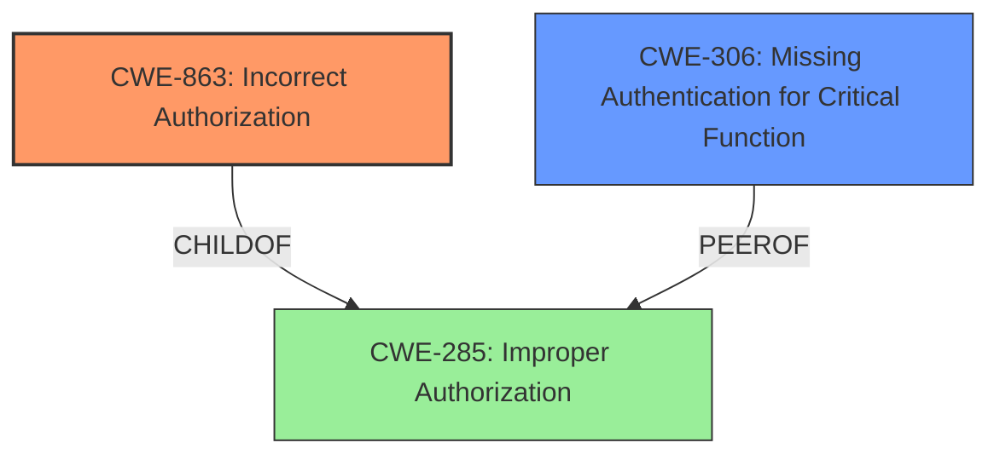

# Analysis Report for CVE-2022-23627

# Vulnerability Analysis Report: CVE-2022-23627

## Description


## Analysis (with Relationship Data)

# Summary
| CWE ID | CWE Name | Confidence | CWE Abstraction Level | CWE Vulnerability Mapping Label | CWE-Vulnerability Mapping Notes |
|---|---|---|---|---|---|
| CWE-863 | Incorrect Authorization | 1.0 | Class | Primary | Allowed-with-Review |
| CWE-306 | Missing Authentication for Critical Function | 0.7 | Base | Secondary | Allowed |

## Evidence and Confidence

*   **Confidence Score:** 0.85
*   **Evidence Strength:** HIGH

## Relationship Analysis
The primary relationship influencing my decision is the hierarchical structure between CWE-285 (Improper Authorization), CWE-863 (Incorrect Authorization), and CWE-306 (Missing Authentication for Critical Function). CWE-863 is a child of CWE-285, indicating a more specific type of authorization issue. Since the vulnerability involves an **incorrect access verification**, CWE-863 is more appropriate than its parent. CWE-306 is also under CWE-287 which is a peer of CWE-284 and parent to CWE-285, but it indicates a complete lack of authentication which is not the case here.



## Vulnerability Chain
The vulnerability chain begins with the **inadequate access verification** in the ASF application. This leads to the ability to access resources beyond those configured, ultimately resulting in a confidentiality breach.

## Summary of Analysis
My analysis concludes that the primary CWE for this vulnerability is CWE-863 (**Incorrect Authorization**) and a possible secondary is CWE-306 (**Missing Authentication for Critical Function**).

The primary decision is heavily based on the vulnerability description and the CVE reference summary. The **root cause** is described as an "**inadequate access verification**" when proxy commands are used. The system incorrectly verifies access against the source bot instead of the target bot. This directly aligns with the description of CWE-863, which states: "The product performs an authorization check when an actor attempts to access a resource or perform an action, but it does not correctly perform the check."

The evidence supporting this decision includes:

*   **Vulnerability Description Key Phrases:** "**rootcause:** **inadequate access verification**"
*   **CVE Reference Links Content Summary:** "**Inadequate Access Control:** The core issue is the flawed logic in verifying user permissions when proxying commands. The system mistakenly checks access against the source bot instead of the target bot, leading to privilege escalation."

While CWE-306 (**Missing Authentication for Critical Function**) was also considered due to the lack of proper verification on the target bot, it was deemed less accurate because the vulnerability isn't a complete absence of authentication but rather a flawed authorization process. The ASF application *does* perform authentication, but the authorization check is performed against the wrong entity.

The hierarchical relationship between CWE-285 and CWE-863 reinforces the choice of the latter. CWE-863 is a more specific child of CWE-285, making it a better fit for the described vulnerability.

The retriever results also support the selection of CWE-863, with a high similarity score.

The final decision to use CWE-863 as the primary CWE is based on the direct evidence of **incorrect access verification**, the hierarchical relationship of CWEs, and the MITRE mapping guidance. This CWE is at the Class level of abstraction, but since there isn't a better fit at the Base level, it is deemed appropriate. CWE-306 is considered a secondary candidate as it highlights a missing check on the target bot, but it's not the primary **root cause**.

Relevant CWE Information:

# Enhanced Context (25 CWEs)
The following CWEs were identified as potentially relevant to this vulnerability:

## CWE-274: Improper Handling of Insufficient Privileges
**Abstraction Level**: Base
**Similarity Score**: 0.77
**Source**: dense

**Description**:
The product does not handle or incorrectly handles when it has insufficient privileges to perform an operation, leading to resultant weaknesses.

**Mapping Guidance**:
- Usage: Discouraged
- Rationale: This CWE entry could be deprecated in a future version of CWE.


## CWE-807: Reliance on Untrusted Inputs in a Security Decision
**Abstraction Level**: Base
**Similarity Score**: 0.76
**Source**: dense

**Description**:
The product uses a protection mechanism that relies on the existence or values of an input, but the input can be modified by an untrusted actor in a way that bypasses the protection mechanism.

**Mapping Guidance**:
- Usage: Allowed
- Rationale: This CWE entry is at the Base level of abstraction, which is a preferred level of abstraction for mapping to the root causes of vulnerabilities.


## CWE-280: Improper Handling of Insufficient Permissions or Privileges 
**Abstraction Level**: Base
**Similarity Score**: 0.76
**Source**: dense

**Description**:
The product does not handle or incorrectly handles when it has insufficient privileges to access resources or functionality as specified by their permissions. This may cause it to follow unexpected code paths that may leave the product in an invalid state.

**Mapping Guidance**:
- Usage: Allowed
- Rationale: This CWE entry is at the Base level of abstraction, which is a preferred level of abstraction for mapping to the root causes of vulnerabilities.


## CWE-267: Privilege Defined With Unsafe Actions
**Abstraction Level**: Base
**Similarity Score**: 0.76
**Source**: dense

**Description**:
A particular privilege, role, capability, or right can be used to perform unsafe actions that were not intended, even when it is assigned to the correct entity.

**Mapping Guidance**:
- Usage: Allowed
- Rationale: This CWE entry is at the Base level of abstraction, which is a preferred level of abstraction for mapping to the root causes of vulnerabilities.


## CWE-668: Exposure of Resource to Wrong Sphere
**Abstraction Level**: Class
**Similarity Score**: 0.76
**Source**: dense

**Description**:
The product exposes a resource to the wrong control sphere, providing unintended actors with inappropriate access to the resource.

**Mapping Guidance**:
- Usage: Discouraged
- Rationale: CWE-668 is high-level and is often misused as a catch-all when lower-level CWE IDs might be applicable. It is sometimes used for low-information vulnerability reports [REF-1287]. It is a level-1 Class (i.e., a child of a Pillar). It is not useful for trend analysis.


## CWE-266: Incorrect Privilege Assignment
**Abstraction Level**: Base
**Similarity Score**: 0.76
**Source**: dense

**Description**:
A product incorrectly assigns a privilege to a particular actor, creating an unintended sphere of control for that actor.

**Mapping Guidance**:
- Usage: Allowed
- Rationale: This CWE entry is at the Base level of abstraction, which is a preferred level of abstraction for mapping to the root causes of vulnerabilities.


## CWE-639: Authorization Bypass Through User-Controlled Key
**Abstraction Level**: Base
**Similarity Score**: 0.76
**Source**: dense

**Description**:
The system's authorization functionality does not prevent one user from gaining access to another user's data or record by modifying the key value identifying the data.

**Mapping Guidance**:
- Usage: Allowed
- Rationale: This CWE entry is at the Base level of abstraction, which is a preferred level of abstraction for mapping to the root causes of vulnerabilities.


## CWE-184: Incomplete List of Disallowed Inputs
**Abstraction Level**: Base
**Similarity Score**: 0.76
**Source**: dense

**Description**:
The product implements a protection mechanism that relies on a list of inputs (or properties of inputs) that are not allowed by policy or otherwise require other action to neutralize before additional processing takes place, but the list is incomplete.

**Mapping Guidance**:
- Usage: Allowed
- Rationale: This CWE entry is at the Base level of abstraction, which is a preferred level of abstraction for mapping to the root causes of vulnerabilities.


## CWE-1289: Improper Validation of Unsafe Equivalence in Input
**Abstraction Level**: Base
**Similarity Score**: 0.75
**Source**: dense

**Description**:
The product receives an input value that is used as a resource identifier or other type of reference, but it does not validate or incorrectly validates that the input is equivalent to a potentially-unsafe value.

**Mapping Guidance**:
- Usage: Allowed
- Rationale: This CWE entry is at the Base level of abstraction, which is a preferred level of abstraction for


## CWE Relationship Analysis

Current CWEs represent these abstraction levels: .


### Vulnerability Chain Analysis

**Chain starting from CWE-266:**
- 266 (Incorrect Privilege Assignment) - ROOT


**Chain starting from CWE-280:**
- 280 (Improper Handling of Insufficient Permissions or Privileges ) - ROOT


### CWE Relationship Diagram

```mermaid
graph TD
    classDef primary fill:#f96,stroke:#333,stroke-width:2px
    classDef secondary fill:#69f,stroke:#333
    classDef tertiary fill:#9e9,stroke:#333
```


*Report generated on 2025-03-31 06:18:00*
