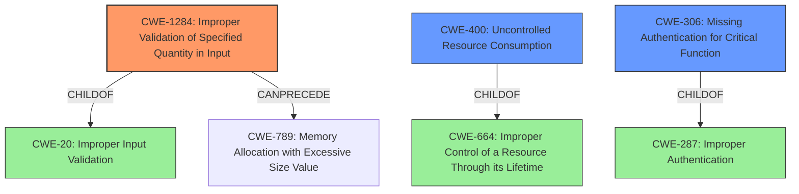

# Raw Analyzer Response for CVE-2022-23635

# Summary
| CWE ID | CWE Name | Confidence | CWE Abstraction Level | CWE Vulnerability Mapping Label | CWE-Vulnerability Mapping Notes |
|---|---|---|---|---|---|
| CWE-1284 | Improper Validation of Specified Quantity in Input | 0.8 | Base | Allowed | Primary CWE |
| CWE-400 | Uncontrolled Resource Consumption | 0.6 | Class | Discouraged | Secondary Candidate |
| CWE-306 | Missing Authentication for Critical Function | 0.5 | Base | Allowed | Secondary Candidate |

## Evidence and Confidence

*   **Confidence Score:** 0.7
*   **Evidence Strength:** MEDIUM

## Relationship Analysis
The primary CWE, CWE-1284, is a base-level weakness that describes the **improper validation of a specified quantity in input**. It is a child of CWE-20 (Improper Input Validation) and can precede CWE-789 (Memory Allocation with Excessive Size Value). CWE-400 (Uncontrolled Resource Consumption) is a class-level weakness and a child of CWE-664 (Improper Control of a Resource Through its Lifetime). It is often misused and has more specific children. CWE-306 (Missing Authentication for Critical Function) is a base-level weakness and child of CWE-287 (Improper Authentication).

## Vulnerability Chain
The vulnerability chain starts with the **improper validation of a specified quantity in the input** (CWE-1284). This leads to a **request processing error**, resulting in the control plane crashing. If authentication is missing (CWE-306) on the endpoint, it exacerbates the issue. Ultimately, this can lead to uncontrolled resource consumption (CWE-400) due to the excessive or incorrect processing of the crafted message.

## Summary of Analysis
The initial assessment considered the retriever results and the vulnerability description. The primary focus was to identify the root cause of the vulnerability, which is a **request processing error** caused by a specially crafted message that crashes the control plane.

The analysis identified CWE-1284 (Improper Validation of Specified Quantity in Input) as the most appropriate primary CWE. The "CVE Reference Links Content Summary" indicates that the vulnerability involves "Lack of proper input validation when unmarshaling JSON data." This suggests that the input is not properly validated, which aligns directly with CWE-1284. The crafted message likely contains a malformed quantity (e.g., size or length), leading to a crash.

The graph relationships influenced the selection by highlighting potential consequences of CWE-1284, such as CWE-789 (Memory Allocation with Excessive Size Value), but evidence to support that was not present.

The selected CWE is at the optimal level of specificity, as it directly addresses the **lack of proper input validation** that leads to the crash. While CWE-20 (Improper Input Validation) is a parent, CWE-1284 provides more detail about the type of input that is not being validated (a specified quantity).

Relevant CWE Information:

# Enhanced Context (25 CWEs)
The following CWEs were identified as potentially relevant to this vulnerability:

## CWE-300: Channel Accessible by Non-Endpoint
**Abstraction Level**: Class
**Similarity Score**: 0.76
**Source**: dense

**Description**:
The product does not adequately verify the identity of actors at both ends of a communication channel, or does not adequately ensure the integrity of the channel, in a way that allows the channel to be accessed or influenced by an actor that is not an endpoint.

**Mapping Guidance**:
- Usage: Discouraged
- Rationale: CWE-300 is commonly misused for vulnerabilities in which the prerequisites for exploitation require the adversary to be in a privileged "in-the-middle" position.
- **NOT USED:** The vulnerability is not about the integrity of the communication channel itself.

## CWE-1289: Improper Validation of Unsafe Equivalence in Input
**Abstraction Level**: Base
**Similarity Score**: 0.76
**Source**: dense

**Description**:
The product receives an input value that is used as a resource identifier or other type of reference, but it does not validate or incorrectly validates that the input is equivalent to a potentially-unsafe value.

**Mapping Guidance**:
- Usage: Allowed
- Rationale: This CWE entry is at the Base level of abstraction, which is a preferred level of abstraction for mapping to the root causes of vulnerabilities.
- **NOT USED:** Not related to resource identifier or reference.

## CWE-297: Improper Validation of Certificate with Host Mismatch
**Abstraction Level**: Variant
**Similarity Score**: 0.76
**Source**: dense

**Description**:
The product communicates with a host that provides a certificate, but the product does not properly ensure that the certificate is actually associated with that host.

**Mapping Guidance**:
- Usage: Allowed
- Rationale: This CWE entry is at the Variant level of abstraction, which is a preferred level of abstraction for mapping to the root causes of vulnerabilities.
- **NOT USED:** Certificate validation is not the primary issue.

## CWE-295: Improper Certificate Validation
**Abstraction Level**: Base
**Similarity Score**: 0.76
**Source**: dense

**Description**:
The product does not validate, or incorrectly validates, a certificate.

**Mapping Guidance**:
- Usage: Allowed
- Rationale: This CWE entry is at the Base level of abstraction, which is a preferred level of abstraction for mapping to the root causes of vulnerabilities.
- **NOT USED:** Certificate validation is not the primary issue.

## CWE-345: Insufficient Verification of Data Authenticity
**Abstraction Level**: Class
**Similarity Score**: 0.75
**Source**: dense

**Description**:
The product does not sufficiently verify the origin or authenticity of data, in a way that causes it to accept invalid data.

**Mapping Guidance**:
- Usage: Discouraged
- Rationale: This CWE entry is a level-1 Class (i.e., a child of a Pillar). It might have lower-level children that would be more appropriate
- **NOT USED:** Data authenticity is not the core issue.

## CWE-303: Incorrect Implementation of Authentication Algorithm
**Abstraction Level**: Base
**Similarity Score**: 0.75
**Source**: dense

**Description**:
The requirements for the product dictate the use of an established authentication algorithm, but the implementation of the algorithm is incorrect.

**Mapping Guidance**:
- Usage: Allowed
- Rationale: This CWE entry is at the Base level of abstraction, which is a preferred level of abstraction for mapping to the root causes of vulnerabilities.
- **NOT USED:** The authentication algorithm is not the problem

## CWE-668: Exposure of Resource to Wrong Sphere
**Abstraction Level**: Class
**Similarity Score**: 0.75
**Source**: dense

**Description**:
The product exposes a resource to the wrong control sphere, providing unintended actors with inappropriate access to the resource.

**Mapping Guidance**:
- Usage: Discouraged
- Rationale: CWE-668 is high-level and is often misused as a catch-all when lower-level CWE IDs might be applicable. It is sometimes used for low-information vulnerability reports [REF-1287]. It is a level-1 Class (i.e., a child of a Pillar). It is not useful for trend analysis.
- **NOT USED:** Too generic and doesn't capture the specific nature of the vulnerability.

## CWE-404: Improper Resource Shutdown or Release
**Abstraction Level**: Class
**Similarity Score**: 0.75
**Source**: dense

**Description**:
The product does not release or incorrectly releases a resource before it is made available for re-use.

**Mapping Guidance**:
- Usage: Allowed-with-Review
- Rationale: This CWE entry is a Class and might have Base-level children that would be more appropriate