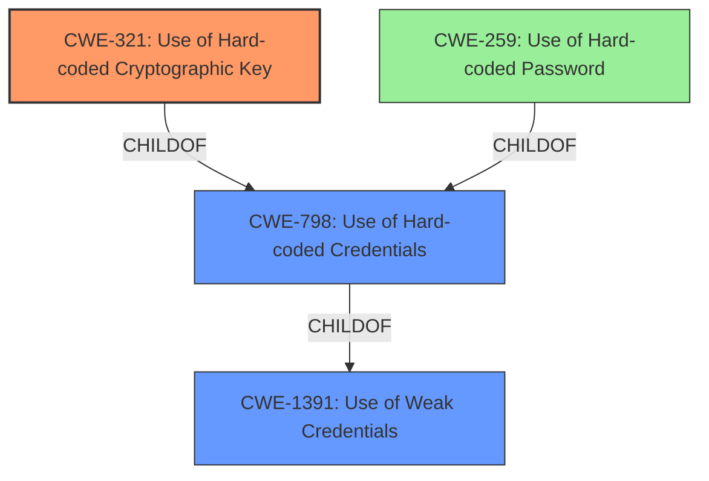

# Raw Analyzer Response for CVE-2022-23650

# Summary
| CWE ID  | CWE Name                                  | Confidence | CWE Abstraction Level | CWE Vulnerability Mapping Label | CWE-Vulnerability Mapping Notes |
| :-------- | :----------------------------------------- | :---------- | :-------------------- | :------------------------------ | :------------------------------ |
| CWE-321 | Use of Hard-coded Cryptographic Key         | 1.0         | Variant               | Allowed                         | Primary CWE                    |
| CWE-798 | Use of Hard-coded Credentials            | 0.75        | Base                  | Allowed                         | Secondary Candidate            |
| CWE-1391 | Use of Weak Credentials                  | 0.6         | Class                 | Allowed-with-Review           | Secondary Candidate            |

## Evidence and Confidence

*   **Confidence Score:** 0.9
*   **Evidence Strength:** HIGH

## Relationship Analysis
The primary relationship influencing the CWE selection is the hierarchical relationship. CWE-321 (Variant) and CWE-259 (Variant) are children of CWE-798 (Base), which in turn is a child of CWE-1391 (Class). The vulnerability description focuses on a **hard-coded cryptographic key**, making CWE-321 the most specific and appropriate choice. CWE-798 and CWE-1391 are broader, but still relevant.

## Vulnerability Chain
The vulnerability chain starts with the **hard-coded cryptographic key**, which leads to the ability to forge JWT tokens, bypass authentication, and ultimately execute admin commands on the remote server.
  - **Root Cause:** CWE-321: Use of Hard-coded Cryptographic Key
  - **Impact:** Unauthorized access and execution of admin commands

## Summary of Analysis
The primary CWE is CWE-321, based on the presence of a **hard-coded cryptographic key**. The vulnerability description explicitly states this: "there is a **hard-coded cryptographic key** in the code base which can be exploited to run admin commands on a remote server". The "CVE Reference Links Content Summary" section further reinforces this by stating "The vulnerability stems from the use of a hard-coded cryptographic key within the Netmaker codebase." This aligns perfectly with the CWE-321 description: "The use of a hard-coded cryptographic key significantly increases the possibility that encrypted data may be recovered."

CWE-798 is also considered because it represents the general case of **hard-coded credentials**, and CWE-321 is a specific type of **hard-coded credential**.

CWE-1391 (Use of Weak Credentials) is a more general classification. While the **hard-coded key** is technically a "weak credential," CWE-321 is more specific and therefore preferred.

CWE-259 (Use of Hard-coded Password) was considered but rejected because the vulnerability specifically involves a cryptographic key, not a password.

The choice of CWE-321 is at the optimal level of specificity because it directly addresses the root cause: the **hard-coded cryptographic key**. This allows for targeted mitigation strategies.

Relevant CWE Information:

# Enhanced Context (25 CWEs)
The following CWEs were identified as potentially relevant to this vulnerability:

## CWE-1391: Use of Weak Credentials
**Abstraction Level**: Class
**Similarity Score**: 0.80
**Source**: dense

**Description**:
The product uses weak credentials (such as a default key or hard-coded password) that can be calculated, derived, reused, or guessed by an attacker.

**Mapping Guidance**:
- Usage: Allowed-with-Review
- Rationale: This CWE entry is a Class and might have Base-level children that would be more appropriate

## CWE-798: Use of Hard-coded Credentials
**Abstraction Level**: Base
**Similarity Score**: 0.78
**Source**: dense

**Description**:
The product contains hard-coded credentials, such as a password or cryptographic key.

**Mapping Guidance**:
- Usage: Allowed
- Rationale: This CWE entry is at the Base level of abstraction, which is a preferred level of abstraction for mapping to the root causes of vulnerabilities.

## CWE-303: Incorrect Implementation of Authentication Algorithm
**Abstraction Level**: Base
**Similarity Score**: 0.78
**Source**: dense

**Description**:
The requirements for the product dictate the use of an established authentication algorithm, but the implementation of the algorithm is incorrect.

**Mapping Guidance**:
- Usage: Allowed
- Rationale: This CWE entry is at the Base level of abstraction, which is a preferred level of abstraction for mapping to the root causes of vulnerabilities.

## CWE-807: Reliance on Untrusted Inputs in a Security Decision
**Abstraction Level**: Base
**Similarity Score**: 0.78
**Source**: dense

**Description**:
The product uses a protection mechanism that relies on the existence or values of an input, but the input can be modified by an untrusted actor in a way that bypasses the protection mechanism.

**Mapping Guidance**:
- Usage: Allowed
- Rationale: This CWE entry is at the Base level of abstraction, which is a preferred level of abstraction for mapping to the root causes of vulnerabilities.

## CWE-345: Insufficient Verification of Data Authenticity
**Abstraction Level**: Class
**Similarity Score**: 0.77
**Source**: dense

**Description**:
The product does not sufficiently verify the origin or authenticity of data, in a way that causes it to accept invalid data.

**Mapping Guidance**:
- Usage: Discouraged
- Rationale: This CWE entry is a level-1 Class (i.e., a child of a Pillar). It might have lower-level children that would be more appropriate

## CWE-1390: Weak Authentication
**Abstraction Level**: Class
**Similarity Score**: 0.77
**Source**: dense

**Description**:
The product uses an authentication mechanism to restrict access to specific users or identities, but the mechanism does not sufficiently prove that the claimed identity is correct.

**Mapping Guidance**:
- Usage: Allowed-with-Review
- Rationale: This CWE entry is a Class and might have Base-level children that would be more appropriate

## CWE-668: Exposure of Resource to Wrong Sphere
**Abstraction Level**: Class
**Similarity Score**: 0.77
**Source**: dense

**Description**:
The product exposes a resource to the wrong control sphere, providing unintended actors with inappropriate access to the resource.

**Mapping Guidance**:
- Usage: Discouraged
- Rationale: CWE-668 is high-level and is often misused as a catch-all when lower-level CWE IDs might be applicable. It is sometimes used for low-information vulnerability reports [REF-1287]. It is a level-1 Class (i.e., a child of a Pillar). It is not useful for trend analysis.

## CWE-330: Use of Insufficiently Random Values
**Abstraction Level**: Class
**Similarity Score**: 0.77
**Source**: dense

**Description**:
The product uses insufficiently random numbers or values in a security context that depends on unpredictable numbers.

**Mapping Guidance**:
- Usage: Discouraged
- Rationale: This CWE entry is a level-1 Class (i.e., a child of a Pillar). It might have lower-level children that would be more appropriate

## CWE-1188: Initialization of a Resource with an Insecure Default
**Abstraction Level**: Base
**Similarity Score**: 0.76
**Source**: dense

**Description**:
The product initializes or sets a resource with a default that is intended to be changed by the administrator, but the default is not secure.

**Mapping Guidance**:
- Usage: Allowed
- Rationale: This CWE entry is at the Base level of abstraction, which is a preferred level of abstraction for mapping to the root causes of vulnerabilities.

## CWE-1392: Use of Default Credentials
**Abstraction Level**: Base
**Similarity Score**: 0.76
**Source**: dense

**Description**:
The product uses default credentials (such as passwords or cryptographic keys) for potentially critical functionality.

**Mapping Guidance**:
- Usage: Allowed
- Rationale: This CWE entry is at the Base level of abstraction, which is a preferred level of abstraction for mapping to the root causes of vulnerabilities.