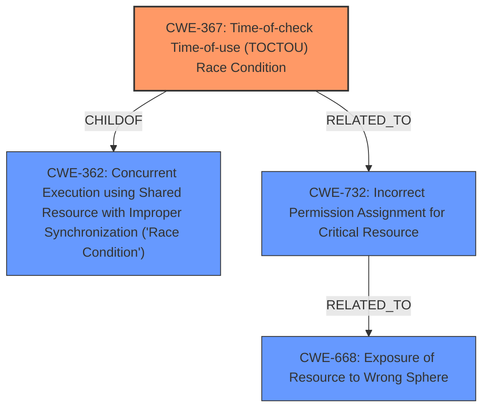

# Analysis for CVE-2022-23653

# Summary
| CWE ID | CWE Name | Confidence | CWE Abstraction Level | CWE Vulnerability Mapping Label | CWE-Vulnerability Mapping Notes |
|---|---|---|---|---|---|
| CWE-367 | Time-of-check Time-of-use (TOCTOU) Race Condition | 0.9 | Base | Allowed | Primary CWE |
| CWE-732 | Incorrect Permission Assignment for Critical Resource | 0.7 | Class | Allowed-with-Review | Secondary Candidate |
| CWE-668 | Exposure of Resource to Wrong Sphere | 0.6 | Class | Discouraged | Secondary Candidate |

## Evidence and Confidence

*   **Confidence Score:** 0.9
*   **Evidence Strength:** HIGH

## Relationship Analysis
The primary CWE selected is CWE-367 **Time-of-check Time-of-use (TOCTOU) Race Condition**, which is a Base level CWE and a child of CWE-362 **Concurrent Execution using Shared Resource with Improper Synchronization ('Race Condition')**. The vulnerability specifically describes a TOCTOU race condition where a file's permissions are changed after it is created, allowing a brief window for an attacker to access the file. CWE-732 **Incorrect Permission Assignment for Critical Resource** and CWE-668 **Exposure of Resource to Wrong Sphere** are also considered, as the initial file permissions are world-readable. However, the race condition aspect is the primary driver of the vulnerability, making CWE-367 the most accurate mapping.

## Vulnerability Chain
The vulnerability chain starts with the **incorrect initial permission assignment** (potentially related to CWE-732, but not the root cause) which leads to a **TOCTOU race condition** (CWE-367). A local attacker exploits this race condition to read the file containing sensitive information like API keys, leading to unauthorized access.

## Summary of Analysis
The initial assessment correctly identifies the **TOCTOU race condition** as the primary **root cause** vulnerability. The vulnerability description and CVE reference links content summary clearly support this, emphasizing the race condition during the creation and permission modification of the local database file. The report correctly notes that the advisory indicates that the weakness is related to CWE-276 (Incorrect Default Permissions). However, the race condition is the core issue, making CWE-367 the more precise fit. While CWE-732 could be a contributing factor, the race condition is the direct mechanism of the exploit. The choice of CWE-367 is further supported by its "Base" abstraction level and "Allowed" usage, as well as its high retriever score.

The evidence from the vulnerability description key phrases clearly states "**rootcause:** **TOCTOU race condition**". The CVE Reference Links Content Summary also states "**Time-of-check-time-of-use (TOCTOU) Race Condition:** The vulnerability stems from a race condition during the creation and permission modification of a local database file that stores API keys and bucket name-to-ID mappings."

The selected CWE, CWE-367, is at the optimal level of specificity, as it directly addresses the **TOCTOU race condition**. Higher-level CWEs like CWE-362 are less specific, while lower-level CWEs might not fully capture the essence of the vulnerability.

Relevant CWE Information:

# Enhanced Context (25 CWEs)
The following CWEs were identified as potentially relevant to this vulnerability:

## CWE-59: Improper Link Resolution Before File Access ('Link Following')
**Abstraction Level**: Base
**Similarity Score**: 0.75
**Source**: dense

**Description**:
The product attempts to access a file based on the filename, but it does not properly prevent that filename from identifying a link or shortcut that resolves to an unintended resource.

**Mapping Guidance**:
- Usage: Allowed
- Rationale: This CWE entry is at the Base level of abstraction, which is a preferred level of abstraction for mapping to the root causes of vulnerabilities.

This CWE is not applicable, as the vulnerability does not involve improper link resolution.

## CWE-668: Exposure of Resource to Wrong Sphere
**Abstraction Level**: Class
**Similarity Score**: 0.75
**Source**: dense

**Description**:
The product exposes a resource to the wrong control sphere, providing unintended actors with inappropriate access to the resource.

**Mapping Guidance**:
- Usage: Discouraged
- Rationale: CWE-668 is high-level and is often misused as a catch-all when lower-level CWE IDs might be applicable. It is sometimes used for low-information vulnerability reports [REF-1287]. It is a level-1 Class (i.e., a child of a Pillar). It is not useful for trend analysis.

This CWE is a possible secondary mapping since the file is world-readable initially, but the primary issue is the **TOCTOU race condition**. CWE-668 is too general.

## CWE-312: Cleartext Storage of Sensitive Information
**Abstraction Level**: Base
**Similarity Score**: 0.74
**Source**: dense

**Description**:
The product stores sensitive information in cleartext within a resource that might be accessible to another control sphere.

**Mapping Guidance**:
- Usage: Allowed
- Rationale: This CWE entry is at the Base level of abstraction, which is a preferred level of abstraction for mapping to the root causes of vulnerabilities.

This CWE is not applicable, as the vulnerability is about the **TOCTOU race condition**, not about storing the sensitive information in cleartext.

## CWE-23: Relative Path Traversal
**Abstraction Level**: Base
**Similarity Score**: 0.74
**Source**: dense

**Description**:
The product uses external input to construct a pathname that should be within a restricted directory, but it does not properly neutralize sequences such as ".." that can resolve to a location that is outside of that directory.

**Mapping Guidance**:
- Usage: Allowed
- Rationale: This CWE entry is at the Base level of abstraction, which is a preferred level of abstraction for mapping to the root causes of vulnerabilities.

This CWE is not applicable, as the vulnerability does not involve path traversal.

## CWE-667: Improper Locking
**Abstraction Level**: Class
**Similarity Score**: 0.74
**Source**: dense

**Description**:
The product does not properly acquire or release a lock on a resource, leading to unexpected resource state changes and behaviors.

**Mapping Guidance**:
- Usage: Allowed-with-Review
- Rationale: This CWE entry is a Class and might have Base-level children that would be more appropriate

This CWE is not directly applicable, as the vulnerability is more specifically related to a **TOCTOU race condition** than a general locking issue.

## CWE-639: Authorization Bypass Through User-Controlled Key
**Abstraction Level**: Base
**Similarity Score**: 0.74
**Source**: dense

**Description**:
The system's authorization functionality does not prevent one user from gaining access to another user's data or record by modifying the key value identifying the data.

**Mapping Guidance**:
- Usage: Allowed
- Rationale: This CWE entry is at the Base level of abstraction, which is a preferred level of abstraction for mapping to the root causes of vulnerabilities.

This CWE is not applicable, as the vulnerability does not involve authorization bypass through a user-controlled key.

## CWE-538: Insertion of Sensitive Information into Externally-Accessible File or Directory
**Abstraction Level**: Base
**Similarity Score**: 0.74
**Source**: dense

**Description**:
The product places sensitive information into files or directories that are accessible to actors who are allowed to have access to the files, but not to the sensitive information.

**Mapping Guidance**:
- Usage: Allowed
- Rationale: This CWE entry is at the Base level of abstraction, which is a preferred level of abstraction for mapping to the root causes of vulnerabilities.

This CWE could be related, but the **TOCTOU race condition** is the more specific issue.

## CWE-212: Improper Removal of Sensitive Information Before Storage or Transfer
**Abstraction Level**: Base
**Similarity Score**: 0.74
**Source**: dense

**Description**:
The product stores, transfers, or shares a resource that contains sensitive information, but it does not properly remove that information before the product makes the