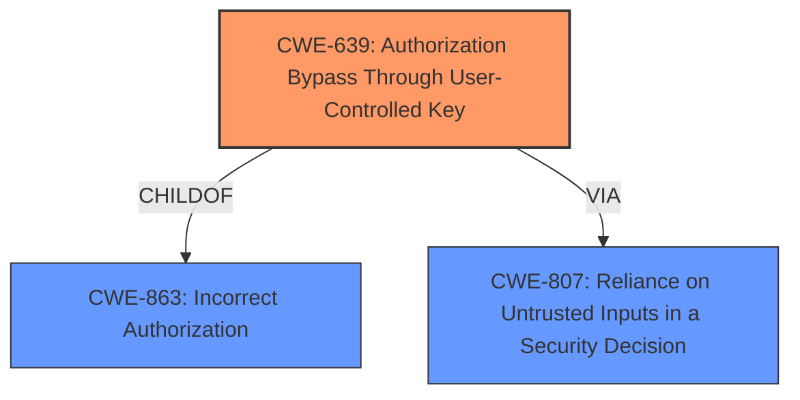

# Analysis for CVE-2022-23654

# Summary
| CWE ID | CWE Name | Confidence | CWE Abstraction Level | CWE Vulnerability Mapping Label | CWE-Vulnerability Mapping Notes |
|---|---|---|---|---|---|
| CWE-639 | Authorization Bypass Through User-Controlled Key | 0.9 | Base | Allowed | Primary CWE |
| CWE-807 | Reliance on Untrusted Inputs in a Security Decision | 0.7 | Base | Allowed | Secondary CWE |
| CWE-863 | Incorrect Authorization | 0.6 | Class | Allowed-with-Review | Secondary CWE |

## Evidence and Confidence

*   **Confidence Score:** 0.8
*   **Evidence Strength:** HIGH

## Relationship Analysis
The primary CWE is CWE-639, which falls under CWE-863 (Incorrect Authorization). CWE-807 is related as the **untrusted user-provided value** is used in the **incorrect authorization**. The relationships show how data flows and how the **incorrect authorization** occurs due to the **reliance on untrusted inputs**.

## Vulnerability Chain
The vulnerability chain starts with the **reliance on user-provided input** (the target page ID). The **access control incorrectly checks the path access against the user-provided values instead of the actual path associated with the page ID**. This leads to an **authorization bypass**, allowing an authenticated user to update a page outside their allowed paths.

## Summary of Analysis
The primary weakness lies in the **improper authorization** logic that relies on user-controlled input. The system **fails to properly validate the user-provided page ID against the actual path associated with the page**, leading to the bypass. This is supported by the **Vulnerability Description Key Phrases**, which states the **rootcause** is "access control incorrectly check the path access against the user-provided values instead of the actual path associated to the page ID". The **CVE Reference Links Content Summary** confirms that the vulnerability stems from an **improper access control check** when updating a page, and the system **incorrectly verifies write access against user-provided path values instead of the actual path associated with the page ID**.

CWE-639, Authorization Bypass Through User-Controlled Key, is selected as the primary CWE because the attacker is able to modify the key value (page ID) to access another user's data (page). This aligns with the description of CWE-639: "The system's authorization functionality does not prevent one user from gaining access to another user's data or record by modifying the key value identifying the data."

CWE-807, Reliance on Untrusted Inputs in a Security Decision, is selected as a secondary CWE because the vulnerability stems from the system's reliance on the user-provided page ID for authorization decisions. This aligns with the description of CWE-807: "The product uses a protection mechanism that relies on the existence or values of an input, but the input can be modified by an untrusted actor in a way that bypasses the protection mechanism."

CWE-863, Incorrect Authorization, is also selected as a secondary CWE. It is a broader class that encompasses the specific authorization bypass.

Other CWEs considered but not used:

*   CWE-22, Improper Limitation of a Pathname to a Restricted Directory ('Path Traversal'): While the impact involves accessing pages outside the allowed paths, the **root cause** is not a path traversal issue but an authorization bypass. The path itself remains valid, but the authorization check **fails** because it relies on the user-provided page ID.
*   CWE-59, Improper Link Resolution Before File Access ('Link Following'): This CWE is not applicable because the vulnerability does not involve symbolic links or shortcuts.
*   CWE-367, Time-of-check Time-of-use (TOCTOU) Race Condition: This CWE is not applicable as the vulnerability is not related to a race condition.
*   CWE-471, Modification of Assumed-Immutable Data (MAID): This is not directly related. The page ID is modifiable, but the core issue is that this modification isn't properly validated against access control.
*   CWE-1385, Missing Origin Validation in WebSockets: This CWE is not applicable as the vulnerability does not involve WebSockets.
*   CWE-116, Improper Encoding or Escaping of Output: This is not related to the vulnerability description.
*   CWE-201, Insertion of Sensitive Information Into Sent Data: This is not related to the vulnerability description.

The selected CWEs are at the appropriate level of specificity. CWE-639 accurately captures the **root cause** of the vulnerability, while CWE-807 and CWE-863 provide additional context.