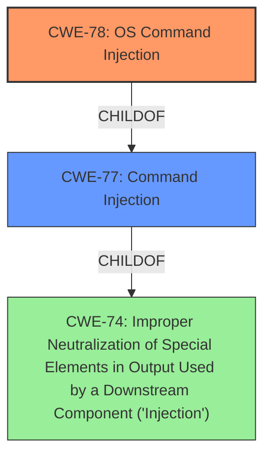

# Analysis for CVE-2022-23661

# Summary
| CWE ID | CWE Name | Confidence | CWE Abstraction Level | CWE Vulnerability Mapping Label | CWE-Vulnerability Mapping Notes |
|---|---|---|---|---|---|
| CWE-78 | Improper Neutralization of Special Elements used in an OS Command ('OS Command Injection') | 1.0 | Base | Allowed | Primary CWE |

## Evidence and Confidence

*   **Confidence Score:** 1.0
*   **Evidence Strength:** HIGH

## Relationship Analysis
The primary relationship is that CWE-78 is a base CWE, focusing on the specific case of OS command injection, making it more specific than its parent, CWE-77, which covers command injection more broadly.

## Vulnerability Chain
The chain of the vulnerability is a follows:
1.  **Root Cause:** Improper neutralization of special elements in OS commands.
2.  **Weakness:** **Command injection** vulnerability.
3.  **Impact:** An authenticated remote attacker can inject commands.

## Summary of Analysis
The vulnerability description clearly states a **command injection** vulnerability in Aruba ClearPass Policy Manager. The primary CWE match from the provided data is CWE-78, "Improper Neutralization of Special Elements used in an OS Command ('OS Command Injection')." This aligns directly with the vulnerability description's mention of **command injection**.

The evidence supporting this decision is strong, and the retriever results also list CWE-78 as a top candidate. The description matches the scenario where the product constructs an OS command using external input without proper neutralization.

The selection of CWE-78 is at the optimal level of specificity, as it directly addresses the **OS command injection** rather than a more general injection issue.

Relevant CWE Information:

# Enhanced Context (25 CWEs)

## CWE-77: Improper Neutralization of Special Elements used in a Command ('Command Injection')
This CWE was considered, but CWE-78 is more specific since the command injection involves OS commands.
## CWE-22: Improper Limitation of a Pathname to a Restricted Directory ('Path Traversal')
This CWE was considered but is not relevant because the vulnerability is about **command injection**, not path traversal.
## CWE-89: Improper Neutralization of Special Elements used in an SQL Command ('SQL Injection')
This CWE was considered but is not relevant because the vulnerability is about **command injection**, not SQL injection.
## CWE-23: Relative Path Traversal
This CWE was considered but is not relevant because the vulnerability is about **command injection**, not path traversal.
## CWE-269: Improper Privilege Management
This CWE was considered but is not relevant because the description explicitly refers to command injection.
## CWE-73: External Control of File Name or Path
This CWE was considered but is not relevant because the vulnerability is about **command injection**, not file path manipulation.
## CWE-284: Improper Access Control
This CWE was considered but is not relevant because the description explicitly refers to command injection.
## CWE-74: Improper Neutralization of Special Elements in Output Used by a Downstream Component ('Injection')
This CWE was considered but is too high-level; CWE-78 provides more specificity.
## CWE-94: Improper Control of Generation of Code ('Code Injection')
This CWE was considered, but CWE-78 is more relevant as it directly addresses the **OS command injection** vulnerability.