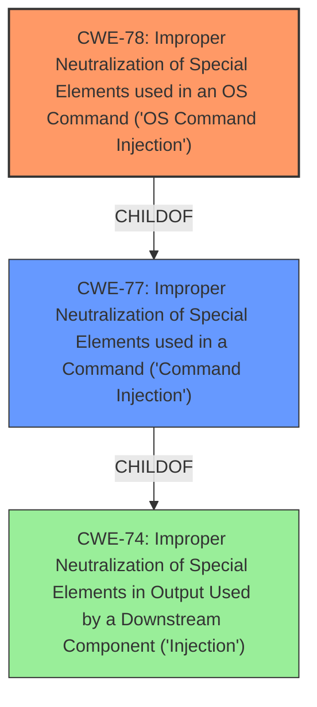

# Raw Analyzer Response for CVE-2022-23663

# Summary
| CWE ID | CWE Name | Confidence | CWE Abstraction Level | CWE Vulnerability Mapping Label | CWE-Vulnerability Mapping Notes |
|---|---|---|---|---|---|
| CWE-78 | Improper Neutralization of Special Elements used in an OS Command ('OS Command Injection') | 1.0 | Base | Allowed | Primary CWE |

## Evidence and Confidence

*   **Confidence Score:** 1.0
*   **Evidence Strength:** HIGH

## Relationship Analysis
The primary relationship is that CWE-78 is a base CWE, providing a more specific classification of **command injection** than its parent class CWE-77. The vulnerability description explicitly mentions **command injection**, making CWE-78 the more fitting choice.

## Vulnerability Chain
The vulnerability chain starts with the software **failing to neutralize special elements** within externally influenced input, leading to the ability to inject OS commands. The result is arbitrary command execution on the system.

## Summary of Analysis
The initial assessment identified CWE-78 as the most suitable CWE based on the **Vulnerability Description**, which explicitly mentions **command injection**, and the **Primary CWE Match** which also suggests CWE-78. The Retriever Results also list CWE-78 as a strong candidate.

The vulnerability description states: "A authenticated remote **command injection** vulnerability was discovered in Aruba ClearPass Policy Manager version(s) 6.10.4 and below, 6.9.9 and below, 6.8.9-HF2 and below, 6.7.x and below. Aruba has released updates to ClearPass Policy Manager that address this security vulnerability."

The relationship analysis confirms that CWE-78 is a more specific (Base) form of CWE-77 (Class), and is directly related to the described vulnerability. The mapping guidance for CWE-78 encourages its use when appropriate, further supporting the selection.

CWE-78 is selected at the optimal level of specificity, as it directly describes the **command injection** vulnerability, which is the root cause.

Relevant CWE Information:

# Enhanced Context (25 CWEs)
The following CWEs were identified as potentially relevant to this vulnerability:

## CWE-74: Improper Neutralization of Special Elements in Output Used by a Downstream Component ('Injection')
**Abstraction Level**: Class
**Similarity Score**: 0.75
**Source**: dense

**Description**:
The product constructs all or part of a command, data structure, or record using externally-influenced input from an upstream component, but it does not neutralize or incorrectly neutralizes special elements that could modify how it is parsed or interpreted when it is sent to a downstream component.

**Mapping Guidance**:
- Usage: Discouraged
- Rationale: CWE-74 is high-level and often misused when lower-level weaknesses are more appropriate.

## CWE-78: Improper Neutralization of Special Elements used in an OS Command ('OS Command Injection')
**Abstraction Level:** Base
**Status:** Stable

### Description
The product constructs all or part of an OS command using externally-influenced input from an upstream component, but it does not neutralize or incorrectly neutralizes special elements that could modify the intended OS command when it is sent to a downstream component.