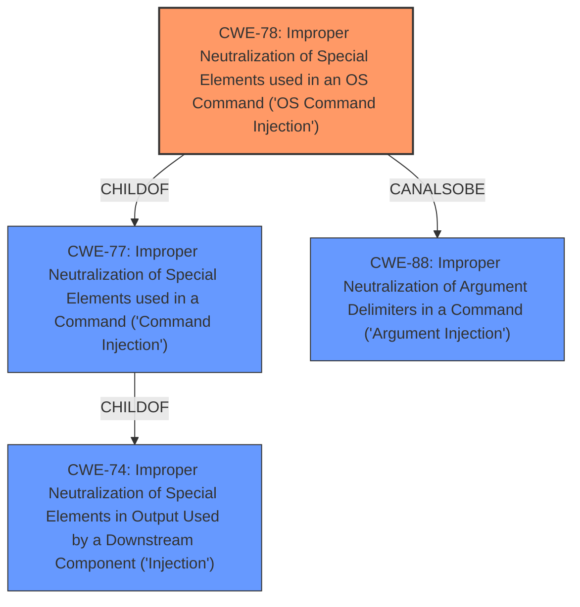

# Enhanced Analysis for CVE-2022-23664

# Summary
| CWE ID | CWE Name | Confidence | CWE Abstraction Level | CWE Vulnerability Mapping Label | CWE-Vulnerability Mapping Notes |
|---|---|---|---|---|---|
| CWE-78 | Improper Neutralization of Special Elements used in an OS Command ('OS Command Injection') | 1.0 | Base | Allowed | Primary CWE |

## Evidence and Confidence

*   **Confidence Score:** 1.0
*   **Evidence Strength:** HIGH

## Relationship Analysis
The primary relationship influencing the decision is the ChildOf relationship between CWE-78 and CWE-77, and CWE-77's relationship as ChildOf CWE-74. While CWE-77 is a broader category of command injection, the description specifically mentions an "OS command injection", thus making CWE-78 a more appropriate and specific fit. The CanAlsoBe relationship to CWE-88 (Argument Injection) was considered, but the provided vulnerability description does not have sufficient detail to confirm this.



## Vulnerability Chain
The chain of events in this vulnerability is:
1.  **Root Cause:** **Improper Neutralization of Special Elements used in an OS Command** (CWE-78). The application fails to properly sanitize input, allowing an attacker to inject OS commands.
2.  **Impact:** Execution of arbitrary OS commands on the system.

## Summary of Analysis
The initial assessment correctly identified CWE-78 as the primary weakness due to the explicit mention of "**command injection**" in the vulnerability description. The Retriever Results also strongly suggest CWE-78 and CWE-77. The final decision to use CWE-78 is based on its greater specificity compared to CWE-77, as it directly addresses OS command injection.

The primary evidence for this is the "**weakness: command injection**" phrase from the "Vulnerability Description Key Phrases" section.
The description aligns perfectly with CWE-78's description: "The product constructs all or part of an OS command using externally-influenced input from an upstream component, but it does not neutralize or incorrectly neutralizes special elements that could modify the intended OS command when it is sent to a downstream component."

Other CWEs were considered but ultimately deemed less suitable:

*   CWE-77: While related, it's a more general form of command injection. Since the description specifies OS commands, CWE-78 is more accurate.
*   CWE-22 and CWE-23: These are related to path traversal vulnerabilities, which are not indicated in the vulnerability description.
*   CWE-89: This is related to SQL injection, which is not indicated in the vulnerability description.
*   CWE-269 and CWE-284: These relate to privilege management and access control issues. While command injection *could* lead to privilege escalation, the root cause is the lack of input sanitization, not a direct privilege management flaw.

The decision to select CWE-78 is supported by the MITRE mapping guidance, which marks it as "Allowed" and notes that it's at the Base level of abstraction, a preferred level for mapping root causes. The selection of CWE-78 is at the optimal level of specificity, as it precisely captures the nature of the **command injection** vulnerability.


## CWE Relationship Analysis

Current CWEs represent these abstraction levels: .


### Vulnerability Chain Analysis

**Chain starting from CWE-89:**
- 89 (Improper Neutralization of Special Elements used in an SQL Command ('SQL Injection')) - ROOT


**Chain starting from CWE-78:**
- 78 (Improper Neutralization of Special Elements used in an OS Command ('OS Command Injection')) - ROOT


### CWE Relationship Diagram

```mermaid
graph TD
    classDef primary fill:#f96,stroke:#333,stroke-width:2px
    classDef secondary fill:#69f,stroke:#333
    classDef tertiary fill:#9e9,stroke:#333
```