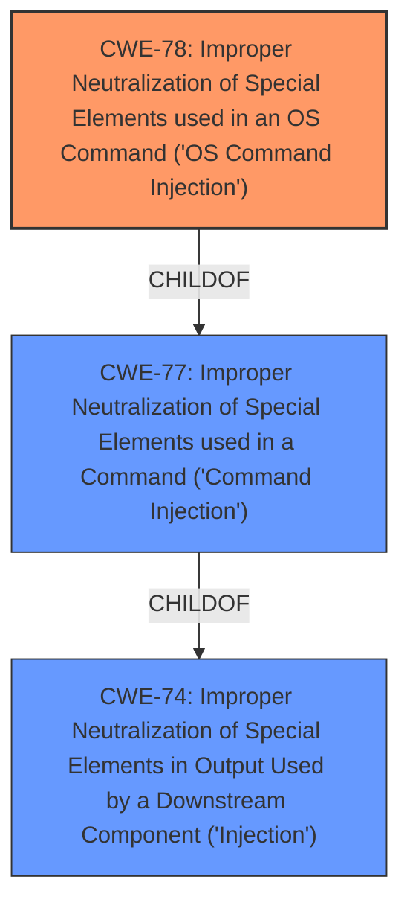

# Enhanced Analysis for CVE-2022-23666

# Summary
| CWE ID | CWE Name | Confidence | CWE Abstraction Level | CWE Vulnerability Mapping Label | CWE-Vulnerability Mapping Notes |
|---|---|---|---|---|---|
| CWE-78 | Improper Neutralization of Special Elements used in an OS Command ('OS Command Injection') | 1.0 | Base | Allowed | Primary CWE |

## Evidence and Confidence

*   **Confidence Score:** 1.0
*   **Evidence Strength:** HIGH

## Relationship Analysis
The primary relationship that influenced the decision was the hierarchical relationship between CWE-77 and CWE-78, where CWE-78 is a base-level child of the class-level CWE-77. Additionally, the alternate terms associated with CWE-78, specifically "Shell injection", further solidified its relevance. No chain relationships were relevant.



## Vulnerability Chain
The vulnerability chain consists of:
1.  **Root Cause:** Improper Neutralization of Special Elements used in an OS Command (CWE-78)
2.  **Impact:** Execution of arbitrary OS commands due to the injection vulnerability.

## Summary of Analysis
The initial analysis focused on identifying the root cause of the vulnerability, which the description clearly states as a **command injection** vulnerability. The primary CWE match from similar CVE descriptions is CWE-78, which aligns directly with the vulnerability's root cause.

The vulnerability description explicitly mentions "**command injection** vulnerability". The phrase "**command injection**" is the key indicator.

CWE-78 (Improper Neutralization of Special Elements used in an OS Command) is the most specific and appropriate choice. It is a base-level CWE, which is preferred, and it directly addresses the **command injection** vulnerability.

The selection of CWE-78 is based on the explicit mention of "**command injection**" in the vulnerability description and the alignment of CWE-78's description with the vulnerability's root cause. The relationship analysis and mapping guidance further support this selection.

Relevant CWE Information:

# Enhanced Context (25 CWEs)
The following CWEs were identified as potentially relevant to this vulnerability:

## CWE-74: Improper Neutralization of Special Elements in Output Used by a Downstream Component ('Injection')
**Abstraction Level**: Class
**Similarity Score**: 0.75
**Source**: dense

**Description**:
The product constructs all or part of a command, data structure, or record using externally-influenced input from an upstream component, but it does not neutralize or incorrectly neutralizes special elements that could modify how it is parsed or interpreted when it is sent to a downstream component.

**Mapping Guidance**:
- Usage: Discouraged
- Rationale: CWE-74 is high-level and often misused when lower-level weaknesses are more appropriate.

## CWE-78: Improper Neutralization of Special Elements used in an OS Command ('OS Command Injection')
**Abstraction Level**: base
**Similarity Score**: 5.03
**Source**: graph

**Description**:
CWE-78: Improper Neutralization of Special Elements used in an OS Command ('OS Command Injection')

**Mapping Guidance**:
- Usage: Allowed
- Rationale: This CWE entry is at the Base level of abstraction, which is a preferred level of abstraction for mapping to the root causes of vulnerabilities.

**Relationships**:
- CANFOLLOW -> CWE-184
- CANALSOBE -> CWE-88
- CHILDOF -> CWE-77
- CHILDOF -> CWE-77
- CHILDOF -> CWE-74


## CWE Relationship Analysis

Current CWEs represent these abstraction levels: .


### Vulnerability Chain Analysis

**Chain starting from CWE-184:**
- 184 (Incomplete List of Disallowed Inputs) - ROOT


**Chain starting from CWE-78:**
- 78 (Improper Neutralization of Special Elements used in an OS Command ('OS Command Injection')) - ROOT


### CWE Relationship Diagram

```mermaid
graph TD
    classDef primary fill:#f96,stroke:#333,stroke-width:2px
    classDef secondary fill:#69f,stroke:#333
    classDef tertiary fill:#9e9,stroke:#333
```