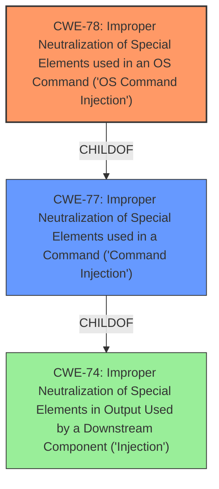

# Analysis for CVE-2022-23667

# Summary
| CWE ID | CWE Name | Confidence | CWE Abstraction Level | CWE Vulnerability Mapping Label | CWE-Vulnerability Mapping Notes |
|---|---|---|---|---|---|
| CWE-78 | Improper Neutralization of Special Elements used in an OS Command ('OS Command Injection') | 1.0 | Base | Allowed | Primary CWE |
| CWE-77 | Improper Neutralization of Special Elements used in a Command ('Command Injection') | 0.5 | Class | Allowed-with-Review | Secondary Candidate |

## Evidence and Confidence

*   **Confidence Score:** 1.0
*   **Evidence Strength:** HIGH

## Relationship Analysis
The primary CWE is CWE-78, which is a Base level weakness and a child of the Class level CWE-77. The relationship between CWE-78 and CWE-77 influenced the selection, where CWE-78 is a more specific instance of CWE-77.

## Vulnerability Chain
The chain of root cause and weaknesses that followed for the Vulnerability Description:
  - The application fails to neutralize special elements in an OS command.
  - An authenticated remote attacker exploits this **command injection** vulnerability.
  - The attacker can then execute arbitrary commands on the system.

## Summary of Analysis
The vulnerability description clearly states a **command injection** vulnerability exists in Aruba ClearPass Policy Manager. The primary CWE match from similar CVE descriptions and the Retriever Results is CWE-78 [CWE-78: Improper Neutralization of Special Elements used in an OS Command ('OS Command Injection')]. This aligns with the description of the vulnerability.

The selection of CWE-78 is based on the following evidence:
* Vulnerability Description Key Phrases: "**weakness:** **command injection**"
* CWE for similar CVE Descriptions: "Primary CWE Match: CWE-78"
* Retriever Results: "2 | 78 | Improper Neutralization of Special Elements used in an OS Command ('OS Command Injection') | Base | Allowed | alternate_terms | 0.700"

CWE-78 is at the Base level of abstraction, which is preferred for mapping root causes, and its usage is "Allowed" according to MITRE's mapping guidance.

CWE-77 [CWE-77: Improper Neutralization of Special Elements used in a Command ('Command Injection')] was also considered, as it is a parent of CWE-78. However, since the vulnerability specifically involves OS commands, CWE-78 is a more precise and appropriate choice. The usage for CWE-77 is "Allowed-with-Review" with the comment "CWE-77 is often misused when OS command injection (CWE-78) was intended instead." Given the specific mention of OS commands, CWE-78 is a better fit.

CWE-22 [CWE-22: Improper Limitation of a Pathname to a Restricted Directory ('Path Traversal')], CWE-89 [CWE-89: Improper Neutralization of Special Elements used in an SQL Command ('SQL Injection')], and CWE-23 [CWE-23: Relative Path Traversal] were also considered, but these relate to path traversal and SQL injection, respectively, and do not match the description of a **command injection** vulnerability.

CWE-269 [CWE-269: Improper Privilege Management] and CWE-284 [CWE-284: Improper Access Control] are too high-level and are discouraged by MITRE.
CWE-74 [CWE-74: Improper Neutralization of Special Elements in Output Used by a Downstream Component ('Injection')] is a parent Class of CWE-78, but CWE-78 is more specific.
CWE-94 [CWE-94: Improper Control of Generation of Code ('Code Injection')] was considered but deemed less appropriate because the vulnerability is about injecting commands, not generating code.

Based on the available evidence and the MITRE mapping guidance, CWE-78 is the most appropriate CWE for this vulnerability.