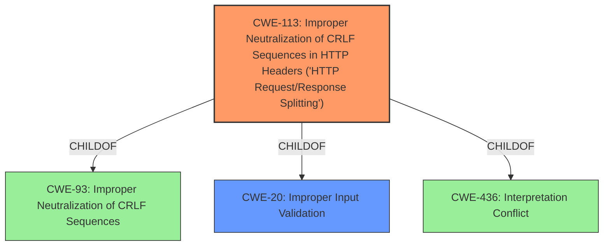

# Analysis Report for CVE-2022-23701

# Vulnerability Analysis Report: CVE-2022-23701

## Description


## Analysis (with Relationship Data)

# Summary

| CWE ID | CWE Name | Confidence | CWE Abstraction Level | CWE Vulnerability Mapping Label | CWE-Vulnerability Mapping Notes |
|---|---|---|---|---|---|
| CWE-113 | Improper Neutralization of CRLF Sequences in HTTP Headers ('HTTP Request/Response Splitting') | 0.9 | Variant | Primary | Allowed |
| CWE-20 | Improper Input Validation | 0.6 | Class | Secondary | Discouraged |

## Evidence and Confidence

*   **Confidence Score:** 0.75
*   **Evidence Strength:** MEDIUM

## Relationship Analysis
The primary CWE identified is CWE-113, which is a Variant of CWE-93 (Improper Neutralization of CRLF Sequences). CWE-113 also has a ChildOf relationship with CWE-20 (Improper Input Validation) and CWE-436 (Interpretation Conflict). These relationships highlight that the core issue stems from **improper input sanitization** leading to the potential for HTTP Request/Response Splitting. While CWE-20 is a parent, CWE-113 provides a more specific classification aligning with the vulnerability description.



## Vulnerability Chain
The vulnerability chain begins with **improper input sanitization**. This allows an attacker to supply invalid input to the iLO 4 webserver, leading to a **remote host header injection**. The final impact is that the webserver responds with a redirect to an attacker-controlled domain.

Improper Input Sanitization -> Remote Host Header Injection -> Redirect to Attacker-Controlled Domain

## Summary of Analysis
The initial assessment identified CWE-113 as the primary candidate based on the **weakness** being a **remote host header injection** and the **rootcause** of **improper input sanitization**. The vulnerability description clearly indicates that the iLO 4 webserver does not properly neutralize CRLF sequences in HTTP headers, leading to the possibility of HTTP Request/Response Splitting. This directly aligns with the description of CWE-113.

The retriever results also support this assessment, with CWE-113 appearing as a relevant candidate. CWE-74 and CWE-79 were considered but deemed less specific. CWE-20 (Improper Input Validation) was considered as a secondary weakness since it is a broader classification that encompasses the **improper input sanitization**, but CWE-113 more precisely describes the specific type of **improper neutralization** occurring.

The relationships outlined in the relationship analysis section also influenced the final selection, reinforcing the connection between **improper input sanitization** and the resulting HTTP Request/Response Splitting.

Based on the available evidence and the relationship analysis, CWE-113 is the optimal choice for this vulnerability.

Relevant CWE Information:

# Enhanced Context (25 CWEs)
The following CWEs were identified as potentially relevant to this vulnerability:

## CWE-113: Improper Neutralization of CRLF Sequences in HTTP Headers ('HTTP Request/Response Splitting')
**Abstraction Level**: Variant
**Similarity Score**: 0.79
**Source**: dense

**Description**:
The product receives data from an HTTP agent/component (e.g., web server, proxy, browser, etc.), but it does not neutralize or incorrectly neutralizes CR and LF characters before the data is included in outgoing HTTP headers.

**Mapping Guidance**:
- Usage: Allowed
- Rationale: This CWE entry is at the Variant level of abstraction, which is a preferred level of abstraction for mapping to the root causes of vulnerabilities.

## CWE-20: Improper Input Validation
**Abstraction Level**: Class
**Similarity Score**: 0.388
**Source**: sparse

**Description**:
The product receives input or data, but it does
        not validate or incorrectly validates that the input has the
        properties that are required to process the data safely and
        correctly.

**Mapping Guidance**:
- Usage: Discouraged

## CWE-74: Improper Neutralization of Special Elements in Output Used by a Downstream Component ('Injection')
**Abstraction Level**: Class
**Similarity Score**: 0.77
**Source**: dense

**Description**:
The product constructs all or part of a command, data structure, or record using externally-influenced input from an upstream component, but it does not neutralize or incorrectly neutralizes special elements that could modify how it is parsed or interpreted when it is sent to a downstream component.

**Mapping Guidance**:
- Usage: Discouraged

## CWE-79: Improper Neutralization of Input During Web Page Generation ('Cross-site Scripting')
**Abstraction Level**: Base
**Similarity Score**: 0.76
**Source**: dense

**Description**:
The product does not neutralize or incorrectly neutralizes user-controllable input before it is placed in output that is used as a web page that is served to other users.

**Mapping Guidance**:
- Usage: Allowed

### Detailed Analysis of Selected CWEs:

*   **CWE-113: Improper Neutralization of CRLF Sequences in HTTP Headers ('HTTP Request/Response Splitting')**
    *   **Match:** The vulnerability description specifically mentions the possibility of supplying invalid input causing a redirect, which aligns with the impact of CWE-113.
    *   **Explanation:** The vulnerability allows an attacker to inject CRLF sequences into HTTP headers, potentially leading to the server misinterpreting the HTTP stream and redirecting users to an attacker-controlled domain. This matches the extended description of CWE-113, which discusses how unexpected data in HTTP headers can lead to attacks such as server-side request forgery and cache poisoning.
    *   **Relationships:** CWE-113 is a variant, making it a more specific choice than its parent classes.
    *   **Guidance:** The mapping guidance recommends using the variant level of abstraction, which supports this selection.

*   **CWE-20: Improper Input Validation**
    *   **Match:** The vulnerability stems from **improper input sanitization**, which is a form of **improper input validation**.
    *   **Explanation:** While CWE-20 is a broader category, the root cause of the vulnerability lies in the iLO 4 webserver's failure to adequately validate and sanitize input before including it in HTTP headers.
    *   **Relationships:** CWE-20 is a class and a parent to CWE-113.
    *   **Guidance:** The mapping guidance discourages using CWE-20 when more specific CWEs are available, but it is still a valid secondary consideration as it represents the general class of error.

### CWEs Considered But Not Used:

*   **CWE-74: Improper Neutralization of Special Elements in Output Used by a Downstream Component ('Injection')** - While this could be considered, it's too broad. The vulnerability is more specifically related to CRLF injection in HTTP headers, making CWE-113 a better fit.
*   **CWE-79: Improper Neutralization of Input During Web Page Generation ('Cross-site Scripting')** - This CWE relates to Cross-site Scripting vulnerabilities. The described vulnerability focuses on HTTP header manipulation for redirection, not script injection into web pages, making CWE-113 a more appropriate selection.
*   **CWE-78: Improper Neutralization of Special Elements used in an OS Command ('OS Command Injection')** - The vulnerability does not involve OS command injection, making this CWE irrelevant.
*   **CWE-1284: Improper Validation of Specified Quantity in Input** - This CWE is about validating quantities, which is not relevant to this vulnerability.

The final decision to prioritize CWE-113 is primarily based on the specific description of the vulnerability involving **remote host header injection** due to **improper input sanitization**, aligning perfectly with the characteristics of HTTP Request/Response Splitting.


## CWE Relationship Analysis

Current CWEs represent these abstraction levels: .


### Vulnerability Chain Analysis

**Chain starting from CWE-436:**
- 436 (Interpretation Conflict) - ROOT


**Chain starting from CWE-20:**
- 20 (Improper Input Validation) - ROOT


### CWE Relationship Diagram

```mermaid
graph TD
    classDef primary fill:#f96,stroke:#333,stroke-width:2px
    classDef secondary fill:#69f,stroke:#333
    classDef tertiary fill:#9e9,stroke:#333
```


*Report generated on 2025-03-30 13:16:39*
