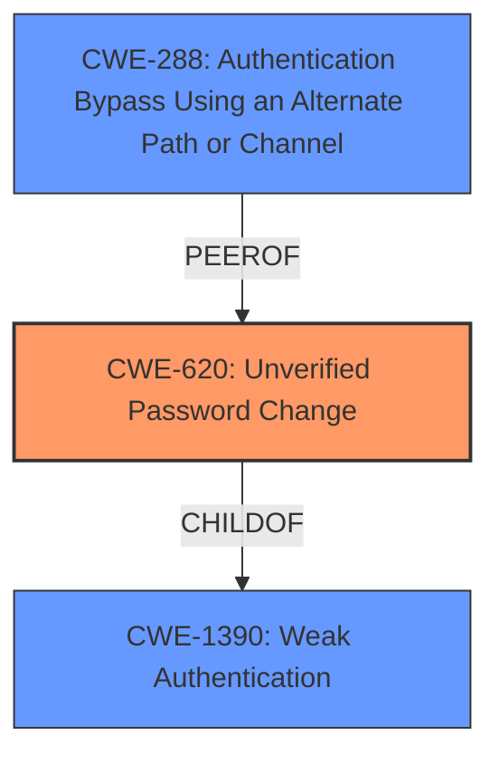

# Enhanced Analysis for CVE-2022-23722

# Summary
| CWE ID | CWE Name | Confidence | CWE Abstraction Level | CWE Vulnerability Mapping Label | CWE-Vulnerability Mapping Notes |
|---|---|---|---|---|---|
| CWE-620 | Unverified Password Change | 0.9 | Base | Primary | Allowed |
| CWE-288 | Authentication Bypass Using an Alternate Path or Channel | 0.6 | Base | Secondary | Allowed |
| CWE-1390 | Weak Authentication | 0.5 | Class | Secondary | Allowed-with-Review |

## Evidence and Confidence

*   **Confidence Score:** 0.8
*   **Evidence Strength:** MEDIUM

## Relationship Analysis
The primary CWE selected is CWE-620 (Unverified Password Change), which accurately reflects the **lack of verification** during the password reset process. CWE-1390 (Weak Authentication) is a broader classification that encompasses various authentication weaknesses, including unverified password changes. It is a parent of CWE-620. CWE-288 (Authentication Bypass Using an Alternate Path or Channel) is considered because an existing user is able to reset another user's password which could be seen as bypassing authentication.



## Vulnerability Chain
The vulnerability chain starts with a **lack of proper verification** during the password reset process (CWE-620), leading to the ability for an existing user to reset another user's password, effectively **bypassing authentication** (CWE-288). This highlights a flaw in the authentication mechanism (CWE-1390).

## Summary of Analysis
The primary vulnerability is that the password reset mechanism **does not properly verify** the user's identity before allowing a password reset. This aligns directly with CWE-620's description: "When setting a new password for a user, the product does not require knowledge of the original password, or using another form of authentication." The evidence from the vulnerability description is: "When a password reset mechanism is configured to use the Authentication API with an Authentication Policy, email One-Time Password, PingID or SMS authentication, an existing user can reset another existing users password."

The graph relationships show that CWE-620 is a child of CWE-1390, indicating a more specific type of weak authentication. While CWE-1390 could be considered, CWE-620 provides a more precise classification of the vulnerability. CWE-288 is a peer of CWE-620 since the lack of password verification can also be seen as bypassing authentication since an existing user is able to reset another user's password.

The selected CWEs are at the optimal level of specificity because they directly address the **root cause** of the vulnerability (CWE-620) and its broader implications (CWE-1390 and CWE-288). CWE-620 is the most specific and accurate representation of the weakness.

Relevant CWE Information:
# Enhanced Context (25 CWEs)
The following CWEs were identified as potentially relevant to this vulnerability:

## CWE-303: Incorrect Implementation of Authentication Algorithm
**Abstraction Level**: Base
**Similarity Score**: 0.80
**Source**: dense

**Description**:
The requirements for the product dictate the use of an established authentication algorithm, but the implementation of the algorithm is incorrect.

**Mapping Guidance**:
- Usage: Allowed
- Rationale: This CWE entry is at the Base level of abstraction, which is a preferred level of abstraction for mapping to the root causes of vulnerabilities.

*Not Selected*: Although there might be an incorrect implementation, the description does not provide enough information for this to be a good fit.

## CWE-1391: Use of Weak Credentials
**Abstraction Level**: Class
**Similarity Score**: 0.79
**Source**: dense

**Description**:
The product uses weak credentials (such as a default key or hard-coded password) that can be calculated, derived, reused, or guessed by an attacker.

**Mapping Guidance**:
- Usage: Allowed-with-Review
- Rationale: This CWE entry is a Class and might have Base-level children that would be more appropriate

*Not Selected*: The vulnerability isn't related to weak credentials but rather the **lack of verification**.

## CWE-288: Authentication Bypass Using an Alternate Path or Channel
**Abstraction Level**: Base
**Similarity Score**: 0.78
**Source**: dense

**Description**:
The product requires authentication, but the product has an alternate path or channel that does not require authentication.

**Mapping Guidance**:
- Usage: Allowed
- Rationale: This CWE entry is at the Base level of abstraction, which is a preferred level of abstraction for mapping to the root causes of vulnerabilities.

*Selected*: The vulnerability allows an existing user to reset another user's password which could be seen as bypassing authentication.

## CWE-1390: Weak Authentication
**Abstraction Level**: Class
**Similarity Score**: 0.78
**Source**: dense

**Description**:
The product uses an authentication mechanism to restrict access to specific users or identities, but the mechanism does not sufficiently prove that the claimed identity is correct.

**Mapping Guidance**:
- Usage: Allowed-with-Review
- Rationale: This CWE entry is a Class and might have Base-level children that would be more appropriate

*Selected*: This vulnerability demonstrates a **weakness in the authentication** mechanism.

## CWE-807: Reliance on Untrusted Inputs in a Security Decision
**Abstraction Level**: Base
**Similarity Score**: 0.77
**Source**: dense

**Description**:
The product uses a protection mechanism that relies on the existence or values of an input, but the input can be modified by an untrusted actor in a way that bypasses the protection mechanism.

**Mapping Guidance**:
- Usage: Allowed
- Rationale: This CWE entry is at the Base level of abstraction, which is a preferred level of abstraction for mapping to the root causes of vulnerabilities.

*Not Selected*: There is nothing in the vulnerability description to indicate that the reliance on untrusted inputs is a factor.

## CWE-307: Improper Restriction of Excessive Authentication Attempts
**Abstraction Level**: Base
**Similarity Score**: 0.77
**Source**: dense

**Description**:
The product does not implement sufficient measures to prevent multiple failed authentication attempts within a short time frame.

**Mapping Guidance**:
- Usage: Allowed
- Rationale: This CWE entry is at the Base level of abstraction, which is a preferred level of abstraction for mapping to the root causes of vulnerabilities.

*Not Selected*: This is not related to excessive authentication attempts but rather the **lack of verification** in the password reset mechanism.

## CWE-305: Authentication Bypass by Primary Weakness
**Abstraction Level**: Base
**Similarity Score**: 0.77
**Source**: dense

**Description**:
The authentication algorithm is sound, but the implemented mechanism can be bypassed as the result of a separate weakness that is primary to the authentication error.

**Mapping Guidance**:
- Usage: Allowed
- Rationale: This CWE entry is at the Base level of abstraction, which is a preferred level of abstraction for mapping to the root causes of vulnerabilities.

*Not Selected*: The description does not indicate a bypass due to a separate weakness.

## CWE-204: Observable Response Discrepancy
**Abstraction Level**: Base
**Similarity Score**: 0.76
**Source**: dense

**Description**:
The product provides different responses to incoming requests in a way that reveals internal state information to an unauthorized actor outside of the intended control sphere.

**Mapping Guidance**:
- Usage: Allowed
- Rationale: This CWE entry is at the Base level of abstraction, which is a preferred level of abstraction for mapping to the root causes of vulnerabilities.

*Not Selected*: The vulnerability is not about information leakage through observable response discrepancies.

## CWE-798: Use of Hard-coded Credentials
**Abstraction Level**: Base
**Similarity Score**: 0.76
**Source**: dense

**Description**:
The product contains hard-coded credentials, such as a password or cryptographic key.

**Mapping Guidance**:
- Usage: Allowed
- Rationale: This CWE entry is at the Base level of abstraction, which is a preferred level of abstraction for mapping to the root causes of vulnerabilities.

*Not Selected*: The issue is not related to hard-coded credentials.

## CWE-620: Unverified Password Change
**Abstraction Level**: Base
**Similarity Score**: 0.76
**Source**: dense

**Description**:
When setting a new password for a user, the product does not require knowledge of the


## CWE Relationship Analysis

Current CWEs represent these abstraction levels: .


### Vulnerability Chain Analysis

**Chain starting from CWE-305:**
- 305 (Authentication Bypass by Primary Weakness) - ROOT


**Chain starting from CWE-1390:**
- 1390 (Weak Authentication) - ROOT


### CWE Relationship Diagram

```mermaid
graph TD
    classDef primary fill:#f96,stroke:#333,stroke-width:2px
    classDef secondary fill:#69f,stroke:#333
    classDef tertiary fill:#9e9,stroke:#333
```