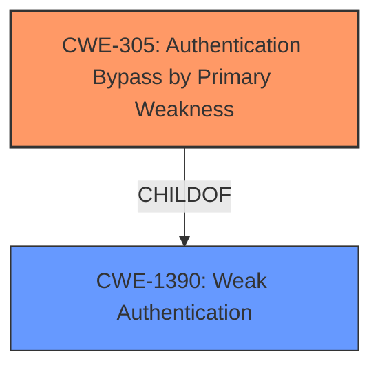

# Enhanced Analysis for CVE-2022-23723

# Summary
| CWE ID  | CWE Name                                                              | Confidence | CWE Abstraction Level | CWE Vulnerability Mapping Label | CWE-Vulnerability Mapping Notes |
| :-------- | :-------------------------------------------------------------------- | :--------- | :---------------------- | :------------------------------ | :------------------------------ |
| CWE-305 | Authentication Bypass by Primary Weakness                             | 0.75       | Base                    | Primary                         | Allowed                       |
| CWE-1390 | Weak Authentication                                                       | 0.60       | Class                   | Secondary                       | Allowed-with-Review         |

## Evidence and Confidence

*   **Confidence Score:** 0.70
*   **Evidence Strength:** LOW

## Relationship Analysis
The primary CWE, CWE-305, is a child of CWE-1390, which indicates a hierarchical relationship where CWE-305 is a more specific type of **weak authentication**. There are no explicit chain relationships indicated in the provided information. The selection of CWE-305 over CWE-1390 is due to its specificity in describing authentication bypass due to a primary weakness, while CWE-1390 is a more general classification.



## Vulnerability Chain
The vulnerability chain starts with an unspecified primary weakness that leads to **MFA bypass**.

## Summary of Analysis
The analysis is based on the provided vulnerability description, which states an **MFA bypass** vulnerability exists in the PingFederate PingOne MFA Integration Kit when adapter HTML templates are used.

The primary CWE selected is CWE-305 (Authentication Bypass by Primary Weakness). This is based on the description mentioning an **MFA bypass** due to some unspecified weakness. The "Retriever Results" also lists CWE-305 with the highest score for the dense retriever, making it a strong candidate. Since the description mentions a **bypass**, the **"Authentication Bypass by Primary Weakness"** description matches.

The secondary CWE considered is CWE-1390 (Weak Authentication), which is a class-level CWE and a parent of CWE-305. The retriever results include CWE-1390 as a candidate. While the vulnerability leads to **MFA bypass**, the root cause isn't specifically identified as a weak authentication mechanism itself, but rather a separate weakness enabling the bypass.

The evidence is weak because there is no "CVE Reference Links Content Summary" section to validate the root cause of the weakness.

Relevant CWE Information:
# Enhanced Context (25 CWEs)
The following CWEs were identified as potentially relevant to this vulnerability:

## CWE-305: Authentication Bypass by Primary Weakness
**Abstraction:** Base
**Status:** Draft

### Description
The authentication algorithm is sound, but the implemented mechanism can be bypassed as the result of a separate weakness that is primary to the authentication error.

### Extended Description
Not provided

### Alternative Terms
None

### Relationships
ChildOf -> CWE-1390

### Mapping Guidance
**Usage:** Allowed
**Rationale:** This CWE entry is at the Base level of abstraction, which is a preferred level of abstraction for mapping to the root causes of vulnerabilities.
**Comments:** Carefully read both the name and description to ensure that this mapping is an appropriate fit. Do not try to 'force' a mapping to a lower-level Base/Variant simply to comply with this preferred level of abstraction.
**Reasons:**
- Acceptable-Use


### Additional Notes
**[Relationship]** Most "authentication bypass" errors are resultant, not primary.

## CWE-1390: Weak Authentication
**Abstraction:** Class
**Status:** Incomplete

### Description
The product uses an authentication mechanism to restrict access to specific users or identities, but the mechanism does not sufficiently prove that the claimed identity is correct.

### Extended Description


Attackers may be able to bypass weak authentication faster and/or with less effort than expected.

### Alternative Terms
None

### Relationships
ChildOf -> CWE-287

### Mapping Guidance
**Usage:** Allowed-with-Review
**Rationale:** This CWE entry is a Class and might have Base-level children that would be more appropriate
**Comments:** Examine children of this entry to see if there is a better fit
**Reasons:**
- Abstraction


## CWE Relationship Analysis

Current CWEs represent these abstraction levels: .


### Vulnerability Chain Analysis

**Chain starting from CWE-1390:**
- 1390 (Weak Authentication) - ROOT


**Chain starting from CWE-305:**
- 305 (Authentication Bypass by Primary Weakness) - ROOT


### CWE Relationship Diagram

```mermaid
graph TD
    classDef primary fill:#f96,stroke:#333,stroke-width:2px
    classDef secondary fill:#69f,stroke:#333
    classDef tertiary fill:#9e9,stroke:#333
```