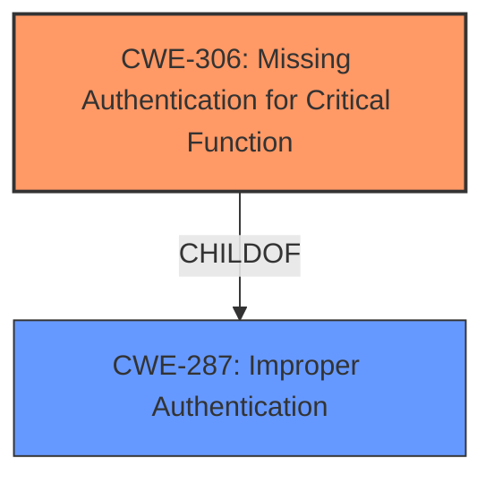

# Analysis for CVE-2022-23729

# Summary
| CWE ID | CWE Name | Confidence | CWE Abstraction Level | CWE Vulnerability Mapping Label | CWE-Vulnerability Mapping Notes |
|---|---|---|---|---|---|
| CWE-306 | Missing Authentication for Critical Function | 0.9 | Base | Allowed | Primary CWE |

## Evidence and Confidence

*   **Confidence Score:** 0.9
*   **Evidence Strength:** HIGH

## Relationship Analysis
The primary relationship influencing the decision is that CWE-306 is a child of CWE-287 (Improper Authentication). While CWE-287 might seem applicable at first glance, CWE-306 is more specific because it directly addresses the **missing authentication** aspect. The tool also suggested CWE-305 (Authentication Bypass by Primary Weakness), but that is not the case because there is no authentication at all.

## Vulnerability Chain
The vulnerability chain is straightforward: the device is in a factory state, and **critical functionality** (access to the shell) lacks authentication, allowing unauthorized access.

## Summary of Analysis
The analysis concludes that CWE-306 (Missing Authentication for Critical Function) is the most appropriate CWE for this vulnerability. This decision is based on the vulnerability description, which explicitly states that the device can access the shell without any authentication process when in the factory state.

The evidence supporting this decision is:
- Vulnerability Description Key Phrases:
  - **impact:** access shell without adb authentication

This aligns directly with the description of CWE-306, which states: "The product does not perform any authentication for functionality that requires a provable user identity or consumes a significant amount of resources." Accessing the shell clearly requires authentication.

The selection of CWE-306 is at the optimal level of specificity. While CWE-287 (Improper Authentication) is a parent of CWE-306, it is a more general classification. CWE-306 directly addresses the specific issue of **missing authentication** for a critical function, making it a more precise and informative classification.

Relevant CWE Information:

# Enhanced Context (25 CWEs)
The following CWEs were identified as potentially relevant to this vulnerability:

## CWE-306: Missing Authentication for Critical Function
**Abstraction:** Base
**Status:** Draft

### Description
The product does not perform any authentication for functionality that requires a provable user identity or consumes a significant amount of resources.

### Extended Description
Not provided

### Alternative Terms
None

### Relationships
ChildOf -> CWE-287
ChildOf -> CWE-287

### Mapping Guidance
**Usage:** Allowed
**Rationale:** This CWE entry is at the Base level of abstraction, which is a preferred level of abstraction for mapping to the root causes of vulnerabilities.
**Comments:** Carefully read both the name and description to ensure that this mapping is an appropriate fit. Do not try to 'force' a mapping to a lower-level Base/Variant simply to comply with this preferred level of abstraction.
**Reasons:**
- Acceptable-Use

### Observed Examples
- **CVE-2022-31260:** Chain: a digital asset management program has an undisclosed backdoor in the legacy version of a PHP script (CWE-912) that could allow an unauthenticated user to export metadata (CWE-306)
- **CVE-2022-29951:** TCP-based protocol in Programmable Logic Controller (PLC) has no authentication.
- **CVE-2022-29952:** Condition Monitor firmware uses a protocol that does not require authentication.