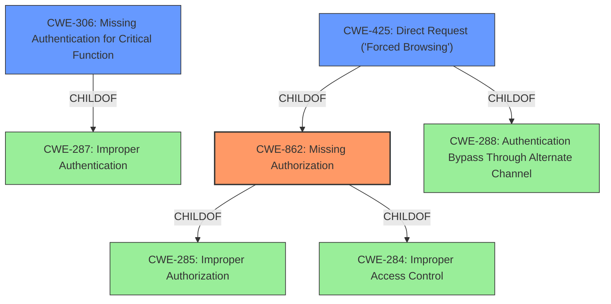

# Raw Analyzer Response for CVE-2022-2373

# Summary
| CWE ID | CWE Name | Confidence | CWE Abstraction Level | CWE Vulnerability Mapping Label | CWE-Vulnerability Mapping Notes |
|---|---|---|---|---|---|
| CWE-862 | Missing Authorization | 1.0 | Class | Primary | Allowed-with-Review |
| CWE-306 | Missing Authentication for Critical Function | 0.7 | Base | Secondary | Allowed |
| CWE-425 | Direct Request ('Forced Browsing') | 0.6 | Base | Secondary | Allowed |

## Evidence and Confidence

*   **Confidence Score:** 0.9
*   **Evidence Strength:** HIGH

## Relationship Analysis
The primary CWE is CWE-862, Missing Authorization, which is a class-level CWE. It has child relationships to CWE-285 (Improper Authorization) and CWE-284 (Improper Access Control). CWE-306, Missing Authentication for Critical Function, is a base-level CWE and a child of CWE-287, Improper Authentication. CWE-425, Direct Request ('Forced Browsing'), is a base-level CWE that has child relationships with CWE-862 and CWE-288 (Authorization Bypass Through Alternate Channel). The choice of CWE-862 as the primary CWE is appropriate because the vulnerability description explicitly mentions **missing authorization**. The other CWEs considered are related to authorization and access control, but they are either too general or not specific enough to accurately represent the vulnerability.

## Vulnerability Chain
The vulnerability chain starts with the **missing authorization** in a REST endpoint. This allows unauthenticated users to directly request and retrieve WordPress user details, such as name and email address.

## Summary of Analysis
The initial analysis focused on the **missing authorization** in the REST endpoint, which allows unauthenticated users to retrieve WordPress user details. The vulnerability description key phrases highlight "**missing authorisation**" as the root cause and "retrieve WordPress users details" as the impact. The CVE Reference Links Content Summary confirms that the REST endpoint `/wp-json/ssa/v1/users` lacks authorization checks.

The Retriever Results identified CWE-862, Missing Authorization, as the top candidate. The description of CWE-862, "The product does not perform an authorization check when an actor attempts to access a resource or perform an action," aligns perfectly with the vulnerability description. The usage is "Allowed-with-Review" because it is a Class and might have Base-level children that would be more appropriate.

CWE-306, Missing Authentication for Critical Function, was considered because it addresses the lack of authentication. While the vulnerability description focuses on authorization, the absence of authentication contributes to the issue. However, since authorization is explicitly mentioned, CWE-862 is more appropriate as the primary CWE.

CWE-425, Direct Request ('Forced Browsing'), was also considered as unauthenticated users can directly request user details.

The final decision is to assign CWE-862 as the primary CWE because it directly addresses the **missing authorization** in the REST endpoint. CWE-306 and CWE-425 are secondary because they relate to the lack of authentication and the ability to directly access the resource, respectively. The selection is at the optimal level of specificity, as CWE-862 is a Class, but its children are not as relevant to the specific vulnerability. The evidence from the vulnerability description and the CVE Reference Links Content Summary strongly support this classification.
The graph relationships support the primary selection of CWE-862, as it is related to both authentication (CWE-306) and direct request (CWE-425) vulnerabilities.
Based on the evidence provided, the selected CWEs are at the optimal level of specificity.
Relevant CWE Information:

# Enhanced Context (25 CWEs)

## CWE-552: Files or Directories Accessible to External Parties
**Abstraction Level**: Base
**Similarity Score**: 0.79
**Source**: dense

**Description**:
The product makes files or directories accessible to unauthorized actors, even though they should not be.

**Mapping Guidance**:
- Usage: Allowed
- Rationale: This CWE entry is at the Base level of abstraction, which is a preferred level of abstraction for mapping to the root causes of vulnerabilities.

## CWE-41: Improper Resolution of Path Equivalence
**Abstraction Level**: Base
**Similarity Score**: 0.77
**Source**: dense

**Description**:
The product is vulnerable to file system contents disclosure through path equivalence. Path equivalence involves the use of special characters in file and directory names. The associated manipulations are intended to generate multiple names for the same object.

**Mapping Guidance**:
- Usage: Allowed
- Rationale: This CWE entry is at the Base level of abstraction, which is a preferred level of abstraction for mapping to the root causes of vulnerabilities.

## CWE-425: Direct Request ('Forced Browsing')
**Abstraction Level**: Base
**Similarity Score**: 0.77
**Source**: dense

**Description**:
The web application does not adequately enforce appropriate authorization on all restricted URLs, scripts, or files.

**Mapping Guidance**:
- Usage: Allowed
- Rationale: This CWE entry is at the Base level of abstraction, which is a preferred level of abstraction for mapping to the root causes of vulnerabilities.

## CWE-23: Relative Path Traversal
**Abstraction Level**: Base
**Similarity Score**: 0.77
**Source**: dense

**Description**:
The product uses external input to construct a pathname that should be within a restricted directory, but it does not properly neutralize sequences such as ".." that can resolve to a location that is outside of that directory.

**Mapping Guidance**:
- Usage: Allowed
- Rationale: This CWE entry is at the Base level of abstraction, which is a preferred level of abstraction for mapping to the root causes of vulnerabilities.

## CWE-639: Authorization Bypass Through User-Controlled Key
**Abstraction Level**: Base
**Similarity Score**: 0.76
**Source**: dense

**Description**:
The system's authorization functionality does not prevent one user from gaining access to another user's data or record by modifying the key value identifying the data.

**Mapping Guidance**:
- Usage: Allowed
- Rationale: This CWE entry is at the Base level of abstraction, which is a preferred level of abstraction for mapping to the root causes of vulnerabilities.

## CWE-668: Exposure of Resource to Wrong Sphere
**Abstraction Level**: Class
**Similarity Score**: 0.76
**Source**: dense

**Description**:
The product exposes a resource to the wrong control sphere, providing unintended actors with inappropriate access to the resource.

**Mapping Guidance**:
- Usage: Discouraged
- Rationale: CWE-668 is high-level and is often misused as a catch-all when lower-level CWE IDs might be applicable. It is sometimes used for low-information vulnerability reports [REF-1287]. It is a level-1 Class (i.e., a child of a Pillar). It is not useful for trend analysis.

## CWE-538: Insertion of Sensitive Information into Externally-Accessible File or Directory
**Abstraction Level**: Base
**Similarity Score**: 0.76
**Source**: dense

**Description**:
The product places sensitive information into files or directories that are accessible to actors who are allowed to have access to the files, but not to the sensitive information.

**Mapping Guidance**:
- Usage: Allowed
- Rationale: This CWE entry is at the Base level of abstraction, which is a preferred level of abstraction for mapping to the root causes of vulnerabilities.

## CWE-472: External Control of Assumed-Immutable Web Parameter
**Abstraction Level**: Base
**Similarity Score**: 0.76
**Source**: dense

**Description**:
The web application does not sufficiently verify inputs that are assumed to be immutable but are actually externally