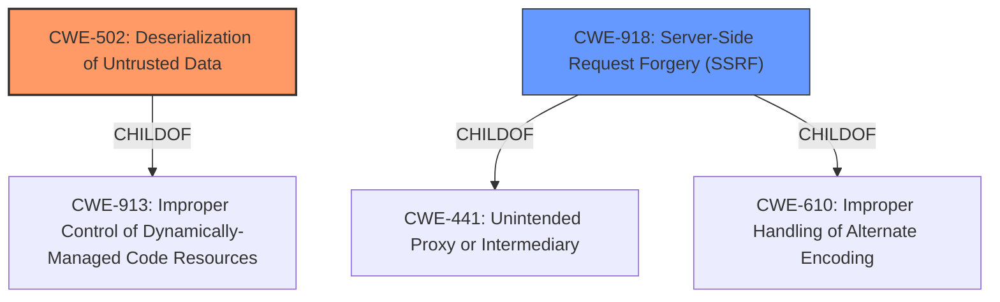

# Analysis Report for CVE-2022-23734

# Vulnerability Analysis Report: CVE-2022-23734

## Description


## Analysis (with Relationship Data)

# Summary
| CWE ID | CWE Name | Confidence | CWE Abstraction Level | CWE Vulnerability Mapping Label | CWE-Vulnerability Mapping Notes |
|---|---|---|---|---|---|
| CWE-502 | Deserialization of Untrusted Data | 1 | Base | Allowed | Primary CWE |
| CWE-918 | Server-Side Request Forgery (SSRF) | 0.7 | Base | Allowed | Secondary Candidate |

## Evidence and Confidence

*   **Confidence Score:** 0.8
*   **Evidence Strength:** HIGH

## Relationship Analysis
The primary CWE is CWE-502 **[CWE-502: Deserialization of Untrusted Data]**, which is a Base level CWE. CWE-502 has child relationships to CWE-913 **[CWE-913: Improper Control of Dynamically-Managed Code Resources]**. CWE-918 **[CWE-918: Server-Side Request Forgery (SSRF)]** is a child of CWE-441 **[CWE-441: Unintended Proxy or Intermediary]** and CWE-610 **[CWE-610: Improper Handling of Alternate Encoding]**. These relationships helped confirm that CWE-502 is the more direct root cause, while CWE-918 is a contributing factor.



## Vulnerability Chain
The vulnerability chain starts with the attacker gaining access via SSRF (CWE-918), which leads to the control of data being deserialized, and then the **improper deserialization** (CWE-502) of that data, ultimately resulting in remote code execution.

## Summary of Analysis
The initial analysis correctly identifies the **improper deserialization** as a key aspect of this vulnerability. The retriever results support this with CWE-502 **[CWE-502: Deserialization of Untrusted Data]** having the highest score. The vulnerability description explicitly mentions "deserialization of untrusted data" which aligns perfectly with CWE-502. The SSRF component (CWE-918 **[CWE-918: Server-Side Request Forgery (SSRF)]**) is a prerequisite for exploiting the deserialization vulnerability. The chain relationship clarifies that SSRF enables the attacker to control the data being deserialized, making CWE-502 the primary weakness and CWE-918 a contributing factor.

I am selecting CWE-502 as the primary CWE because the root cause is the **improper deserialization** of the data which could potentially lead to remote code execution. This is directly stated in the **Vulnerability Description Key Phrases**.
I am selecting CWE-918 because "an attacker would need to gain access via a server-side request forgery (SSRF) that would let an attacker control the data being deserialized" which means that SSRF is a prerequisite for this vulnerability.

CWE-20 **[CWE-20: Improper Input Validation]**, CWE-285 **[CWE-285: Improper Authorization]**, and CWE-287 **[CWE-287: Improper Authentication]** were considered but not selected. CWE-20 is too general. CWE-285 and CWE-287 do not fit the description as there is no mention of authorization or authentication issues. CWE-94 **[CWE-94: Improper Control of Generation of Code ('Code Injection')]** was also considered, however the vulnerability explicitly mentions **improper deserialization** which aligns better with CWE-502.

Relevant CWE Information:

# Enhanced Context (25 CWEs)
The following CWEs were identified as potentially relevant to this vulnerability:

## CWE-1289: Improper Validation of Unsafe Equivalence in Input
**Abstraction Level**: Base
**Similarity Score**: 0.78
**Source**: dense

**Description**:
The product receives an input value that is used as a resource identifier or other type of reference, but it does not validate or incorrectly validates that the input is equivalent to a potentially-unsafe value.

**Mapping Guidance**:
- Usage: Allowed
- Rationale: This CWE entry is at the Base level of abstraction, which is a preferred level of abstraction for mapping to the root causes of vulnerabilities.


## CWE-807: Reliance on Untrusted Inputs in a Security Decision
**Abstraction Level**: Base
**Similarity Score**: 0.77
**Source**: dense

**Description**:
The product uses a protection mechanism that relies on the existence or values of an input, but the input can be modified by an untrusted actor in a way that bypasses the protection mechanism.

**Mapping Guidance**:
- Usage: Allowed
- Rationale: This CWE entry is at the Base level of abstraction, which is a preferred level of abstraction for mapping to the root causes of vulnerabilities.


## CWE-74: Improper Neutralization of Special Elements in Output Used by a Downstream Component ('Injection')
**Abstraction Level**: Class
**Similarity Score**: 0.76
**Source**: dense

**Description**:
The product constructs all or part of a command, data structure, or record using externally-influenced input from an upstream component, but it does not neutralize or incorrectly neutralizes special elements that could modify how it is parsed or interpreted when it is sent to a downstream component.

**Mapping Guidance**:
- Usage: Discouraged
- Rationale: CWE-74 is high-level and often misused when lower-level weaknesses are more appropriate.


## CWE-184: Incomplete List of Disallowed Inputs
**Abstraction Level**: Base
**Similarity Score**: 0.75
**Source**: dense

**Description**:
The product implements a protection mechanism that relies on a list of inputs (or properties of inputs) that are not allowed by policy or otherwise require other action to neutralize before additional processing takes place, but the list is incomplete.

**Mapping Guidance**:
- Usage: Allowed
- Rationale: This CWE entry is at the Base level of abstraction, which is a preferred level of abstraction for mapping to the root causes of vulnerabilities.


## CWE-639: Authorization Bypass Through User-Controlled Key
**Abstraction Level**: Base
**Similarity Score**: 0.75
**Source**: dense

**Description**:
The system's authorization functionality does not prevent one user from gaining access to another user's data or record by modifying the key value identifying the data.

**Mapping Guidance**:
- Usage: Allowed
- Rationale: This CWE entry is at the Base level of abstraction, which is a preferred level of abstraction for mapping to the root causes of vulnerabilities.


## CWE-303: Incorrect Implementation of Authentication Algorithm
**Abstraction Level**: Base
**Similarity Score**: 0.75
**Source**: dense

**Description**:
The requirements for the product dictate the use of an established authentication algorithm, but the implementation of the algorithm is incorrect.

**Mapping Guidance**:
- Usage: Allowed
- Rationale: This CWE entry is at the Base level of abstraction, which is a preferred level of abstraction for mapping to the root causes of vulnerabilities.


## CWE-274: Improper Handling of Insufficient Privileges
**Abstraction Level**: Base
**Similarity Score**: 0.75
**Source**: dense

**Description**:
The product does not handle or incorrectly handles when it has insufficient privileges to perform an operation, leading to resultant weaknesses.

**Mapping Guidance**:
- Usage: Discouraged
- Rationale: This CWE entry could be deprecated in a future version of CWE.


## CWE-183: Permissive List of Allowed Inputs
**Abstraction Level**: Base
**Similarity Score**: 0.75
**Source**: dense

**Description**:
The product implements a protection mechanism that relies on a list of inputs (or properties of inputs) that are explicitly allowed by policy because the inputs are assumed to be safe, but the list is too permissive - that is, it allows an input that is unsafe, leading to resultant weaknesses.

**Mapping Guidance**:
- Usage: Allowed
- Rationale: This CWE entry is at the Base level of abstraction, which is a preferred level of abstraction for mapping to the root causes of vulnerabilities.


## CWE-73: External Control of File Name or Path
**Abstraction Level**: Base
**Similarity Score**: 0.75
**Source**: dense

**Description**:
The product allows user input to


## CWE Relationship Analysis

Current CWEs represent these abstraction levels: .


### Vulnerability Chain Analysis

**Chain starting from CWE-918:**
- 918 (Server-Side Request Forgery (SSRF)) - ROOT


**Chain starting from CWE-913:**
- 913 (Improper Control of Dynamically-Managed Code Resources) - ROOT


### CWE Relationship Diagram

```mermaid
graph TD
    classDef primary fill:#f96,stroke:#333,stroke-width:2px
    classDef secondary fill:#69f,stroke:#333
    classDef tertiary fill:#9e9,stroke:#333
```


*Report generated on 2025-03-31 10:36:21*
