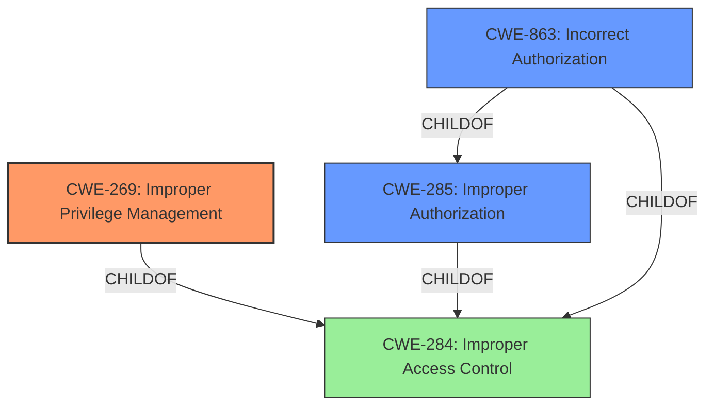

# Enhanced Analysis for CVE-2022-23737

# Summary
| CWE ID | CWE Name | Confidence | CWE Abstraction Level | CWE Vulnerability Mapping Label | CWE-Vulnerability Mapping Notes |
|---|---|---|---|---|---|
| CWE-269 | Improper Privilege Management | 0.9 | Class | Primary | Discouraged |
| CWE-285 | Improper Authorization | 0.7 | Class | Secondary | Discouraged |
| CWE-863 | Incorrect Authorization | 0.6 | Class | Secondary | Allowed-with-Review |

## Evidence and Confidence

*   **Confidence Score:** 0.8
*   **Evidence Strength:** HIGH

## Relationship Analysis
The primary relationship that influenced the CWE selection was the hierarchical structure, particularly the parent-child relationships involving CWE-269 **Improper Privilege Management**, CWE-285 **Improper Authorization**, and CWE-863 **Incorrect Authorization**. CWE-269 is a child of CWE-284 **Improper Access Control**, while CWE-285 and CWE-863 are children of CWE-284. The abstraction levels guided the choice of CWE-269, as the description specifically mentions **improper privilege management**. The mapping guidance discourages the use of CWE-269, but it is the closest match to the root cause.



## Vulnerability Chain
The chain of events for this vulnerability starts with **improper privilege management** (CWE-269), leading to unauthorized users being able to create or delete pages. The final impact is unauthorized modification of pages.

## Summary of Analysis
The initial assessment focused on identifying the root cause of the vulnerability, which the description clearly states as **improper privilege management**. This pointed towards CWE-269. However, the mapping guidance for CWE-269 discourages its use due to frequent misuse and recommends looking at its children or related CWEs. Given that the vulnerability allows unauthorized users to create or delete pages, CWE-285 **Improper Authorization** and CWE-863 **Incorrect Authorization** were also considered. However, the root cause is the **improper privilege management**, which makes CWE-269 the most appropriate primary CWE, despite the discouraged usage.

The final decision is based on the explicit mention of "**improper privilege management**" in the vulnerability description.

Relevant CWE Information:

*   **CWE-269: Improper Privilege Management**

    *   **Description:** The product does not properly assign, modify, track, or check privileges for an actor, creating an unintended sphere of control for that actor.
    *   The vulnerability description states "**improper privilege management** vulnerability was identified in GitHub Enterprise Server that allowed users with improper privileges to create or delete pages via the API." This aligns directly with the description of CWE-269.
    *   The security implication is that users with improper privileges can perform actions they should not be able to, such as creating or deleting pages.
    *   **Mapping Guidance:** Discouraged due to common misuse but selected because it is the most accurate representation of the root cause, as stated in the vulnerability description.
    *   **Confidence:** 0.9

*   **CWE-285: Improper Authorization**

    *   **Description:** The product does not perform or incorrectly performs an authorization check when an actor attempts to access a resource or perform an action.
    *   This CWE is applicable because the vulnerability allows users with write permissions (but without the specific privilege to create or delete pages) to perform those actions via the API. The system is not properly checking whether the user has authorization for this specific action.
    *   The security implication is that users can bypass authorization checks and perform unauthorized actions.
    *   **Mapping Guidance:** Discouraged as a high-level class; however, it is relevant as a secondary weakness resulting from the privilege management issue.
    *   **Confidence:** 0.7

*   **CWE-863: Incorrect Authorization**

    *   **Description:** The product performs an authorization check when an actor attempts to access a resource or perform an action, but it does not correctly perform the check.
    *   This CWE is a more specific version of CWE-285, and it is applicable because the authorization check is performed (users need write permissions), but it is not performed correctly (it does not check for the specific privilege to create or delete pages).
    *   The security implication is that the authorization check can be bypassed due to the incorrect implementation.
    *   **Mapping Guidance:** Allowed-with-Review, suggesting examination of more specific child CWEs.
    *   **Confidence:** 0.6

CWEs considered but not used:

*   CWE-284: Improper Access Control - This is a very high-level (Pillar) CWE and is too general for this vulnerability.
*   CWE-23: Relative Path Traversal, CWE-22: Improper Limitation of a Pathname to a Restricted Directory ('Path Traversal'), CWE-59: Improper Link Resolution Before File Access ('Link Following') - These CWEs are related to file system traversal vulnerabilities and are not relevant to this vulnerability, which is related to privilege management and authorization.
*   CWE-20: Improper Input Validation - This CWE is too general and does not accurately describe the root cause of the vulnerability.
*   CWE-732: Incorrect Permission Assignment for Critical Resource - This CWE is related to incorrect permission assignments, which is not the primary issue in this case. The main issue is the improper management of privileges, leading to authorization bypass.
*   CWE-386: Symbolic Name not Mapping to Correct Object, CWE-178: Improper Handling of Case Sensitivity, CWE-843: Access of Resource Using Incompatible Type ('Type Confusion'), CWE-1284: Improper Validation of Specified Quantity in Input, CWE-41: Improper Resolution of Path Equivalence - These CWEs are not relevant to the vulnerability description.


## CWE Relationship Analysis

Current CWEs represent these abstraction levels: .


### Vulnerability Chain Analysis

**Chain starting from CWE-843:**
- 843 (Access of Resource Using Incompatible Type ('Type Confusion')) - ROOT


**Chain starting from CWE-41:**
- 41 (Improper Resolution of Path Equivalence) - ROOT


### CWE Relationship Diagram

```mermaid
graph TD
    classDef primary fill:#f96,stroke:#333,stroke-width:2px
    classDef secondary fill:#69f,stroke:#333
    classDef tertiary fill:#9e9,stroke:#333
```