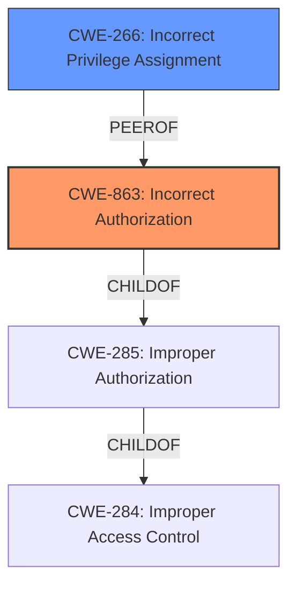

# Analysis for CVE-2022-23741

# Summary
| CWE ID  | CWE Name                         | Confidence | CWE Abstraction Level | CWE Vulnerability Mapping Label | CWE-Vulnerability Mapping Notes |
| ------- | -------------------------------- | ---------- | --------------------- | ----------------------------- | ----------------------------- |
| CWE-863 | Incorrect Authorization          | 0.9        | Class                 | Primary                       | Allowed-with-Review           |
| CWE-266 | Incorrect Privilege Assignment | 0.6        | Base                  | Secondary                     | Allowed                       |

## Evidence and Confidence

*   **Confidence Score:** 0.8
*   **Evidence Strength:** HIGH

## Relationship Analysis
The primary CWE is CWE-863, "Incorrect Authorization", which is a Class-level CWE. This vulnerability is described as an **incorrect authorization** issue that allowed a scoped user-to-server token to escalate privileges. CWE-863 is a child of CWE-285, "Improper Authorization," and CWE-284, "Improper Access Control." While CWE-863 is a class-level CWE, it directly reflects the described issue. CWE-266 "Incorrect Privilege Assignment" is a possible secondary issue, due to the fact that the **incorrect authorization** could lead to **privilege escalation** by allowing a scoped user to obtain admin/owner privileges, but it's not the root cause, thus not the primary CWE.

## Vulnerability Chain
The vulnerability chain starts with **incorrect authorization** (CWE-863), which then leads to **privilege escalation**, allowing a scoped user-to-server token to gain full admin/owner privileges.

## Summary of Analysis
The initial assessment identified **incorrect authorization** as the key weakness. The evidence directly supports this, with the vulnerability description explicitly stating "An **incorrect authorization** vulnerability was identified." This aligns with CWE-863, "Incorrect Authorization," which describes a product performing an authorization check incorrectly. The impact of this vulnerability is significant, allowing a scoped user-to-server token to escalate to full admin/owner privileges.

The Retriever Results also support this assessment, with CWE-863 being a top match. The mapping guidance for CWE-863 suggests reviewing its children for a more specific fit, but none of them appear to be more appropriate given the available information.

The relationship analysis confirms that CWE-863 is the most suitable CWE, as it directly addresses the described weakness. The chain relationship highlights how the **incorrect authorization** leads to **privilege escalation**, but the primary focus remains on the initial authorization flaw.

Based on the evidence and analysis, CWE-863 is the most appropriate CWE for this vulnerability.

Other CWEs Considered:

*   CWE-284: Improper Access Control - This is a Pillar-level CWE and too high-level for this vulnerability. The description explicitly mentions **incorrect authorization**, making CWE-863 a more specific choice.
*   CWE-285: Improper Authorization - This is a Class-level CWE and a parent of CWE-863. While relevant, CWE-863 is more specific as it indicates that the authorization check was performed, but incorrectly.
*   CWE-639: Authorization Bypass Through User-Controlled Key - This CWE is about bypassing authorization by modifying a key value. While privilege escalation occurred, the vulnerability description doesn't explicitly state that it was achieved through a user-controlled key, so CWE-639 is less fitting.
*   CWE-269: Improper Privilege Management - This is a Class-level CWE that deals with improper assignment, modification, tracking, or checking of privileges. While **privilege escalation** is an impact of this vulnerability, the root cause is the **incorrect authorization** check.
*   CWE-250: Execution with Unnecessary Privileges - This CWE addresses scenarios where a product runs with higher privileges than necessary. It doesn't directly align with the described **incorrect authorization** issue.
*   CWE-266: Incorrect Privilege Assignment - This CWE is about incorrectly assigning a privilege to an actor. It is a possible secondary issue, due to the fact that the **incorrect authorization** could lead to **privilege escalation** by allowing a scoped user to obtain admin/owner privileges, but it's not the root cause, thus not the primary CWE.
*   CWE-732: Incorrect Permission Assignment for Critical Resource - This CWE relates to incorrect permission assignments for critical resources. While relevant to access control, it is not as directly related to the **incorrect authorization** check as CWE-863.
*   CWE-23: Relative Path Traversal - This CWE is not relevant to the vulnerability description, as it focuses on path traversal issues.
*   CWE-287: Improper Authentication - This CWE is about insufficient proof of a user's claimed identity, which is not the focus of this vulnerability.

The selection of CWE-863 is at the optimal level of specificity because it directly addresses the **incorrect authorization** check, which is the root cause of the vulnerability. It is also supported by the vulnerability description and the Retriever Results. The confidence in this assessment is high due to the explicit mention of "incorrect authorization" in the vulnerability description.