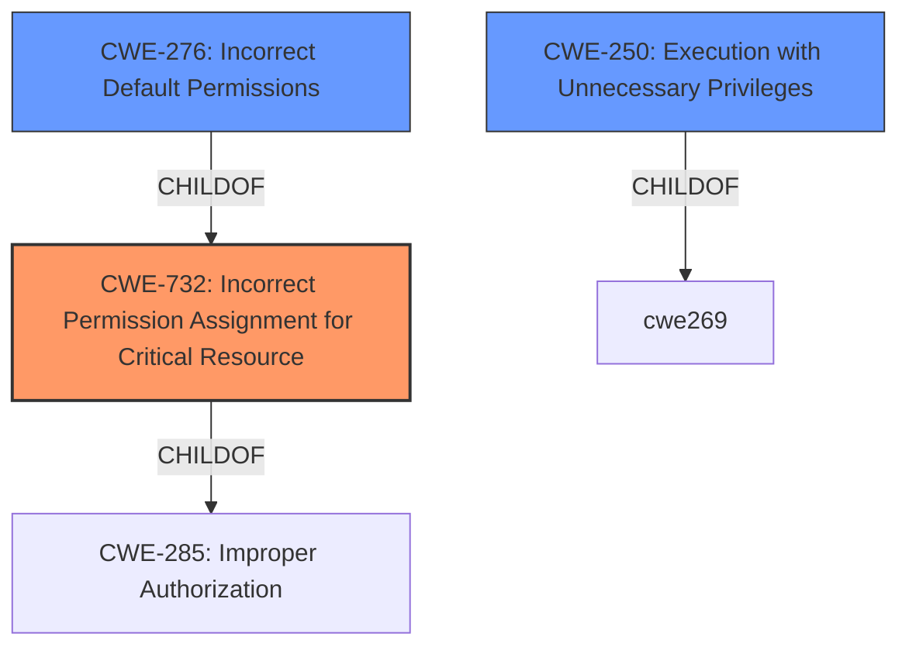

# Enhanced Analysis for CVE-2022-23743

# Summary
| CWE ID  | CWE Name                                                     | Confidence | CWE Abstraction Level | CWE Vulnerability Mapping Label | CWE-Vulnerability Mapping Notes |
| :-------- | :----------------------------------------------------------- | :--------- | :---------------------- | :-------------------------------- | :------------------------------ |
| CWE-732   | Incorrect Permission Assignment for Critical Resource        | 0.9        | Class                   | Allowed-with-Review               | Primary CWE                     |
| CWE-276   | Incorrect Default Permissions                              | 0.7        | Base                    | Allowed                           | Secondary Candidate             |
| CWE-250   | Execution with Unnecessary Privileges                      | 0.6        | Base                    | Allowed                           | Secondary Candidate             |

## Evidence and Confidence

*   **Confidence Score:** 0.8
*   **Evidence Strength:** HIGH

## Relationship Analysis
The primary CWE, CWE-732 [CWE-732: Incorrect Permission Assignment for Critical Resource], is a Class-level CWE, which has children such as CWE-276 [CWE-276: Incorrect Default Permissions] (Base) and is related to CWE-285 [CWE-285: Improper Authorization]. The selection of CWE-732 [CWE-732: Incorrect Permission Assignment for Critical Resource] is based on the **weak permissions** in the `ProgramData` directory that allowed a local attacker to perform an arbitrary file write. CWE-276 [CWE-276: Incorrect Default Permissions] was considered because it relates to permissions set during installation, however, the vulnerability description focuses on existing **weak permissions**, rather than those assigned during installation. CWE-250 [CWE-250: Execution with Unnecessary Privileges] was considered because the file write leads to code execution as local system, implying escalated privileges.



## Vulnerability Chain
The chain of events is as follows:
1.  **Root Cause:** **Weak permissions** on the `ProgramData\CheckPoint\ZoneAlarm\Data\Updates` directory (CWE-732 [CWE-732: Incorrect Permission Assignment for Critical Resource]).
2.  An attacker exploits these **weak permissions** to perform an arbitrary file write.
3.  This arbitrary file write leads to the execution of code as local system, resulting in privilege escalation.

## Summary of Analysis
The primary assessment is based on the provided vulnerability description which states "**weak permissions** in the ProgramData\CheckPoint\ZoneAlarm\Data\Updates directory allow a local attacker the ability to execute an arbitrary file write, leading to execution of code as local system".

The graph relationships highlight the hierarchical structure of CWEs related to privilege and permission management. While CWE-285 [CWE-285: Improper Authorization] is a parent of CWE-732 [CWE-732: Incorrect Permission Assignment for Critical Resource], CWE-732 [CWE-732: Incorrect Permission Assignment for Critical Resource] is more specific because it explicitly mentions incorrect permission assignment.

CWE-732 [CWE-732: Incorrect Permission Assignment for Critical Resource] is chosen as the primary CWE because it directly addresses the root cause described in the vulnerability description: **incorrect permission assignment** leading to unauthorized access and code execution. This is at an optimal level of specificity, as it identifies the specific weakness rather than a more general authorization issue.

CWEs considered but not used:

*   CWE-59 [CWE-59: Improper Link Resolution Before File Access ('Link Following')]: While file operations are involved, the vulnerability does not explicitly mention symbolic links or similar mechanisms.
*   CWE-266 [CWE-266: Incorrect Privilege Assignment]: This CWE is about the incorrect assignment of a privilege to an actor. The described vulnerability is more about **weak permissions** on a resource, not necessarily the assignment of privileges to an actor.
*   CWE-274 [CWE-274: Improper Handling of Insufficient Privileges]: This CWE focuses on the handling of insufficient privileges, which is not the case here. The issue is that the permissions are too permissive, not that the product is incorrectly handling insufficient privileges.
*   CWE-267 [CWE-267: Privilege Defined With Unsafe Actions]: This CWE is about a privilege that can be used to perform unsafe actions, which is not directly applicable here.
*   CWE-280 [CWE-280: Improper Handling of Insufficient Permissions or Privileges]: Similar to CWE-274 [CWE-274: Improper Handling of Insufficient Privileges], this CWE is about handling insufficient privileges, not about resources having overly permissive permissions.
*   CWE-668 [CWE-668: Exposure of Resource to Wrong Sphere]: This CWE is too high-level and a more specific CWE is available.
*   CWE-73 [CWE-73: External Control of File Name or Path]: This CWE is about user input controlling file names or paths, which is not the case here.
*   CWE-41 [CWE-41: Improper Resolution of Path Equivalence]: This CWE is about path equivalence and special characters, which are not mentioned in the vulnerability description.
*   CWE-427 [CWE-427: Uncontrolled Search Path Element]: This CWE is about uncontrolled elements in a search path, which is not directly related to the **weak permissions** issue.
*   CWE-23 [CWE-23: Relative Path Traversal]: This CWE is about path traversal, which is not directly relevant to the described vulnerability.
*   CWE-367 [CWE-367: Time-of-check Time-of-use (TOCTOU) Race Condition]: Although a file write is involved, there is no information to suggest a race condition is involved.


## CWE Relationship Analysis

Current CWEs represent these abstraction levels: .


### Vulnerability Chain Analysis

**Chain starting from CWE-367:**
- 367 (Time-of-check Time-of-use (TOCTOU) Race Condition) - ROOT


**Chain starting from CWE-266:**
- 266 (Incorrect Privilege Assignment) - ROOT


### CWE Relationship Diagram

```mermaid
graph TD
    classDef primary fill:#f96,stroke:#333,stroke-width:2px
    classDef secondary fill:#69f,stroke:#333
    classDef tertiary fill:#9e9,stroke:#333
```