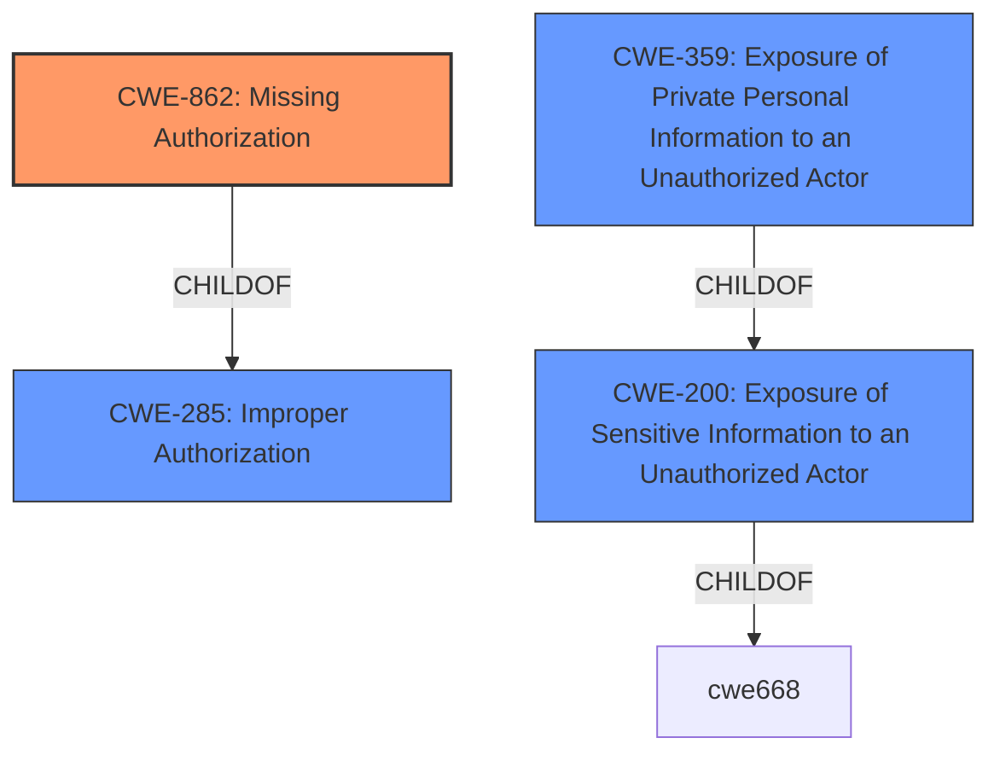

# Analysis Report for CVE-2022-2376

# Vulnerability Analysis Report: CVE-2022-2376

## Description


## Analysis (with Relationship Data)

# Summary
| CWE ID | CWE Name | Confidence | CWE Abstraction Level | CWE Vulnerability Mapping Label | CWE-Vulnerability Mapping Notes |
|---|---|---|---|---|---|
| CWE-862 | Missing Authorization | 1 | Class | Allowed-with-Review | Primary CWE |
| CWE-200 | Exposure of Sensitive Information to an Unauthorized Actor | 0.9 | Class | Discouraged | Secondary Candidate |
| CWE-359 | Exposure of Private Personal Information to an Unauthorized Actor | 0.8 | Base | Allowed | Secondary Candidate |

## Evidence and Confidence

*   **Confidence Score:** 0.9
*   **Evidence Strength:** HIGH

## Relationship Analysis
The primary weakness identified is **CWE-862 (Missing Authorization)**, as the AJAX action `directorist_author_pagination` does not require authentication, leading to unauthorized access. This is a child of **CWE-285 (Improper Authorization)**, but **CWE-862** is more specific as it directly points to the absence of an authorization check. **CWE-200 (Exposure of Sensitive Information to an Unauthorized Actor)** is a related impact, as the lack of authorization leads to the exposure of user email addresses. **CWE-359 (Exposure of Private Personal Information to an Unauthorized Actor)** is a specific type of **CWE-200** and can be considered because the email addresses are considered private personal information. The abstraction level of **CWE-862** is Class, but since it is directly related to the **missing authorization**, it can be considered as the Primary CWE.



## Vulnerability Chain
The vulnerability chain starts with the **missing authorization** check (**CWE-862**), which then leads to the **exposure of sensitive information** (**CWE-200**) like email addresses (**CWE-359**).

## Summary of Analysis
The initial assessment points to the lack of proper authorization as the root cause, leading to the exposure of sensitive user information. The primary weakness is the **missing authorization** check on the AJAX action, which directly violates access control. This is strongly supported by the vulnerability description, which states, "The vulnerability is due to an AJAX action in the Directorist plugin that discloses email addresses of all users. This action is accessible without authentication, meaning anyone can trigger it." The graph relationships clearly show the link between **missing authorization** and **information exposure**. The final decision prioritizes **CWE-862** due to its direct relevance to the **missing authorization** issue, making it the most appropriate choice. **CWE-200** and **CWE-359** are secondary effects as they describe the result of the initial **missing authorization**.

Relevant CWE Information:

**CWE-862: Missing Authorization**
*   The product does not perform an authorization check when an actor attempts to access a resource or perform an action.
*   The AJAX action `directorist_author_pagination` does not require authentication.

**CWE-200: Exposure of Sensitive Information to an Unauthorized Actor**
*   The product exposes sensitive information to an actor that is not explicitly authorized to have access to that information.
*   User email addresses are exposed through an unauthenticated AJAX endpoint.

**CWE-359: Exposure of Private Personal Information to an Unauthorized Actor**
*   The product does not properly prevent a person's private, personal information from being accessed by actors who either (1) are not explicitly authorized to access the information or (2) do not have the implicit consent of the person about whom the information is collected.
*   Attackers can retrieve email addresses of all users of the WordPress site.

**CWEs Considered But Not Used:**

*   **CWE-352 (Cross-Site Request Forgery (CSRF))**: While present in the Retriever Results, this CWE is not applicable as the vulnerability does not require tricking a user into making an unintentional request.
*   **CWE-863 (Incorrect Authorization)**: This CWE is not as relevant as **CWE-862** because the issue is the *absence* of authorization rather than an incorrect authorization implementation.
*   **CWE-285 (Improper Authorization)**: This is a high-level class, and **CWE-862** is a more specific child that better describes the vulnerability.
*   **CWE-359 (Exposure of Private Personal Information to an Unauthorized Actor)**: A more specific child of **CWE-200**, it is considered as a secondary weakness.
*   **CWE-1272 (Sensitive Information Uncleared Before Debug/Power State Transition)**: Irrelevant to the described vulnerability.
*   **CWE-502 (Deserialization of Untrusted Data)**: Irrelevant to the described vulnerability.
*   **CWE-1390 (Weak Authentication)**: Not applicable because the issue is the absence of authentication, not a weak authentication mechanism.
*   **CWE-201 (Insertion of Sensitive Information Into Sent Data)**: While sensitive information is sent, the root cause is the lack of authorization, not the insertion itself.


## CWE Relationship Analysis

Current CWEs represent these abstraction levels: .


### Vulnerability Chain Analysis

**Chain starting from CWE-862:**
- 862 (Missing Authorization) - ROOT


**Chain starting from CWE-201:**
- 201 (Insertion of Sensitive Information Into Sent Data) - ROOT


### CWE Relationship Diagram

```mermaid
graph TD
    classDef primary fill:#f96,stroke:#333,stroke-width:2px
    classDef secondary fill:#69f,stroke:#333
    classDef tertiary fill:#9e9,stroke:#333
```


*Report generated on 2025-03-31 10:19:48*
