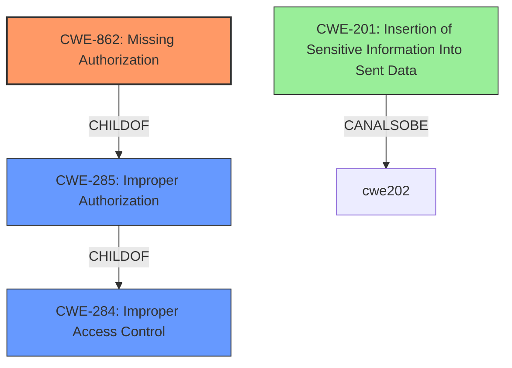

# Enhanced Analysis for CVE-2022-2379

# Summary
| CWE ID | CWE Name | Confidence | CWE Abstraction Level | CWE Vulnerability Mapping Label | CWE-Vulnerability Mapping Notes |
|---|---|---|---|---|---|
| CWE-862 | Missing Authorization | 1.0 | Class | Allowed-with-Review | Primary CWE |
| CWE-201 | Insertion of Sensitive Information Into Sent Data | 0.7 | Base | Allowed | Secondary Candidate |

## Evidence and Confidence

*   **Confidence Score:** 0.9
*   **Evidence Strength:** HIGH

## Relationship Analysis
The primary relationship influencing my decision is the ChildOf relationship between CWE-862 and CWE-285/CWE-284. CWE-862 (Missing Authorization) is a more specific Class-level CWE than the Pillar CWE-284 (Improper Access Control) or Class CWE-285 (Improper Authorization). There are no further Base or Variant level children of CWE-862 that would apply. CWE-201 is a base level CWE that can also be a result of the **lack of authorization**.



## Vulnerability Chain
The vulnerability chain starts with a **lack of authorization** checks in the REST API, which leads to unauthenticated users being able to access sensitive information.

**Chain:**
1.  **Root Cause:** **Missing Authorization** (CWE-862)
2.  **Impact:** Retrieval and **insertion of sensitive information into sent data** (CWE-201)

## Summary of Analysis
The initial analysis focused on identifying the root cause of the vulnerability and its subsequent impact. The primary weakness is the **lack of authorization** in the REST API of the Easy Student Results WordPress plugin. This allows unauthenticated users to access sensitive data, leading to an information disclosure.

The vulnerability description states: "The Easy Student Results WordPress plugin through 2.2.8 lacks authorisation in its REST API, allowing unauthenticated users to retrieve information related to the courses, exams, departments as well as students grades and PII such as email address, physical address, phone number etc." This directly supports the selection of CWE-862 (Missing Authorization).

The Retriever Results and Complete CWE Specifications were used to refine the selection. CWE-862 is a Class-level CWE, and its description aligns with the vulnerability: "The product does not perform an authorization check when an actor attempts to access a resource or perform an action." The CWE mapping guidance suggests reviewing child CWEs for a better fit, but none of the children of CWE-862 provide a more specific description.

CWE-284 (Improper Access Control) and CWE-285 (Improper Authorization) were considered but deemed too general. CWE-306 (Missing Authentication for Critical Function) was also considered, but the vulnerability description focuses on authorization rather than authentication. CWE-201 (Insertion of Sensitive Information Into Sent Data) was considered as a secondary CWE because it describes the impact of the missing authorization, which is the exposure of sensitive data.

The selected CWEs are at the optimal level of specificity, with CWE-862 capturing the root cause and CWE-201 describing the direct impact. The evidence from the vulnerability description and the support from the Retriever Results justify this classification.


## CWE Relationship Analysis

Current CWEs represent these abstraction levels: .


### Vulnerability Chain Analysis

**Chain starting from CWE-862:**
- 862 (Missing Authorization) - ROOT


**Chain starting from CWE-201:**
- 201 (Insertion of Sensitive Information Into Sent Data) - ROOT


### CWE Relationship Diagram

```mermaid
graph TD
    classDef primary fill:#f96,stroke:#333,stroke-width:2px
    classDef secondary fill:#69f,stroke:#333
    classDef tertiary fill:#9e9,stroke:#333
```