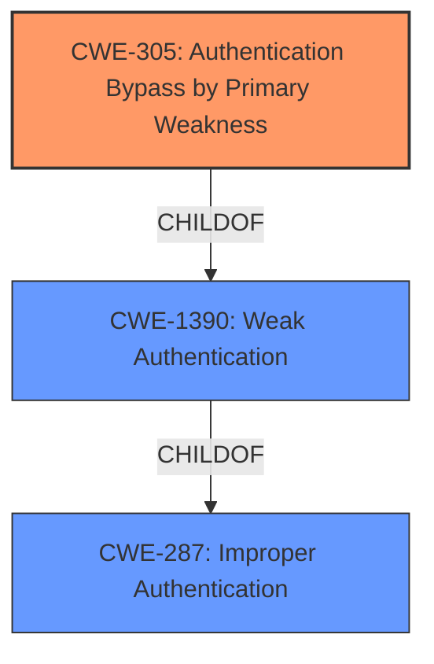

# Analysis Report for CVE-2022-23795

# Vulnerability Analysis Report: CVE-2022-23795

## Description


## Analysis (with Relationship Data)

# Summary
| CWE ID | CWE Name | Confidence | CWE Abstraction Level | CWE Vulnerability Mapping Label | CWE-Vulnerability Mapping Notes |
|---|---|---|---|---|---|
| CWE-305 | Authentication Bypass by Primary Weakness | 0.8 | Base | Allowed | Primary CWE |
| CWE-1390 | Weak Authentication | 0.6 | Class | Allowed-with-Review | Secondary Candidate |
| CWE-287 | Improper Authentication | 0.5 | Class | Discouraged | Secondary Candidate |

## Evidence and Confidence

*   **Confidence Score:** 0.8
*   **Evidence Strength:** HIGH

## Relationship Analysis
The primary relationship influencing the selection was the ChildOf relationship: CWE-305 **Authentication Bypass by Primary Weakness** is a child of CWE-1390 **Weak Authentication**, and both are related to authentication issues. CWE-287 **Improper Authentication** is a parent of both. The abstraction level was also considered, favoring the more specific Base level of CWE-305 over the Class levels of CWE-1390 and CWE-287.



## Vulnerability Chain
The vulnerability chain starts with the **root cause**: a user row not being bound to a specific authentication mechanism. This leads to the **weakness**: an **authentication bypass**. The final **impact** is a potential account takeover under specific circumstances.

## Summary of Analysis
The initial assessment identified a potential authentication bypass in Joomla due to a user row not being bound to a specific authentication mechanism, potentially leading to account takeover. The evidence from the "CVE Reference Links Content Summary" states: "Root cause of vulnerability: A user row in Joomla was not bound to a specific authentication mechanism" and "Weaknesses/vulnerabilities present: Incorrect Access Control".

The Retriever Results suggested CWE-287 **Improper Authentication**, CWE-620 **Unverified Password Change**, CWE-338 **Use of Cryptographically Weak Pseudo-Random Number Generator (PRNG)**, CWE-1390 **Weak Authentication**, and CWE-306 **Missing Authentication for Critical Function**. However, based on the description and evidence provided, CWE-305 **Authentication Bypass by Primary Weakness** is the most appropriate, as the **authentication mechanism** itself isn't inherently flawed, but a separate **weakness** (the lack of binding) allows for a bypass.

CWE-1390 **Weak Authentication** is considered as a related Class, and CWE-287 **Improper Authentication** is the parent Class of CWE-1390.

The final decision prioritizes CWE-305 because it most accurately reflects the root cause: "The authentication algorithm is sound, but the implemented mechanism can be bypassed as the result of a separate **weakness** that is primary to the authentication error." This is a more precise characterization of the vulnerability than simply stating that authentication is missing or improper. The selected CWEs are at the optimal level of specificity, with CWE-305 being a Base level CWE providing more detail than the Class level CWEs.

Relevant CWE Information:

# Enhanced Context (25 CWEs)

## CWE-305: Authentication Bypass by Primary Weakness
**Abstraction:** Base
**Status:** Draft

### Description
The **authentication** algorithm is sound, but the implemented mechanism can be **bypassed** as the result of a separate **weakness** that is primary to the **authentication** error.

### Extended Description
Not provided

### Alternative Terms
None

### Relationships
ChildOf -> CWE-1390

### Mapping Guidance
**Usage:** Allowed
**Rationale:** This CWE entry is at the Base level of abstraction, which is a preferred level of abstraction for mapping to the root causes of vulnerabilities.
**Comments:** Carefully read both the name and description to ensure that this mapping is an appropriate fit. Do not try to 'force' a mapping to a lower-level Base/Variant simply to comply with this preferred level of abstraction.
**Reasons:**
- Acceptable-Use

### Additional Notes
**[Relationship]** Most "**authentication bypass**" errors are resultant, not primary.

### Observed Examples
- **CVE-2002-1374:** The provided password is only compared against the first character of the real password.
- **CVE-2000-0979:** The password is not properly checked, which allows remote attackers to bypass access controls by sending a 1-byte password that matches the first character of the real password.
- **CVE-2001-0088:** Chain: Forum software does not properly initialize an array, which inadvertently sets the password to a single character, allowing remote attackers to easily guess the password and gain administrative privileges.

**CWE-287 Improper Authentication:** Considered but not selected as it is too general. The vulnerability is not merely an improper authentication, but a bypass due to a specific flaw. The mapping guidance discourages using CWE-287 when more specific entries exist.

**CWE-620 Unverified Password Change:** Considered but not selected as it specifically relates to password changes without verification, which is not the primary issue described in the vulnerability.

**CWE-338 Use of Cryptographically Weak Pseudo-Random Number Generator (PRNG):** Considered but not selected as it involves weak PRNGs, which is unrelated to the described vulnerability.

**CWE-1390 Weak Authentication:** Considered as a secondary CWE because it encompasses the general idea of a **weakness** in the **authentication** process. However, CWE-305 provides a more precise description of how the **authentication** is bypassed.

**CWE-306 Missing Authentication for Critical Function:** Considered but not selected as it describes a complete lack of **authentication**, whereas the Joomla vulnerability involves a bypass of the existing **authentication** mechanism.


## CWE Relationship Analysis

Current CWEs represent these abstraction levels: .


### Vulnerability Chain Analysis

**Chain starting from CWE-1390:**
- 1390 (Weak Authentication) - ROOT


**Chain starting from CWE-620:**
- 620 (Unverified Password Change) - ROOT


### CWE Relationship Diagram

```mermaid
graph TD
    classDef primary fill:#f96,stroke:#333,stroke-width:2px
    classDef secondary fill:#69f,stroke:#333
    classDef tertiary fill:#9e9,stroke:#333
```


*Report generated on 2025-03-31 12:03:41*
