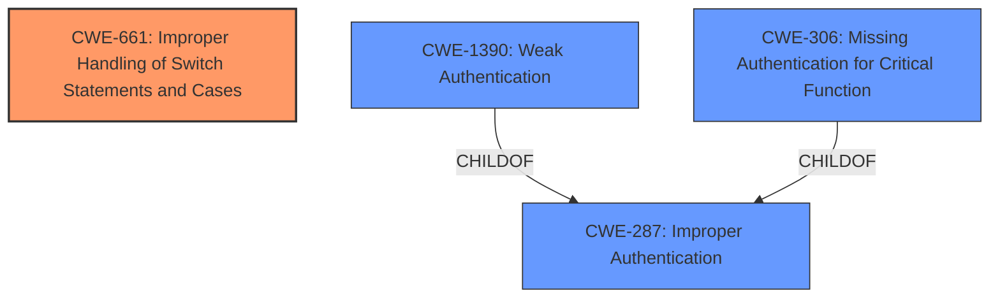

# Analysis for CVE-2022-23807

# Summary
| CWE ID | CWE Name | Confidence | CWE Abstraction Level | CWE Vulnerability Mapping Label | CWE-Vulnerability Mapping Notes |
|---|---|---|---|---|---|
| CWE-661 | Improper Handling of Switch Statements and Cases | 0.75 | Base | Primary | Allowed |
| CWE-287 | Improper Authentication | 0.5 | Class | Secondary | Discouraged |

## Evidence and Confidence

*   **Confidence Score:** 0.7
*   **Evidence Strength:** MEDIUM

## Relationship Analysis
The primary CWE is CWE-661, which is a Base level CWE. CWE-287, Improper Authentication, is a Class level CWE and a parent of CWE-306 (Missing Authentication for Critical Function) and CWE-1390 (Weak Authentication). The relationship analysis focused on finding the most specific CWE to represent the **improper handling** of the two-factor authentication bypass.

## Vulnerability Chain
The chain starts with a valid user authenticating with two-factor authentication. This user then manipulates their account in a way that exploits an **improper handling** of the two-factor authentication status, leading to a bypass of two-factor authentication on subsequent logins. The **root cause** is the **improper handling** of the two-factor authentication status, and the impact is the bypass of two-factor authentication.

## Summary of Analysis
Initially, I considered CWE-287 (Improper Authentication) and its children, but the core issue here isn't necessarily a completely broken authentication scheme, but rather a flaw in how the application handles the state of two-factor authentication for an already authenticated user. The CVE description and summary mention "manipulate their account to bypass two-factor authentication" and "Improper Processing of User's 2FA Status," indicating that the application's logic around 2FA status is flawed.

The assigned CWE in the provided information is CWE-661. The description of the CVE also fits the description of CWE-661 since it states the application does not properly handle a specific user action sequence, allowing a bypass of the 2FA mechanism.

Based on the provided evidence, I've selected CWE-661 as the primary CWE.
CWE-287 is a secondary candidate since there is an authentication bypass involved.

Relevant CWE Information:

# Enhanced Context (25 CWEs)
The following CWEs were identified as potentially relevant to this vulnerability:

## CWE-303: Incorrect Implementation of Authentication Algorithm
**Abstraction Level**: Base
**Similarity Score**: 0.79
**Source**: dense

**Description**:
The requirements for the product dictate the use of an established authentication algorithm, but the **implementation** of the algorithm is **incorrect**.

**Mapping Guidance**:
- Usage: Allowed
- Rationale: This CWE entry is at the Base level of abstraction, which is a preferred level of abstraction for mapping to the root causes of vulnerabilities.

## CWE-287: Improper Authentication
**Abstraction:** Class
**Status:** Draft

### Description
When an actor claims to have a given identity, the product **does not prove or insufficiently proves that the claim is correct.**

### Extended Description
Not provided

### Alternative Terms
authentification: An alternate term is "authentification", which appears to be most commonly used by people from non-English-speaking countries.
AuthN: "AuthN" is typically used as an abbreviation of "authentication" within the web application security community. It is also distinct from "AuthZ," which is an abbreviation of "authorization." The use of "Auth" as an abbreviation is discouraged, since it could be used for either authentication or authorization.
AuthC: "AuthC" is used as an abbreviation of "authentication," but it appears to used less frequently than "AuthN."

### Relationships
ChildOf -> CWE-284
ChildOf -> CWE-284

### Mapping Guidance
**Usage:** Discouraged
**Rationale:** This CWE entry might be misused when lower-level CWE entries are likely to be applicable. It is a level-1 Class (i.e., a child of a Pillar).
**Comments:** Consider children or descendants, beginning with CWE-1390: Weak Authentication or CWE-306: Missing Authentication for Critical Function.
**Reasons:**
- Frequent Misuse
**Suggested Alternatives:**
- CWE-1390: Weak Authentication
- CWE-306: Missing Authentication for Critical Function

## CWE-1390: Weak Authentication
**Abstraction:** Class
**Status:** Incomplete

### Description
The product uses an authentication mechanism to restrict access to specific users or identities, but the mechanism **does not sufficiently prove that the claimed identity is correct.**

## CWE-306: Missing Authentication for Critical Function
**Abstraction:** Base
**Status:** Draft

### Description
The product **does not perform any authentication for functionality that requires a provable user identity or consumes a significant amount of resources.**

### CWE-661: Improper Handling of Switch Statements and Cases
The product contains a switch statement or equivalent construct, but it **does not properly handle** all cases, which can lead to unexpected behavior or security vulnerabilities. This might occur because a case is missing, or because the default case is **not handled correctly**.

**CWE-661**
The vulnerability's details align with CWE-661 because the successful bypass depends on the **improper handling** of a specific sequence of actions, which can be interpreted as a missing or **incorrectly handled case** within the application's logic for managing two-factor authentication status. The security implication is a bypass of two-factor authentication, allowing unauthorized access.
*   **Confidence Score:** 0.75

**CWE-287 Improper Authentication**
The vulnerability results in the bypass of two-factor authentication, which is a form of authentication. Therefore, CWE-287 is a relevant, though less specific, classification. However, CWE-287 is discouraged.
*   **Confidence Score:** 0.5