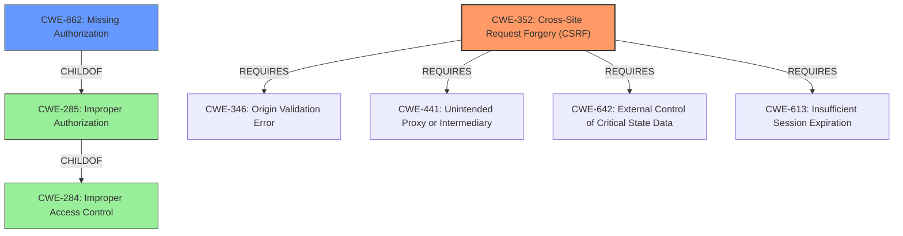

# Analysis for CVE-2022-2382

# Summary
| CWE ID | CWE Name | Confidence | CWE Abstraction Level | CWE Vulnerability Mapping Label | CWE-Vulnerability Mapping Notes |
|---|---|---|---|---|---|
| CWE-352 | Cross-Site Request Forgery (CSRF) | 0.9 | Compound | Allowed | Primary CWE |
| CWE-862 | Missing Authorization | 0.9 | Class | Allowed-with-Review | Secondary Candidate |

## Evidence and Confidence

*   **Confidence Score:** 0.9
*   **Evidence Strength:** HIGH

## Relationship Analysis
The primary weakness is CWE-352, Cross-Site Request Forgery (CSRF), which is a compound weakness that relies on multiple other weaknesses. The vulnerability description also mentions a **lack of authorization**, which directly corresponds to CWE-862, Missing Authorization. CWE-862 is a child of CWE-285 (Improper Authorization) and CWE-284 (Improper Access Control).

## Vulnerability Chain
The vulnerability chain involves:
1.  **Root Cause 1:** **Flawed CSRF checks** (CWE-352) - The application does not properly verify the origin of the request, making it susceptible to CSRF attacks.
2.  **Root Cause 2:** **Lack of authorization** (CWE-862) - The application does not verify if the authenticated user has the right privileges to perform the requested action.
3.  **Impact:** An authenticated user (even with minimal privileges) can **delete arbitrary blog options**.

## Summary of Analysis
The analysis is based on the provided vulnerability description and the CVE reference links content summary. The **flawed CSRF checks and lack of authorization** are the root causes that allow authenticated users to delete arbitrary blog options.

The description states, "The Product Slider for WooCommerce WordPress plugin before 2.5.7 has **flawed CSRF checks and lack authorisation** in some of its AJAX actions, allowing any authenticated users, such as subscriber to call them. One in particular could allow them to delete arbitrary blog options." This directly supports the identification of CWE-352 and CWE-862 as the primary weaknesses.

The graph relationships confirm that CWE-352 and CWE-862 are distinct weaknesses that contribute to the overall vulnerability. CWE-352 is a compound weakness, while CWE-862 is a more specific class of improper authorization.

The selected CWEs are at the optimal level of specificity because they directly address the identified root causes and the nature of the vulnerability. CWE-352 accurately represents the CSRF vulnerability and CWE-862 accurately represents the **missing authorization**.

Relevant CWE Information:

# Enhanced Context (25 CWEs)

## CWE-80: Improper Neutralization of Script-Related HTML Tags in a Web Page (Basic XSS)
**Abstraction Level**: Variant
**Similarity Score**: 0.79
**Source**: dense
Not selected because the vulnerability does not involve improper neutralization of script-related HTML tags. It's about CSRF and missing authorization.

## CWE-116: Improper Encoding or Escaping of Output
**Abstraction Level**: Class
**Similarity Score**: 0.77
**Source**: dense
Not selected because the vulnerability does not involve improper encoding or escaping of output. It's about CSRF and missing authorization.

## CWE-639: Authorization Bypass Through User-Controlled Key
**Abstraction Level**: Base
**Similarity Score**: 0.77
**Source**: dense
Not selected because the vulnerability doesn't explicitly state the authorization bypass is due to user-controlled keys. It is a more general **lack of authorization**.

## CWE-472: External Control of Assumed-Immutable Web Parameter
**Abstraction Level**: Base
**Similarity Score**: 0.77
**Source**: dense
Not selected because there is no mention of externally controlled immutable parameters.

## CWE-425: Direct Request ('Forced Browsing')
**Abstraction Level**: Base
**Similarity Score**: 0.77
**Source**: dense
Not selected because the description focuses on **flawed CSRF checks and lack of authorization**, rather than direct requests bypassing authorization.

## CWE-74: Improper Neutralization of Special Elements in Output Used by a Downstream Component ('Injection')
**Abstraction Level**: Class
**Similarity Score**: 0.77
**Source**: dense
Not selected because there is no mention of injection vulnerabilities.

## CWE-184: Incomplete List of Disallowed Inputs
**Abstraction Level**: Base
**Similarity Score**: 0.77
**Source**: dense
Not selected because the vulnerability isn't related to an incomplete list of disallowed inputs.

## CWE-1289: Improper Validation of Unsafe Equivalence in Input
**Abstraction Level**: Base
**Similarity Score**: 0.76
**Source**: dense
Not selected because there's no mention of unsafe equivalence validation.

## CWE-807: Reliance on Untrusted Inputs in a Security Decision
**Abstraction Level**: Base
**Similarity Score**: 0.76
**Source**: dense
Not selected as the core issue is **lack of authorization** and **flawed CSRF checks**, not necessarily reliance on untrusted inputs in a security decision.

## CWE-41: Improper Resolution of Path Equivalence
**Abstraction Level**: Base
**Similarity Score**: 0.76
**Source**: dense
Not selected as the vulnerability is not related to path equivalence issues.

## CWE-79: Improper Neutralization of Input During Web Page Generation ('Cross-site Scripting')
**Abstraction Level**: Base
**Similarity Score**: 7986.56
**Source**: sparse
Not selected as the vulnerability does not involve cross-site scripting.

## CWE-116: Improper Encoding or Escaping of Output
**Abstraction Level**: Class
**Similarity Score**: 7893.17
**Source**: sparse
Not selected as the vulnerability does not involve improper encoding or escaping.

## CWE-352: Cross-Site Request Forgery (CSRF)
**Abstraction Level**: Compound
**Similarity Score**: 7740.00
**Source**: sparse
Selected as a primary weakness because the description mentions **flawed CSRF checks**.

## CWE-863: Incorrect Authorization
**Abstraction Level**: Class
**Similarity Score**: 7698.30
**Source**: sparse
Not selected, the description is better represented as a **lack of authorization**, which is covered by CWE-862.

## CWE-285: Improper Authorization
**Abstraction Level**: Class
**Similarity Score**: 7641.93
**Source**: sparse
Not selected, CWE-285 is too high-level, a more specific class of authorization issues is better.

## CWE-183: Permissive List of Allowed Inputs
**Abstraction Level**: base
**Similarity Score**: 4.82
**Source**: graph
Not selected as the vulnerability isn't related to a permissive list of allowed inputs.

## CWE-178: Improper Handling of Case Sensitivity
**Abstraction Level**: base
**Similarity Score**: 4.51
**Source**: graph
Not selected as there is no mention of case sensitivity issues.

## CWE-430: Deployment of Wrong Handler
**Abstraction Level**: base
**Similarity Score**: 4.51
**Source**: graph
Not selected as the vulnerability isn't related to deployment of the wrong handler.

## CWE-494: Download of Code Without Integrity Check
**Abstraction Level**: base
**Similarity Score**: 4.33
**Source**: graph
Not selected as the vulnerability doesn't involve downloading code without integrity checks.

## CWE-471: Modification of Assumed-Immutable Data (MAID)
**Abstraction Level**: base
**Similarity Score