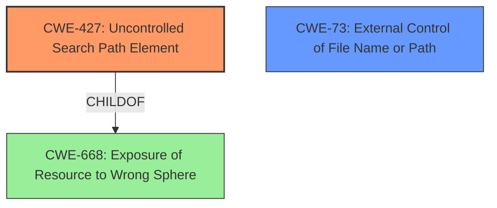

# Analysis Report for CVE-2022-23853

# Vulnerability Analysis Report: CVE-2022-23853

## Description


## Analysis (with Relationship Data)

# Summary
| CWE ID | CWE Name | Confidence | CWE Abstraction Level | CWE Vulnerability Mapping Label | CWE-Vulnerability Mapping Notes |
|---|---|---|---|---|---|
| CWE-427 | Uncontrolled Search Path Element | 0.9 | Base | Allowed | Primary CWE |
| CWE-73 | External Control of File Name or Path | 0.6 | Base | Allowed | Secondary Candidate |
| CWE-668 | Exposure of Resource to Wrong Sphere | 0.4 | Class | Discouraged | Secondary Candidate |

## Evidence and Confidence

*   **Confidence Score:** 0.9
*   **Evidence Strength:** HIGH

## Relationship Analysis
The primary CWE, CWE-427, is a base-level weakness and a child of CWE-668. CWE-427 directly addresses the **uncontrolled search path element** issue described in the vulnerability. CWE-73 is considered as a secondary candidate because the vulnerability involves external control of file names or paths used in filesystem operations. CWE-668 is a high-level class and is discouraged as a primary mapping when more specific CWEs exist.



## Vulnerability Chain
The vulnerability chain starts with a **misunderstanding of the QProcess API**, leading to the execution of binaries from untrusted directories. The chain can be summarized as follows:
1.  **Misunderstanding of QProcess API:** The developers **incorrectly** used the QProcess API, which allows execution of binaries without proper path validation.
2.  **Uncontrolled Search Path Element (CWE-427):** The application searches for executables in the current directory, which can be controlled by an attacker.
3.  **Arbitrary Code Execution:** The attacker can place a malicious executable in the current directory, leading to arbitrary code execution when the application tries to execute the binary.

## Summary of Analysis
The primary CWE assigned is CWE-427 (Uncontrolled Search Path Element) with a confidence score of 0.9. This decision is based on the vulnerability description and the CVE reference links content summary, which clearly indicate that the application executes binaries from a potentially attacker-controlled directory.

The vulnerability description states that the application tries to execute the LSP server binary in the directory of the file that was just opened. This aligns with the description of CWE-427, which states: "The product uses a fixed or controlled search path to find resources, but one or more locations in that path can be under the control of unintended actors."

The CVE reference links content summary confirms this, stating that KTextEditor and Kate don't validate the full path of the executable, instead relying on the system's PATH environment variable and implicitly searching in the current or working directory.

The graph relationships influenced the selection by showing that CWE-427 is a child of CWE-668, but CWE-427 is more specific and thus a better fit. The selected CWE is at the optimal level of specificity, as it directly addresses the root cause of the vulnerability.

Relevant CWE Information:
- **CWE-427 (Uncontrolled Search Path Element):** This CWE is the primary mapping because the application uses the current directory as part of its search path for executables, and this directory can be controlled by an attacker. This allows the attacker to place a malicious executable in the directory, which will be executed by the application.
- **CWE-73 (External Control of File Name or Path):** This CWE is a secondary candidate because the application allows external input (the file's directory) to influence the path of the executable being executed. However, CWE-427 is a more precise match because it specifically addresses the issue of uncontrolled search paths.
- **CWE-668 (Exposure of Resource to Wrong Sphere):** This CWE is a high-level class and is discouraged as a primary mapping when more specific CWEs exist. While the vulnerability does involve exposing a resource (the ability to execute code) to the wrong sphere (an attacker-controlled directory), CWE-427 provides a more detailed description of the weakness.


## CWE Relationship Analysis

Current CWEs represent these abstraction levels: .


### Vulnerability Chain Analysis

**Chain starting from CWE-668:**
- 668 (Exposure of Resource to Wrong Sphere) - ROOT


**Chain starting from CWE-73:**
- 73 (External Control of File Name or Path) - ROOT


### CWE Relationship Diagram

```mermaid
graph TD
    classDef primary fill:#f96,stroke:#333,stroke-width:2px
    classDef secondary fill:#69f,stroke:#333
    classDef tertiary fill:#9e9,stroke:#333
```


*Report generated on 2025-03-30 16:09:50*
