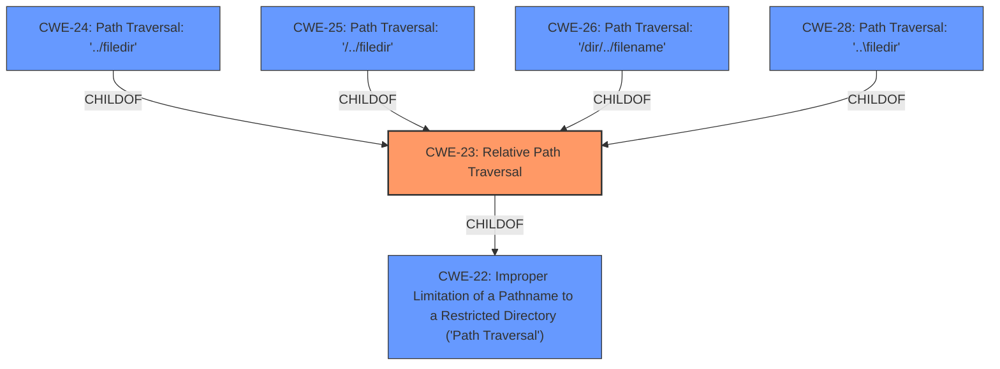

# Enhanced Analysis for CVE-2022-23854

# Summary
| CWE ID | CWE Name | Confidence | CWE Abstraction Level | CWE Vulnerability Mapping Label | CWE-Vulnerability Mapping Notes |
|---|---|---|---|---|---|
| CWE-23 | Relative Path Traversal | 1.0 | Base | Allowed | Primary CWE |

## Evidence and Confidence

*   **Confidence Score:** 1.0
*   **Evidence Strength:** HIGH

## Relationship Analysis
The primary relationship that influenced the decision was the parent-child relationship between CWE-23 and CWE-22. While CWE-22 is a more general case of path traversal, the description and CVE details explicitly mention "relative path traversal" and neutralize sequences such as "..", making CWE-23 a more precise fit. The other variant CWEs (CWE-24, CWE-25, CWE-26, CWE-28) are all children of CWE-23 and represent specific forms of relative path traversal. Since the provided information does not specify a particular form, CWE-23 is the most appropriate base level of abstraction.



## Vulnerability Chain
The chain of events is as follows:
1.  **Root Cause:** **Improper neutralization of input** (specifically, sequences like "..") within a pathname (CWE-23).
2.  **Weakness:** The software constructs a pathname using external input without properly limiting it to a restricted directory.
3.  **Impact:** An unauthenticated attacker with network access can read files outside the intended directory.

## Summary of Analysis
The analysis is primarily based on the provided evidence, specifically the **Vulnerability Description Key Phrases**, the **CVE Reference Links Content Summary**, and the **Retriever Results**. The vulnerability is a **path traversal** exploit that allows an unauthenticated user to read files outside of the secure gateway web server.

The **CVE Reference Links Content Summary** explicitly states that the vulnerability is a **Relative Path Traversal (CWE-23)**.

The **Vulnerability Description Key Phrases** section identifies "**path traversal**" as the **weakness**.

The Retriever Results also list CWE-23 as a highly relevant CWE.

The graph relationships helped confirm that CWE-23 is a specific type of CWE-22 and that it is appropriate to select the more specific CWE-23.

The selection of CWE-23 is at the optimal level of specificity because the vulnerability description specifically mentions **relative path traversal** and the **improper neutralization of sequences such as ".."**. While other CWEs like CWE-24, CWE-25, CWE-26, and CWE-28 are more specific variants of CWE-23, the available information doesn't provide enough detail to pinpoint the exact form of relative path traversal being exploited. Therefore, CWE-23, the Base level of abstraction, is the most accurate and appropriate choice.

Other CWEs Considered but Not Used:

*   CWE-22: Improper Limitation of a Pathname to a Restricted Directory ('Path Traversal'): This is a more general case of path traversal. While applicable, CWE-23 is more specific because the description explicitly mentions "relative path traversal."
*   CWE-59: Improper Link Resolution Before File Access ('Link Following'): This is not applicable because the vulnerability is about traversing directories, not following links or shortcuts.
*   CWE-24, CWE-25, CWE-26, CWE-28: These are all specific variants of CWE-23, but there isn't enough information in the provided text to choose a specific variant over the base CWE-23.
*   CWE-73: External Control of File Name or Path: While the vulnerability involves external control of a file path, the core issue is the improper neutralization of path traversal sequences, making CWE-23 a more precise fit.
*   CWE-668: Exposure of Resource to Wrong Sphere: This is too high-level and doesn't accurately describe the specific weakness.
*   CWE-363: Race Condition Enabling Link Following: This is not applicable as the vulnerability isn't related to race conditions or link following.


## CWE Relationship Analysis

Current CWEs represent these abstraction levels: .


### Vulnerability Chain Analysis

**Chain starting from CWE-363:**
- 363 (Race Condition Enabling Link Following) - ROOT


**Chain starting from CWE-25:**
- 25 (Path Traversal: '/../filedir') - ROOT


### CWE Relationship Diagram

```mermaid
graph TD
    classDef primary fill:#f96,stroke:#333,stroke-width:2px
    classDef secondary fill:#69f,stroke:#333
    classDef tertiary fill:#9e9,stroke:#333
```