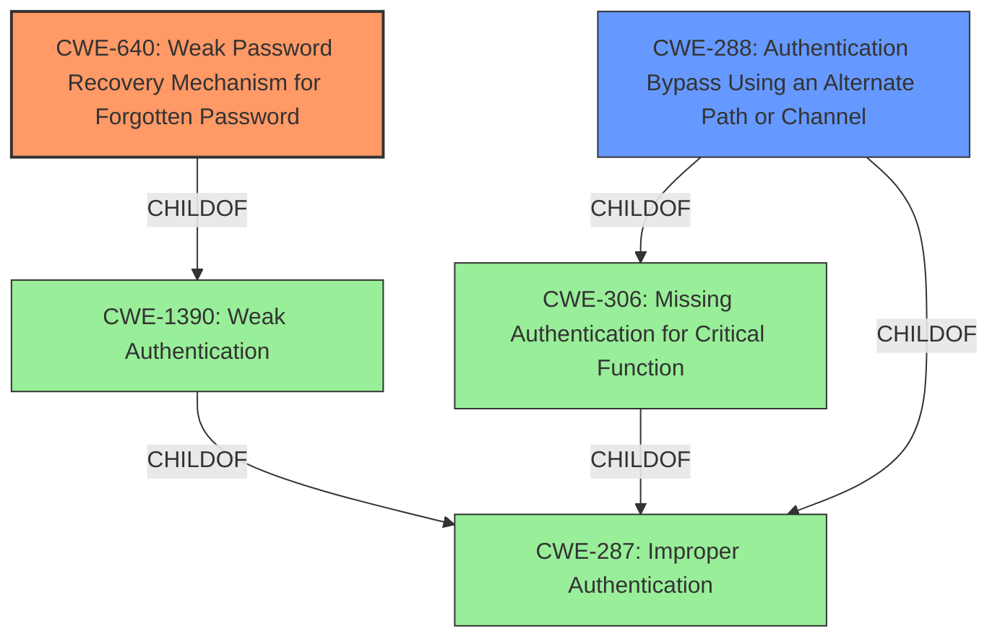

# Raw Analyzer Response for CVE-2022-23855

# Summary
| CWE ID | CWE Name | Confidence | CWE Abstraction Level | CWE Vulnerability Mapping Label | CWE-Vulnerability Mapping Notes |
|---|---|---|---|---|---|
| CWE-640 | Weak Password Recovery Mechanism for Forgotten Password | 0.9 | Base | Allowed-with-Review | Primary CWE. The vulnerability description explicitly states an **authentication bypass** in the "forgotpasswordstep1" component, allowing an unauthenticated user to reset passwords, indicating a flaw in the password recovery mechanism. |
| CWE-288 | Authentication Bypass Using an Alternate Path or Channel | 0.7 | Base | Allowed | Secondary CWE. The vulnerability allows an unauthenticated user to reset passwords, indicating the existence of an alternate path that bypasses the usual authentication process. |

## Evidence and Confidence

*   **Confidence Score:** 0.8
*   **Evidence Strength:** HIGH

## Relationship Analysis
The primary CWE is CWE-640 (Weak Password Recovery Mechanism for Forgotten Password), which falls under the broader category of CWE-287 (Improper Authentication) and CWE-1390 (Weak Authentication). CWE-288 (Authentication Bypass Using an Alternate Path or Channel) is related to CWE-306 (Missing Authentication for Critical Function), both being children of CWE-287. The hierarchical and peer relationships between these CWEs highlight the different facets of the authentication failure.

## Vulnerability Chain
The vulnerability chain starts with a **weakness** in the password recovery mechanism (CWE-640), which leads to an **authentication bypass** (CWE-288), ultimately allowing an unauthenticated user to reset passwords and gain access to any local account. The root cause is the **improper implementation** of the password reset process.

## Summary of Analysis
The initial assessment pointed to CWE-640 as the primary weakness, given the explicit mention of a flaw in the password recovery mechanism. The vulnerability description highlights an **authentication bypass** in the "forgotpasswordstep1" component. The retriever results also listed CWE-640 as the top combined result. The analysis considered other related CWEs, such as CWE-287, CWE-1390, and CWE-306, but these were deemed less specific than CWE-640.

The relationship graph shows that CWE-640 is a child of CWE-1390, which in turn is a child of CWE-287. This indicates a hierarchical relationship where CWE-640 is the most specific representation of the vulnerability.

The selection of CWE-640 is based on the following evidence: "An **authentication bypass** in ECM/maintenance/forgotpasswordstep1 allows an unauthenticated user to reset passwords and login as any local account." This statement directly supports the classification of CWE-640.

CWE-288 is included as a secondary weakness because the ability to reset passwords without proper authentication implies the existence of an alternate path that bypasses the normal authentication process.

Other CWEs considered but not used:

*   CWE-639: Authorization Bypass Through User-Controlled Key - While the vulnerability allows unauthorized access, it's more directly related to the password reset process than a general authorization bypass.
*   CWE-287: Improper Authentication - This is a broader category, and CWE-640 provides a more specific description of the vulnerability.
*   CWE-1390: Weak Authentication - Similar to CWE-287, this is a broader category that encompasses various authentication weaknesses.
*   CWE-306: Missing Authentication for Critical Function - While authentication is missing for the password reset, CWE-640 more accurately describes the specific **weakness** in the recovery mechanism.
*   CWE-620: Unverified Password Change - Similar to CWE-640, but less focused on the recovery *mechanism*.
*   CWE-798: Use of Hard-coded Credentials - There's no evidence of hard-coded credentials being used in this vulnerability.

The selected CWEs are at the optimal level of specificity because they directly address the identified **weakness** in the password recovery mechanism and the resulting **authentication bypass**.