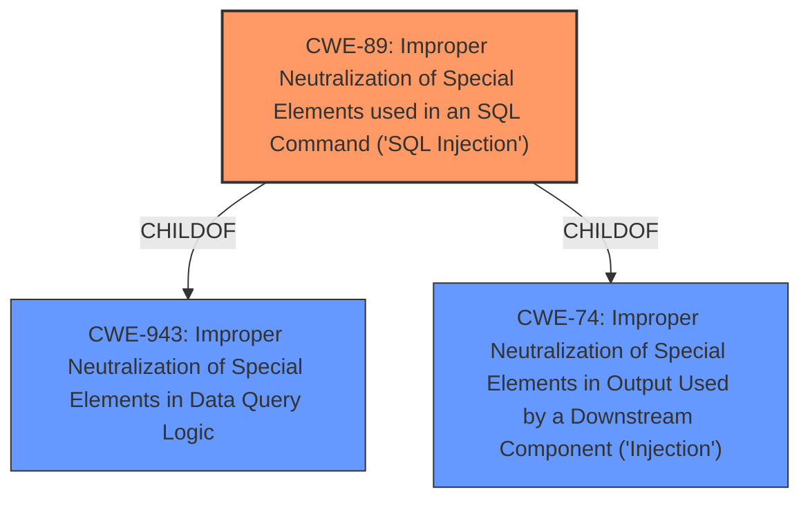

# Raw Analyzer Response for CVE-2022-23857

# Summary
| CWE ID | CWE Name | Confidence | CWE Abstraction Level | CWE Vulnerability Mapping Label | CWE-Vulnerability Mapping Notes |
|---|---|---|---|---|---|
| CWE-89 | Improper Neutralization of Special Elements used in an SQL Command ('SQL Injection') | 1.0 | Base | Primary | Allowed |

## Evidence and Confidence

*   **Confidence Score:** 1.0
*   **Evidence Strength:** HIGH

## Relationship Analysis
The primary relationship influencing the CWE selection is the ChildOf relationship between CWE-89 and CWE-943, and CWE-74. While CWE-943 represents a broader class of data query injection issues, CWE-89 specifically addresses **SQL injection**, aligning perfectly with the vulnerability description and root cause evidence. CWE-74 is a more generic form of injection. Selecting CWE-89 provides the most specific and accurate representation of the vulnerability.

## Vulnerability Chain
The vulnerability chain starts with **improper** input validation, leading to **SQL injection**, and culminating in the potential extraction of sensitive data.

## Summary of Analysis
The analysis is primarily based on the vulnerability description and CVE reference links, which explicitly state the presence of an **SQL injection** vulnerability. The description includes the following confirming evidence:
- Vulnerability Description Key Phrases: "**weakness:** **SQL injection**"
- CVE Reference Links Content Summary: "**SQL Injection:** The primary vulnerability is SQL injection, arising from improper handling of user inputs when generating SQL queries."
The Retriever Results also show CWE-89 as the top match with a score of 1.0.

Given this evidence, CWE-89 is the most appropriate and specific classification for this vulnerability.

Relevant CWE Information:

# Enhanced Context (25 CWEs)
The following CWEs were identified as potentially relevant to this vulnerability:

## CWE-89: Improper Neutralization of Special Elements used in an SQL Command ('SQL Injection')
**Abstraction:** Base
**Status:** Stable

### Description
The product constructs all or part of an SQL command using externally-influenced input from an upstream component, but it does not neutralize or incorrectly neutralizes special elements that could modify the intended SQL command when it is sent to a downstream component. Without sufficient removal or quoting of SQL syntax in user-controllable inputs, the generated SQL query can cause those inputs to be interpreted as SQL instead of ordinary user data.

## CWE-943: Improper Neutralization of Special Elements in Data Query Logic
**Abstraction:** Class
**Status:** Incomplete

### Description
The product generates a query intended to access or manipulate data in a data store such as a database, but it does not neutralize or incorrectly neutralizes special elements that can modify the intended logic of the query.

## CWE-74: Improper Neutralization of Special Elements in Output Used by a Downstream Component ('Injection')
**Abstraction Level**: Class

### Description
The product constructs all or part of a command, data structure, or record using externally-influenced input from an upstream component, but it does not neutralize or incorrectly neutralizes special elements that could modify how it is parsed or interpreted when it is sent to a downstream component.

### Summary of other CWEs Considered

*   **CWE-74:** Considered but not selected because it's a broader class of injection vulnerabilities. While SQL injection falls under this category, CWE-89 provides a more specific classification.
*   **CWE-943:** Considered but not selected because, while it covers data query injection, CWE-89 is a more precise match for **SQL injection**.
*   **CWE-116:** Considered but not selected. Although **SQL injection** can be caused by **improper** encoding, the primary weakness here is the **improper** neutralization of **SQL** special elements.
*   **CWE-79:** Considered but not selected. This is for Cross-Site Scripting, and is not relevant to the **SQL Injection** vulnerability described.
*   **CWE-611:** Considered but not selected. This is for Improper Restriction of XML External Entity Reference, and is not relevant to the **SQL Injection** vulnerability described.
*   **CWE-494:** Considered but not selected. This is for Download of Code Without Integrity Check, and is not relevant to the **SQL Injection** vulnerability described.
*   **CWE-259:** Considered but not selected. This is for Use of Hard-coded Password, and is not relevant to the **SQL Injection** vulnerability described.
*   **CWE-790:** Considered but not selected because the description indicates **improper** neutralization of **SQL** special elements rather than **improper** filtering.
*   **CWE-138:** Considered but not selected because it is a higher-level class and CWE-89 provides a more specific classification for **SQL injection**.
*   **CWE-502:** Considered but not selected because it is for Deserialization of Untrusted Data, and is not relevant to the **SQL Injection** vulnerability described.
*   **CWE-184:** Considered but not selected because the description indicates **improper** neutralization of **SQL** special elements rather than an incomplete list of disallowed inputs.
*   **CWE-1289:** Considered but not selected because the description indicates **improper** neutralization of **SQL** special elements rather than **improper** validation of unsafe equivalence in input.
*   **CWE-807:** Considered but not selected because the description indicates **improper** neutralization of **SQL** special elements rather than reliance on untrusted inputs in a security decision.
*   **CWE-653:** Considered but not selected because the description indicates **improper** neutralization of **SQL** special elements rather than **improper** isolation or compartmentalization.
*   **CWE-345:** Considered but not selected because the description indicates **improper** neutralization of **SQL** special elements rather than insufficient verification of data authenticity.
*   **CWE-41:** Considered but not selected because the description indicates **improper** neutralization of **SQL** special elements rather than **improper** resolution of path equivalence.
*   **CWE-80:** Considered but not selected because the description indicates **improper** neutralization of **SQL** special elements rather than improper neutralization of script-related HTML tags in a Web page (Basic XSS).
*   **CWE-321:** Considered but not selected because it is for Use of Hard-coded Cryptographic Key, and is not relevant to the **SQL Injection** vulnerability described.
*   **CWE-915:** Considered but not selected because it is for **Improperly** Controlled Modification of Dynamically-Determined Object Attributes, and is not relevant to the **SQL Injection** vulnerability described.
*   **CWE-257:** Considered but not selected because it is for Storing Passwords in a Recoverable Format, and is not relevant to the **SQL Injection** vulnerability described.
*   **CWE-798:** Considered but not selected because it is for Use of Hard-coded Credentials, and is not relevant to the **SQL Injection** vulnerability described.
*   **CWE-352:** Considered but not selected because it is for Cross-Site Request Forgery (CSRF), and is not relevant to the **SQL Injection** vulnerability described.