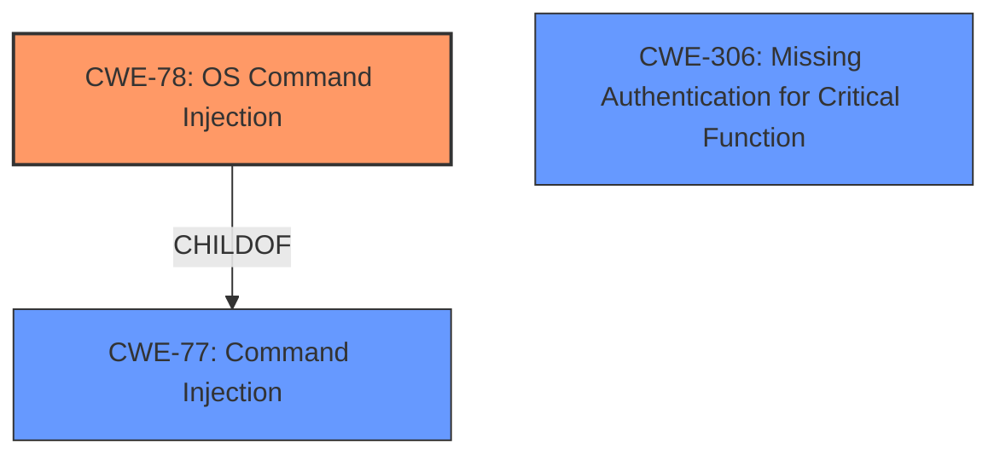

# Analysis Report for CVE-2022-23900

# Vulnerability Analysis Report: CVE-2022-23900

## Description


## Analysis (with Relationship Data)

# Summary

| CWE ID | CWE Name | Confidence | CWE Abstraction Level | CWE Vulnerability Mapping Label | CWE-Vulnerability Mapping Notes |
|---|---|---|---|---|---|
| CWE-78 | Improper Neutralization of Special Elements used in an OS Command ('OS Command Injection') | 1.0 | Base | Allowed | Primary CWE |
| CWE-306 | Missing Authentication for Critical Function | 0.7 | Base | Allowed | Secondary Candidate |

## Evidence and Confidence

*   **Confidence Score:** 0.9
*   **Evidence Strength:** HIGH

## Relationship Analysis
The primary relationship that influenced the decision was the ChildOf relationship between CWE-78 and CWE-77. While the initial description mentioned "command injection", the details in the CVE Reference Links Content Summary clearly indicated that the injected commands were OS commands, leading to the selection of CWE-78. Also, the lack of authentication made CWE-306 a good secondary candidate.



## Vulnerability Chain
The vulnerability chain starts with the **lack of authentication (CWE-306)**, which allows an attacker to reach the vulnerable API endpoint. Then, the **improper neutralization of special elements in OS commands (CWE-78)** allows the attacker to inject malicious commands, leading to remote code execution.

## Summary of Analysis
The initial assessment was based on the **command injection** vulnerability mentioned in the description. However, after reviewing the CVE Reference Links Content Summary, it became clear that the **root cause** was the **improper neutralization** of special elements used in OS commands (CWE-78). This is supported by the statement: "The router directly incorporates user-supplied input into a shell command without proper sanitization or validation." The lack of authentication for the API endpoint (CWE-306) exacerbates the issue. CWE-78 is selected as the optimal level of specificity since the commands being injected were OS commands.

Relevant CWE Information:

# Enhanced Context (25 CWEs)
The following CWEs were identified as potentially relevant to this vulnerability:

## CWE-74: Improper Neutralization of Special Elements in Output Used by a Downstream Component ('Injection')
**Abstraction Level**: Class
**Similarity Score**: 0.77
**Source**: dense

**Description**:
The product constructs all or part of a command, data structure, or record using externally-influenced input from an upstream component, but it does not neutralize or incorrectly neutralizes special elements that could modify how it is parsed or interpreted when it is sent to a downstream component.

**Mapping Guidance**:
- Usage: Discouraged
- Rationale: CWE-74 is high-level and often misused when lower-level weaknesses are more appropriate.

## CWE-78: Improper Neutralization of Special Elements used in an OS Command ('OS Command Injection')
**Abstraction Level**: Base
**Similarity Score**: 5.03
**Source**: graph

**Description**:
CWE-78: Improper Neutralization of Special Elements used in an OS Command ('OS Command Injection')

**Mapping Guidance**:
- Usage: Allowed
- Rationale: This CWE entry is at the Base level of abstraction, which is a preferred level of abstraction for mapping to the root causes of vulnerabilities.

**Relationships**:
- CANFOLLOW -> CWE-184
- CANALSOBE -> CWE-88
- CHILDOF -> CWE-77
- CHILDOF -> CWE-77
- CHILDOF -> CWE-74

### Technical Explanation for CWE-78

*   How the vulnerability's details match the CWE's characteristics: The vulnerability involves the injection of arbitrary OS commands through a vulnerable API endpoint due to **improper neutralization** of special elements.
*   The security implications and potential impact: Successful exploitation allows an attacker to execute arbitrary commands on the router's operating system, leading to full control of the device.
*   Any parent-child relationships or chain patterns that influenced your mapping: CWE-78 is a child of CWE-77 (Improper Neutralization of Special Elements used in a Command).
*   Whether the weakness is primary or secondary in the vulnerability: This is the primary weakness.
*   How the official MITRE mapping guidance influenced your decision: The mapping guidance recommends using the Base level of abstraction, which is appropriate for CWE-78.

### Technical Explanation for CWE-306

*   How the vulnerability's details match the CWE's characteristics: The API endpoint is reachable without any authentication, allowing unauthenticated attackers to exploit the **command injection** vulnerability.
*   The security implications and potential impact: This absence of authentication exacerbates the **command injection** vulnerability, allowing for easier exploitation.
*   Any parent-child relationships or chain patterns that influenced your mapping: N/A
*   Whether the weakness is primary or secondary in the vulnerability: This is a secondary weakness that allows for the primary weakness to be exploited without authentication.
*   How the official MITRE mapping guidance influenced your decision: The mapping guidance recommends using the Base level of abstraction, which is appropriate for CWE-306.

### CWEs Considered But Not Used
*   CWE-77: While the initial description mentioned "command injection", the details revealed that the injected commands were OS commands, making CWE-78 a more specific and accurate choice.
*   CWE-79: This CWE relates to Cross-Site Scripting, which is not relevant to the described vulnerability.
*   CWE-89: This CWE relates to SQL Injection, which is not relevant to the described vulnerability.
*   CWE-94: This CWE relates to Code Injection, but the vulnerability is more specifically related to OS command injection, making CWE-78 a better fit.
*   CWE-425: This CWE relates to Direct Request ('Forced Browsing'), but the core issue is the lack of input validation leading to **command injection**, not just the direct access to the resource.
*   CWE-138: This CWE is a Class-level CWE and is too generic. CWE-78 is a more specific Base-level CWE.
*   CWE-912: While there is hidden functionality, the vulnerability is not because of the hidden functionality but because of the **command injection**.
*   CWE-184: While an incomplete list of disallowed inputs could contribute to this, the primary issue is not the incomplete list but the **improper neutralization** of the inputs.


## CWE Relationship Analysis

Current CWEs represent these abstraction levels: .


### Vulnerability Chain Analysis

**Chain starting from CWE-89:**
- 89 (Improper Neutralization of Special Elements used in an SQL Command ('SQL Injection')) - ROOT


**Chain starting from CWE-425:**
- 425 (Direct Request ('Forced Browsing')) - ROOT


### CWE Relationship Diagram

```mermaid
graph TD
    classDef primary fill:#f96,stroke:#333,stroke-width:2px
    classDef secondary fill:#69f,stroke:#333
    classDef tertiary fill:#9e9,stroke:#333
```


*Report generated on 2025-03-30 22:06:28*
