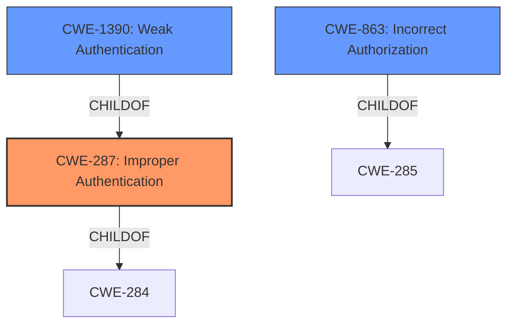

# Analysis for CVE-2022-2393

# Summary

| CWE ID | CWE Name | Confidence | CWE Abstraction Level | CWE Vulnerability Mapping Label | CWE-Vulnerability Mapping Notes |
|---|---|---|---|---|---|
| CWE-287 | Improper Authentication | 0.8 | Class | Primary | Discouraged |
| CWE-1390 | Weak Authentication | 0.7 | Class | Secondary | Allowed-with-Review |
| CWE-863 | Incorrect Authorization | 0.6 | Class | Secondary | Allowed-with-Review |

## Evidence and Confidence

*   **Confidence Score:** 0.7
*   **Evidence Strength:** MEDIUM

## Relationship Analysis
The primary relationship influencing the assessment is the hierarchical structure with `CWE-287` being a parent Class of `CWE-1390`. The vulnerability involves a user being able to impersonate another, indicating an authentication issue. `CWE-287` is a high-level classification, and `CWE-1390` provides more specificity as a weak authentication mechanism. `CWE-863` is related as authorization failures often stem from authentication problems.

## Vulnerability Chain
The vulnerability chain starts with a **PKI misconfiguration** that results in **improper input validation** and **authorization bypass**, leading to the final impact of a user being able to **get a certificate for another user identity**.
  - PKI Misconfiguration -> Improper Input Validation/Authorization Bypass -> User Impersonation

## Summary of Analysis
Initially, the vulnerability description points towards an authentication issue where an attacker can obtain a certificate for another user. The description states, "This flaw allows an authenticated attacker on the adjacent network to impersonate another user within the scope of the domain." This suggests that the system **does not properly** validate the user's identity when issuing the certificate. The "CVE Reference Links Content Summary" confirms this, stating "insufficient validation or authorization checks" and "**Improper Input Validation:** The system does not properly validate the user-provided name."

Given that the attacker is authenticated, the core issue is that the system is not properly verifying the user's right to obtain a certificate for the specified identity, or **Improper Authentication**.
Therefore, the primary CWE is `CWE-287` Improper Authentication.

The Retriever results also suggest `CWE-863` Incorrect Authorization and `CWE-1390` Weak Authentication. While authorization is related, the root cause appears to be a failure in the authentication process, making `CWE-287` more appropriate, and thus `CWE-1390` and `CWE-863` would be secondary.

`CWE-295 Improper Certificate Validation` was also considered, but the core issue isn't with the validation of certificates in general, but rather the process of issuing certificates to the correct users, so `CWE-295` is not an ideal fit.

The final decision is based on the available evidence that the system **fails to properly authenticate** the user's request to obtain a certificate for a specific identity. `CWE-287` is selected as the primary CWE due to its high-level relevance, with `CWE-1390` and `CWE-863` serving as secondary CWEs to provide more specific context.

Relevant CWE Information:

# Enhanced Context (25 CWEs)
The following CWEs were identified as potentially relevant to this vulnerability:

## CWE-287: Improper Authentication
**CWE-287** Improper Authentication, is chosen as the primary CWE. The vulnerability allows an authenticated attacker to impersonate another user, meaning the system **does not sufficiently prove** that the user requesting the certificate is authorized to do so for the target identity. This aligns directly with the description of `CWE-287`, which states "When an actor claims to have a given identity, the product **does not prove or insufficiently proves** that the claim is correct." The security implication is a complete bypass of identity verification, leading to unauthorized access and potential data compromise.

## CWE-1390: Weak Authentication
**CWE-1390** Weak Authentication is selected as a secondary CWE because the authentication mechanism in place is not strong enough to prevent impersonation. While the attacker is authenticated, the authentication process **does not sufficiently prove** the user's identity, making it a **weak** form of authentication.

## CWE-863: Incorrect Authorization
**CWE-863** Incorrect Authorization is selected as a secondary CWE because the vulnerability involves an authorization check that is **not correctly performed**. The system **fails to verify** if the user requesting the certificate has the necessary privileges to obtain a certificate for the specified identity.

The following CWEs were considered but not used:

*   `CWE-923`: Improper Restriction of Communication Channel to Intended Endpoints - This is not the primary issue, as the core vulnerability lies in the authentication and authorization process, not the communication channel itself.
*   `CWE-296`: Improper Following of a Certificate's Chain of Trust - The issue is not with the chain of trust but with the initial issuance of the certificate to the wrong user.
*   `CWE-350`: Reliance on Reverse DNS Resolution for a Security-Critical Action - This is not applicable as the vulnerability does not involve reverse DNS resolution.
*   `CWE-290`: Authentication Bypass by Spoofing - While impersonation is a form of spoofing, the root cause is the failure to properly authenticate the user requesting the certificate, not a direct spoofing attack.
*   `CWE-327`: Use of a Broken or Risky Cryptographic Algorithm - Cryptography is not mentioned in the summary, so this is not a good fit.
*   `CWE-295`: Improper Certificate Validation - The problem isn't the validation of certificates but getting a certificate for the wrong user.
*   `CWE-306`: Missing Authentication for Critical Function - Since the attacker is authenticated, this is not a good fit.