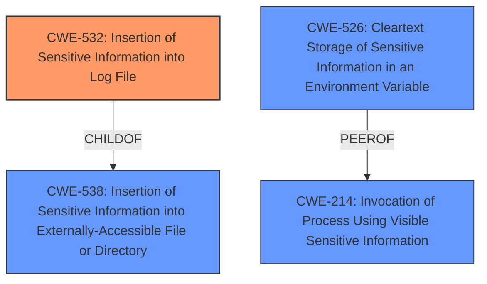

# Raw Analyzer Response for CVE-2022-2394

# Summary
| CWE ID | CWE Name | Confidence | CWE Abstraction Level | CWE Vulnerability Mapping Label | CWE-Vulnerability Mapping Notes |
|---|---|---|---|---|---|
| CWE-532 | Insertion of Sensitive Information into Log File | 1 | Base | Allowed | Primary CWE |
| CWE-214 | Invocation of Process Using Visible Sensitive Information | 0.7 | Base | Allowed | Secondary Candidate |
| CWE-526 | Cleartext Storage of Sensitive Information in an Environment Variable | 0.6 | Variant | Allowed | Secondary Candidate |

## Evidence and Confidence

*   **Confidence Score:** 0.8
*   **Evidence Strength:** MEDIUM

## Relationship Analysis
The primary relationship that influenced the selection was the parent-child relationship between CWE-538 (Insertion of Sensitive Information into Externally-Accessible File or Directory) and CWE-532. CWE-532 is a more specific case of CWE-538, detailing that the sensitive information is specifically being inserted into a log file, which aligns directly with the vulnerability description. CWE-214 and CWE-526 were considered as other potential weaknesses that could be at play. CWE-532 is a base level weakness.

## Vulnerability Chain
The vulnerability chain starts with the printing of sensitive parameters during the planning stage of a Puppet Bolt run. This leads to the **insertion of sensitive information into a log file**, potentially exposing them to unauthorized access, or it could be that the **invocation of the process uses visible sensitive information** or there is **cleartext storage of sensitive information in an environment variable**.

## Summary of Analysis
The analysis is primarily based on the provided vulnerability description and the retriever results. The vulnerability description clearly states that Puppet Bolt prints sensitive parameters, leading to their potential logging. This directly aligns with **CWE-532 (Insertion of Sensitive Information into Log File)**.

The graph relationships, especially the parent-child relationship between CWE-538 and CWE-532, reinforced the selection of CWE-532 as it is a more specific instance of a broader class of vulnerabilities. The description states that "Puppet Bolt prior to version 3.24.0 will **print sensitive parameters** when planning a run resulting in them potentially being **logged** when run programmatically". The phrase "**print sensitive parameters**" indicates the sensitive information is being exposed, and the phrase "resulting in them potentially being **logged**" is insertion into a log file.

CWE-532 is at the optimal level of specificity because it directly describes the **weakness** of sensitive information being inserted into a log file. This is a base-level weakness, which is preferred for vulnerability mapping. I considered CWE-214 and CWE-526. CWE-214 describes sensitive information being visible in a process invocation. It's possible that the "printing" of the sensitive parameters involves invoking a process with those parameters visible. However, the primary issue is the logging, not necessarily the invocation itself. CWE-526 describes storing sensitive information in an environment variable. While it is possible sensitive parameters could be stored in an environment variable, that is not what is explicit in the vulnerability description.

Relevant CWE Information:

# Enhanced Context (25 CWEs)
The following CWEs were identified as potentially relevant to this vulnerability:

## CWE-74: Improper Neutralization of Special Elements in Output Used by a Downstream Component ('Injection')
**Abstraction Level**: Class
**Similarity Score**: 0.79
**Source**: dense

**Description**:
The product constructs all or part of a command, data structure, or record using externally-influenced input from an upstream component, but it does not neutralize or incorrectly neutralizes special elements that could modify how it is parsed or interpreted when it is sent to a downstream component.

**Mapping Guidance**:
- Usage: Discouraged
- Rationale: CWE-74 is high-level and often misused when lower-level weaknesses are more appropriate.

## CWE-184: Incomplete List of Disallowed Inputs
**Abstraction Level**: Base
**Similarity Score**: 0.77
**Source**: dense

**Description**:
The product implements a protection mechanism that relies on a list of inputs (or properties of inputs) that are not allowed by policy or otherwise require other action to neutralize before additional processing takes place, but the list is incomplete.

**Mapping Guidance**:
- Usage: Allowed
- Rationale: This CWE entry is at the Base level of abstraction, which is a preferred level of abstraction for mapping to the root causes of vulnerabilities.

## CWE-116: Improper Encoding or Escaping of Output
**Abstraction Level**: Class
**Similarity Score**: 0.77
**Source**: dense

**Description**:
The product prepares a structured message for communication with another component, but encoding or escaping of the data is either missing or done incorrectly. As a result, the intended structure of the message is not preserved.

**Mapping Guidance**:
- Usage: Allowed-with-Review
- Rationale: This CWE entry is a Class and might have Base-level children that would be more appropriate

## CWE-138: Improper Neutralization of Special Elements
**Abstraction Level**: Class
**Similarity Score**: 0.77
**Source**: dense

**Description**:
The product receives input from an upstream component, but it does not neutralize or incorrectly neutralizes special elements that could be interpreted as control elements or syntactic markers when they are sent to a downstream component.

**Mapping Guidance**:
- Usage: Discouraged
- Rationale: This CWE entry is a level-1 Class (i.e., a child of a Pillar). It might have lower-level children that would be more appropriate

## CWE-80: Improper Neutralization of Script-Related HTML Tags in a Web Page (Basic XSS)
**Abstraction Level**: Variant
**Similarity Score**: 0.77
**Source**: dense

**Description**:
The product receives input from an upstream component, but it does not neutralize or incorrectly neutralizes special characters such as "<", ">", and "&" that could be interpreted as web-scripting elements when they are sent to a downstream component that processes web pages.

**Mapping Guidance**:
- Usage: Allowed
- Rationale: This CWE entry is at the Variant level of abstraction, which is a preferred level of abstraction for mapping to the root causes of vulnerabilities.

## CWE-1289: Improper Validation of Unsafe Equivalence in Input
**Abstraction Level**: Base
**Similarity Score**: 0.77
**Source**: dense

**Description**:
The product receives an input value that is used as a resource identifier or other type of reference, but it does not validate or incorrectly validates that the input is equivalent to a potentially-unsafe value.

**Mapping Guidance**:
- Usage: Allowed
- Rationale: This CWE entry is at the Base level of abstraction, which is a preferred level of abstraction for mapping to the root causes of vulnerabilities.

## CWE-838: Inappropriate Encoding for Output Context
**Abstraction Level**: Base
**Similarity Score**: 0.77
**Source**: dense

**Description**:
The product uses or specifies an encoding when generating output to a downstream component, but the specified encoding is not the same as the encoding that is expected by the downstream component.

**Mapping Guidance**:
- Usage: Allowed
- Rationale: This CWE entry is at the Base level of abstraction, which is a preferred level of abstraction for mapping to the root causes of vulnerabilities.

## CWE-212: Improper Removal of Sensitive Information Before Storage or Transfer
**Abstraction Level**: Base
**Similarity Score**: 0.77
**Source**: dense

**Description**:
The product stores, transfers, or shares a resource that contains sensitive information, but it does not properly remove that information before the product makes the resource available to unauthorized actors.

**Mapping Guidance**:
- Usage: Allowed
- Rationale: This CWE entry is at the Base level of abstraction, which is a preferred level of abstraction for mapping to the root causes of vulnerabilities.

## CWE-538: Insertion of Sensitive Information into Externally-Accessible File or Directory
**Abstraction Level**: Base
**Similarity Score**: 0.77
**Source**: dense

**Description**:
The product places sensitive information into files or directories that are accessible to actors who are allowed to have access to the files, but not to the sensitive information.

**Mapping Guidance**:
- Usage: Allowed
- Rationale: This CWE entry is at the Base level of abstraction, which is