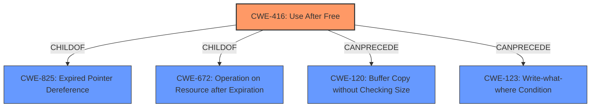

# Analysis for CVE-2022-2399

# Summary
| CWE ID | CWE Name | Confidence | CWE Abstraction Level | CWE Vulnerability Mapping Label | CWE-Vulnerability Mapping Notes |
|---|---|---|---|---|---|
| CWE-416 | Use After Free | 1.0 | Variant | Allowed | Primary CWE |

## Evidence and Confidence

*   **Confidence Score:** 1.0
*   **Evidence Strength:** HIGH

## Relationship Analysis
The primary CWE selected is CWE-416, "Use After Free". This is a Variant level CWE, which is a preferred level of abstraction. CWE-416 is a child of CWE-825 (Expired Pointer Dereference) and CWE-672 (Operation on Resource after Expiration). The "CanPrecede" relationships to CWE-120 (Buffer Copy without Checking Size) and CWE-123 (Write-what-where Condition) suggest potential attack vectors.

## Vulnerability Chain
The vulnerability chain starts with the **use after free** (**ROOTCAUSE**), leading to potential heap corruption (**IMPACT**). The attack vector is a crafted HTML page.

## Summary of Analysis
The vulnerability description clearly indicates a **use after free** condition in WebGPU in Google Chrome. The CVE Reference Links Content Summary confirms the root cause as "Use after free" and the weaknesses/vulnerabilities present as "Use after free in WebGPU." The primary CWE match suggested is CWE-416, "Use After Free". The retriever results also list CWE-416 as the top candidate. Given the clear evidence and the MITRE mapping guidance, CWE-416 is the most appropriate CWE for this vulnerability.

Other CWEs considered but not used:

*   CWE-366: Race Condition within a Thread: While concurrency might be involved, the core issue is the **use after free**, not the race condition itself.
*   CWE-843: Access of Resource Using Incompatible Type ('Type Confusion'): There is no mention of type confusion in the vulnerability description.
*   CWE-122: Heap-based Buffer Overflow: While heap corruption is mentioned as an impact, the root cause is not a buffer overflow, but a **use after free**.
*   CWE-415: Double Free: The vulnerability description clearly indicates **use after free**, not a double free.
*   CWE-908: Use of Uninitialized Resource: The vulnerability description indicates **use after free**, not use of uninitialized resource.
*   CWE-123: Write-what-where Condition: While this could be a consequence of **use after free**, the primary weakness is the **use after free** itself.
*   CWE-362: Concurrent Execution using Shared Resource with Improper Synchronization ('Race Condition'): The primary issue is still the **use after free**
*   CWE-911: Improper Update of Reference Count: There is no mention of reference counting in the description.
*   CWE-404: Improper Resource Shutdown or Release: The issue is not about improper shutdown or release but about using memory after it has already been freed.

The selected CWE is at the optimal level of specificity, as it directly represents the **use after free** condition described in the vulnerability.