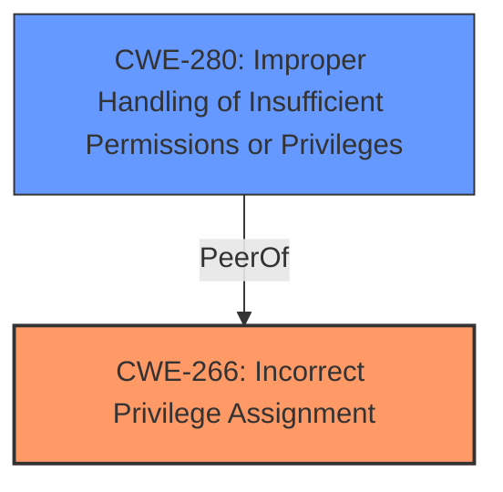

# Analysis Report for CVE-2022-23994

# Vulnerability Analysis Report: CVE-2022-23994

## Description


## Analysis (with Relationship Data)

# Summary
| CWE ID  | CWE Name                        | Confidence | CWE Abstraction Level | CWE Vulnerability Mapping Label | CWE-Vulnerability Mapping Notes |
| :------- | :------------------------------ | :--------- | :-------------------- | :------------------------------ | :------------------------------ |
| CWE-266  | Incorrect Privilege Assignment  | 0.85       | Base                  | Primary CWE                     | Allowed                       |
| CWE-280  | Improper Handling of Insufficient Permissions or Privileges | 0.75       | Base                  | Secondary CWE                    | Allowed                       |

## Evidence and Confidence

*   **Confidence Score:** 0.8
*   **Evidence Strength:** HIGH

## Relationship Analysis
The primary CWE, CWE-266, is at the Base level, providing a specific description of the **incorrect assignment** of privileges.
CWE-280 is a peer that specifies the **handling** of insufficient permissions.



## Vulnerability Chain
The vulnerability chain starts with an **improper access control** leading to the ability of untrusted applications to change bedtime mode without proper permissions. This maps to a privilege assignment issue.

## Summary of Analysis
The initial assessment focused on the **improper access control**, but a deeper analysis reveals that the root cause is specifically related to the **incorrect assignment of privileges**, which is a more precise characterization of the vulnerability. The evidence lies in the **Vulnerability Description Key Phrases**, where the root cause is listed as "**Improper access control**". The **CVE Reference Links Content Summary** reinforces this by stating "**Improper access control vulnerability**".

The decision is based on the provided evidence, the CWE descriptions, and the mapping guidance. CWE-266 is a more appropriate fit as it directly addresses the **incorrect privilege assignment**, while CWE-280 describes the **improper handling** of insufficient permissions. The selected CWEs are at the optimal level of specificity, providing a clear and actionable classification of the vulnerability.

Relevant CWE Information:

# Enhanced Context (25 CWEs)

## CWE-280: Improper Handling of Insufficient Permissions or Privileges
**Abstraction Level**: Base
**Similarity Score**: 0.77
**Source**: dense

**Description**:
The product does not handle or incorrectly handles when it has insufficient privileges to access resources or functionality as specified by their permissions. This may cause it to follow unexpected code paths that may leave the product in an invalid state.

**Mapping Guidance**:
- Usage: Allowed
- Rationale: This CWE entry is at the Base level of abstraction, which is a preferred level of abstraction for mapping to the root causes of vulnerabilities.

## CWE-274: Improper Handling of Insufficient Privileges
**Abstraction Level**: Base
**Similarity Score**: 0.76
**Source**: dense

**Description**:
The product does not handle or incorrectly handles when it has insufficient privileges to perform an operation, leading to resultant weaknesses.

**Mapping Guidance**:
- Usage: Discouraged
- Rationale: This CWE entry could be deprecated in a future version of CWE.

## CWE-266: Incorrect Privilege Assignment
**Abstraction Level**: Base
**Similarity Score**: 0.76
**Source**: dense

**Description**:
A product **incorrectly assigns a privilege to a particular actor**, creating an unintended sphere of control for that actor.

**Mapping Guidance**:
- Usage: Allowed
- Rationale: This CWE entry is at the Base level of abstraction, which is a preferred level of abstraction for mapping to the root causes of vulnerabilities.

## CWE-863: Incorrect Authorization
**Abstraction Level**: Class
**Similarity Score**: 6868.64
**Source**: sparse

**Description**:
The product performs an authorization check when an actor attempts to access a resource or perform an action, but it does not correctly perform the check.

**Mapping Guidance**:
- Usage: Allowed-with-Review
- Rationale: This CWE entry is a Class and might have Base-level children that would be more appropriate

## CWE-284: Improper Access Control
**Abstraction:** Pillar
**Status:** Incomplete

### Description
The product does not restrict or incorrectly restricts access to a resource from an unauthorized actor.

### Extended Description

Access control involves the use of several protection mechanisms such as:

- Authentication (proving the identity of an actor)
- Authorization (ensuring that a given actor can access a resource), and
- Accountability (tracking of activities that were performed)

When any mechanism is not applied or otherwise fails, attackers can compromise the security of the product by gaining privileges, reading sensitive information, executing commands, evading detection, etc.

### Mapping Guidance
**Usage:** Discouraged
**Rationale:** CWE-284 is extremely high-level, a Pillar. Its name, "Improper Access Control," is often misused in low-information vulnerability reports [REF-1287] or by active use of the OWASP Top Ten, such as "A01:2021-Broken Access Control". It is not useful for trend analysis.

### Additional Notes
**[Maintenance]** This entry needs more work. Possible sub-categories include:

- Trusted group includes undesired entities (partially covered by CWE-286)
- Group can perform undesired actions
- ACL parse error does not fail closed

## CWE-285: Improper Authorization
**Abstraction:** Class
**Status:** Draft

### Description
The product does not perform or incorrectly performs an authorization check when an actor attempts to access a resource or perform an action.

### Mapping Guidance
**Usage:** Discouraged
**Rationale:** CWE-285 is high-level and lower-level CWEs can frequently be used instead. It is a level-1 Class (i.e., a child of a Pillar).
**Comments:** Look at CWE-285's children and consider mapping to CWEs such as CWE-862: Missing Authorization, CWE-863: Incorrect Authorization, CWE-732: Incorrect Permission Assignment for Critical Resource, or others.

## CWE-269: Improper Privilege Management
**Abstraction:** Class
**Status:** Draft

### Description
The product does not properly assign, modify, track, or check privileges for an actor, creating an unintended sphere of control for that actor.

### Mapping Guidance
**Usage:** Discouraged
**Rationale:** CWE-269 is commonly misused. It can be conflated with "privilege escalation," which is a technical impact that is listed in many low-information vulnerability reports [REF-1287]. It is not useful for trend analysis.

### CWE-927: Use of Implicit Intent for Sensitive Communication
**Abstraction:** Variant
**Status:** Incomplete

### Description
The Android application uses an implicit intent for transmitting sensitive data to other applications.

### Extended Description
Since an implicit intent does not specify a particular application to receive the data, any application can process the intent by using an Intent Filter for that intent. This can allow untrusted applications to obtain sensitive data.

## Explanation of Selected CWEs

*   **CWE-266: Incorrect Privilege Assignment**
    *   **How it matches:** The vulnerability describes how untrusted applications can change the bedtime mode without proper permissions. This aligns with the definition of **incorrectly assigning a privilege** to an actor (the untrusted application), allowing it to perform actions it should not be able to.
    *   **Security Implications:** This can lead to unauthorized modification of system settings and potentially other security impacts.
    *   **Relationships:** It's a base-level CWE, directly addressing the root cause.
    *   **Mapping Guidance:** The usage is "Allowed," and the rationale supports its use at the Base level of abstraction.
*   **CWE-280: Improper Handling of Insufficient Permissions or Privileges**
    *   **How it matches:** The vulnerability indicates that the system does not properly handle the scenario where an untrusted application has insufficient privileges, leading to the ability to change bedtime mode.
    *   **Security Implications:** This can result in unexpected code paths and an invalid system state.
    *   **Relationships:** This is a peer of CWE-266.
    *   **Mapping Guidance:** The usage is "Allowed," and the rationale supports its use at the Base level of abstraction.

## Explanation of Other CWEs Considered but Not Used

*   **CWE-284: Improper Access Control:** This CWE is a high-level Pillar and is too generic for this vulnerability. The mapping guidance explicitly discourages its use in favor of more specific CWEs.
*   **CWE-285: Improper Authorization:** While related, this is a Class-level CWE and not as specific as CWE-266. The vulnerability isn't about failing to perform an authorization check, but about the incorrect assignment of privileges.
*   **CWE-269: Improper Privilege Management:** This CWE is also too broad. The


## CWE Relationship Analysis

Current CWEs represent these abstraction levels: .


### Vulnerability Chain Analysis

**Chain starting from CWE-862:**
- 862 (Missing Authorization) - ROOT


**Chain starting from CWE-266:**
- 266 (Incorrect Privilege Assignment) - ROOT


### CWE Relationship Diagram

```mermaid
graph TD
    classDef primary fill:#f96,stroke:#333,stroke-width:2px
    classDef secondary fill:#69f,stroke:#333
    classDef tertiary fill:#9e9,stroke:#333
```


*Report generated on 2025-03-30 12:17:50*
