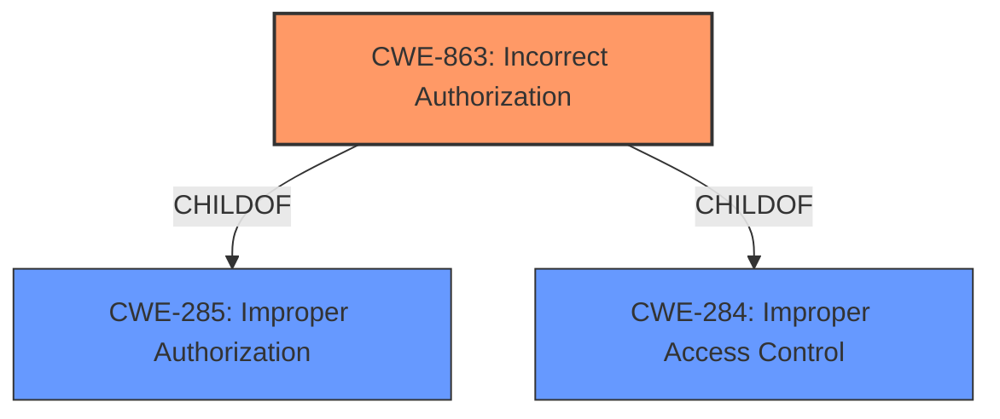

# Enhanced Analysis for CVE-2022-24002

# Summary
| CWE ID | CWE Name | Confidence | CWE Abstraction Level | CWE Vulnerability Mapping Label | CWE-Vulnerability Mapping Notes |
|---|---|---|---|---|---|
| CWE-863 | Incorrect Authorization | 0.85 | Class | Primary | Allowed-with-Review |
| CWE-285 | Improper Authorization | 0.75 | Class | Secondary | Discouraged |
| CWE-284 | Improper Access Control | 0.65 | Pillar | Secondary | Discouraged |

## Evidence and Confidence

*   **Confidence Score:** 0.80
*   **Evidence Strength:** HIGH

## Relationship Analysis
The primary CWE selected is CWE-863 (**Incorrect Authorization**), a Class-level CWE. This is supported by the vulnerability description indicating an **improper authorization** issue. CWE-863 is a child of both CWE-285 (**Improper Authorization**) and CWE-284 (**Improper Access Control**). Although CWE-863 is a Class, the evidence directly points to an incorrect authorization check, making it a more specific fit than its parents. The relationship of CWE-863 being a child of CWE-285 and CWE-284 helped refine the selection, moving from the more general **improper authorization** to **incorrect authorization**.



## Vulnerability Chain
The vulnerability chain starts with an **improper authorization** (**root cause**) leading to the attacker being able to open a protected activity (**impact**).
Root Cause: **Improper Authorization**
Impact: Open Protected Activity

## Summary of Analysis
The initial analysis focused on the description stating "**Improper Authorization** vulnerability" and the CVE Reference Links Content Summary mentioning "**Root cause of vulnerability: Improper authorization**" and "**Weaknesses/vulnerabilities present: Improper access control**". The Retriever Results also highlighted CWE-284, CWE-285, and CWE-863 as potential matches.

CWE-284 (**Improper Access Control**) is too high-level (Pillar) and is discouraged by MITRE as it is often misused. CWE-285 (**Improper Authorization**) is a Class and also discouraged but more relevant than CWE-284. CWE-863 (**Incorrect Authorization**) is a Class and allowed-with-review, suggesting it might have more specific children. However, given the available information and the direct mention of **incorrect authorization** (a failed check), CWE-863 provides the most accurate classification.

The final selection of CWE-863 is based on the evidence of the **improper authorization** combined with the context of a failed authorization check, making it the most specific and relevant CWE.

Relevant CWE Information:
- **Vulnerability Description Key Phrases:** **rootcause: Improper Authorization**
- **CVE Reference Links Content Summary:** **Root cause of vulnerability: Improper authorization**
- **CVE Reference Links Content Summary:** **Weaknesses/vulnerabilities present: Improper access control**


## CWE Relationship Analysis

Current CWEs represent these abstraction levels: .


### Vulnerability Chain Analysis

**Chain starting from CWE-285:**
- 285 (Improper Authorization) - ROOT


**Chain starting from CWE-863:**
- 863 (Incorrect Authorization) - ROOT


### CWE Relationship Diagram

```mermaid
graph TD
    classDef primary fill:#f96,stroke:#333,stroke-width:2px
    classDef secondary fill:#69f,stroke:#333
    classDef tertiary fill:#9e9,stroke:#333
```