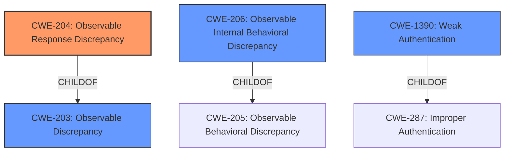

# Analysis for CVE-2022-24032

# Summary
| CWE ID | CWE Name | Confidence | CWE Abstraction Level | CWE Vulnerability Mapping Label | CWE-Vulnerability Mapping Notes |
|---|---|---|---|---|---|
| CWE-204 | Observable Response Discrepancy | 1.0 | Base | Allowed | Primary CWE |
| CWE-203 | Observable Discrepancy | 0.7 | Base | Allowed | Secondary Candidate |
| CWE-206 | Observable Internal Behavioral Discrepancy | 0.6 | Variant | Allowed | Secondary Candidate |
| CWE-1390 | Weak Authentication | 0.5 | Class | Allowed-with-Review | Secondary Candidate |

## Evidence and Confidence

*   **Confidence Score:** 0.8
*   **Evidence Strength:** HIGH

## Relationship Analysis
The primary CWE, CWE-204 [Observable Response Discrepancy], is a child of CWE-203 [Observable Discrepancy]. The vulnerability lies in the different responses based on whether a username is valid. CWE-206 [Observable Internal Behavioral Discrepancy] is a variant of CWE-205 and describes revealing internal state. CWE-1390 [Weak Authentication] is a class-level CWE and a child of CWE-287.

## Vulnerability Chain
The vulnerability chain starts with the **weakness** in the application's authentication process where a failed login produces different error messages based on whether the username is valid. This leads to user enumeration, which is the **impact**.

## Summary of Analysis
The initial analysis focused on the root cause of the vulnerability, which is the application's behavior of providing different responses based on the validity of the username. This aligns perfectly with CWE-204 [Observable Response Discrepancy], as it describes a scenario where the product provides different responses that reveal internal state. The vulnerability description explicitly states that an attacker can identify valid usernames because a failed login attempt produces a different error message when the username is valid. This is direct evidence supporting the selection of CWE-204.

The graph relationships show that CWE-204 is a child of CWE-203, meaning it is a more specific case of observable discrepancies. Given the specific nature of the vulnerability description, CWE-204 is the more appropriate choice.

CWE-206 was also considered, but it is more focused on revealing internal state through multiple observable behaviors, whereas this vulnerability is primarily about the observable response discrepancy during the authentication process.

CWE-1390 [Weak Authentication] is a class-level CWE and a child of CWE-287. While the vulnerability does relate to authentication, the specific **weakness** lies in the observable discrepancy, making CWE-204 a more precise fit.

Therefore, the selected CWEs are at the optimal level of specificity, directly addressing the root cause and impact of the vulnerability.

Relevant CWE Information:

# Enhanced Context (25 CWEs)
The following CWEs were identified as potentially relevant to this vulnerability:

## CWE-204: Observable Response Discrepancy
**Abstraction Level**: Base
**Similarity Score**: 0.81
**Source**: dense

**Description**:
The product provides different responses to incoming requests in a way that reveals internal state information to an unauthorized actor outside of the intended control sphere.

**Mapping Guidance**:
- Usage: Allowed
- Rationale: This CWE entry is at the Base level of abstraction, which is a preferred level of abstraction for mapping to the root causes of vulnerabilities.

## CWE-203: Observable Discrepancy
**Abstraction Level**: Base
**Similarity Score**: 0.77
**Source**: dense

**Description**:
The product behaves differently or sends different responses under different circumstances in a way that is observable to an unauthorized actor, which exposes security-relevant information about the state of the product, such as whether a particular operation was successful or not.

**Mapping Guidance**:
- Usage: Allowed
- Rationale: This CWE entry is at the Base level of abstraction, which is a preferred level of abstraction for mapping to the root causes of vulnerabilities.

## CWE-206: Observable Internal Behavioral Discrepancy
**Abstraction Level**: Variant
**Similarity Score**: 0.78
**Source**: dense

**Description**:
The product performs multiple behaviors that are combined to produce a single result, but the individual behaviors are observable separately in a way that allows attackers to reveal internal state or internal decision points.

**Mapping Guidance**:
- Usage: Allowed
- Rationale: This CWE entry is at the Variant level of abstraction, which is a preferred level of abstraction for mapping to the root causes of vulnerabilities.

## CWE-1390: Weak Authentication
**Abstraction Level**: Class
**Similarity Score**: 0.75
**Source**: dense

**Description**:
The product uses an authentication mechanism to restrict access to specific users or identities, but the mechanism does not sufficiently prove that the claimed identity is correct.

**Mapping Guidance**:
- Usage: Allowed-with-Review
- Rationale: This CWE entry is a Class and might have Base-level children that would be more appropriate

## CWE-208: Observable Timing Discrepancy
**Abstraction Level**: Base
**Similarity Score**: 0.76
**Source**: dense

**Description**:
Two separate operations in a product require different amounts of time to complete, in a way that is observable to an actor and reveals security-relevant information about the state of the product, such as whether a particular operation was successful or not.

**Mapping Guidance**:
- Usage: Allowed
- Rationale: This CWE entry is at the Base level of abstraction, which is a preferred level of abstraction for mapping to the root causes of vulnerabilities.

## CWE-209: Generation of Error Message Containing Sensitive Information
**Abstraction Level**: Base
**Similarity Score**: 0.76
**Source**: dense

**Description**:
The product generates an error message that includes sensitive information about its environment, users, or associated data.

**Mapping Guidance**:
- Usage: Allowed
- Rationale: This CWE entry is at the Base level of abstraction, which is a preferred level of abstraction for mapping to the root causes of vulnerabilities.

CWE-208 [Observable Timing Discrepancy] and CWE-209 [Generation of Error Message Containing Sensitive Information] were considered but are less relevant. The timing difference is not the primary issue, and the specific content of the error message is not the core problem; rather, it is the difference in the response itself that allows user enumeration.