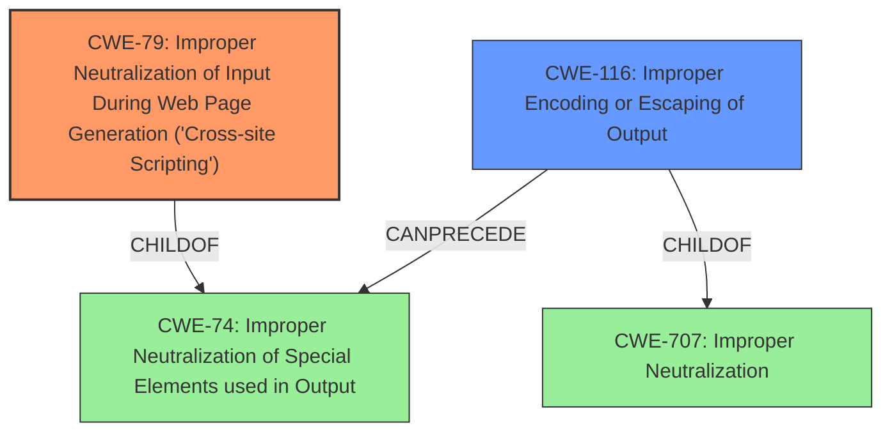

# Enhanced Analysis for CVE-2022-24039

# Summary
| CWE ID | CWE Name | Confidence | CWE Abstraction Level | CWE Vulnerability Mapping Label | CWE-Vulnerability Mapping Notes |
|---|---|---|---|---|---|
| CWE-79 | Improper Neutralization of Input During Web Page Generation ('Cross-site Scripting') | 1.0 | Base | Primary | Allowed |
| CWE-116 | Improper Encoding or Escaping of Output | 0.7 | Class | Secondary | Allowed-with-Review |

## Evidence and Confidence

*   **Confidence Score:** 0.9
*   **Evidence Strength:** HIGH

## Relationship Analysis
The primary CWE is CWE-79, which is a Base level CWE. CWE-79 is a child of CWE-74 (Improper Neutralization of Special Elements used in Output). CWE-116 (Improper Encoding or Escaping of Output) is a Class level CWE and a child of CWE-707 (Improper Neutralization). CWE-116 can precede CWE-74 (Improper Neutralization of Special Elements used in Output).



## Vulnerability Chain
The vulnerability chain starts with the **failure to properly sanitize user-controllable input**. This leads to arbitrary XML injection, potentially allowing an attacker to deliver malicious files and achieve Remote Code Execution (RCE).

## Summary of Analysis
The initial assessment strongly points to CWE-79 (Improper Neutralization of Input During Web Page Generation ('Cross-site Scripting')) as the primary CWE, given the vulnerability description's emphasis on **failing to properly sanitize user-controllable input** before including it in the generated XML body of an XLS report. This aligns perfectly with CWE-79's focus on the **improper neutralization of user-controllable input** in web page generation. The "CVE Reference Links Content Summary" section reinforces this by highlighting the **improper input sanitization** and the resulting possibility of injecting malicious XML code.

CWE-79 is chosen as the primary because the vulnerability involves **failing to properly sanitize user-controllable input** and the impact is arbitrary XML injection. The vulnerability description key phrases state: "rootcause: **fails to properly sanitize user-controllable input**"

CWE-116 (Improper Encoding or Escaping of Output) was also considered because the vulnerability involves the generation of an XLS report, which is a structured message. However, the primary issue is the lack of sanitization of input, making CWE-79 a more direct fit. CWE-116 is a Class level CWE, and a more specific CWE may exist. However, given the available information, CWE-116 is a reasonable secondary candidate.

The selected CWEs are at the optimal level of specificity. CWE-79 is a Base level CWE, which is preferred. CWE-116 is a Class level CWE, but it is still relevant to the vulnerability.

Relevant CWE Information:
*   Vulnerability Description: "The addCell JavaScript function **fails to properly sanitize user-controllable input** before including it into the generated XML body of the XLS report document, such that it is possible to inject arbitrary content (e.g., XML tags) into the generated file."
*   Vulnerability Description Key Phrases: "rootcause: **fails to properly sanitize user-controllable input**"
*   CVE Reference Links Content Summary: "**Improper Input Sanitization:** The application doesn't sanitize user-provided data before using it to generate an XLS report, allowing the injection of arbitrary XML content."


## CWE Relationship Analysis

Current CWEs represent these abstraction levels: .


### Vulnerability Chain Analysis

**Chain starting from CWE-116:**
- 116 (Improper Encoding or Escaping of Output) - ROOT


**Chain starting from CWE-74:**
- 74 (Improper Neutralization of Special Elements in Output Used by a Downstream Component ('Injection')) - ROOT


### CWE Relationship Diagram

```mermaid
graph TD
    classDef primary fill:#f96,stroke:#333,stroke-width:2px
    classDef secondary fill:#69f,stroke:#333
    classDef tertiary fill:#9e9,stroke:#333
```