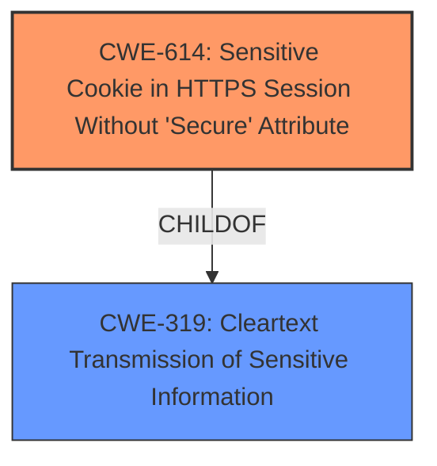

# Analysis Report for CVE-2022-24045

# Vulnerability Analysis Report: CVE-2022-24045

## Description


## Analysis (with Relationship Data)

# Summary
| CWE ID | CWE Name | Confidence | CWE Abstraction Level | CWE Vulnerability Mapping Label | CWE-Vulnerability Mapping Notes |
|---|---|---|---|---|---|
| CWE-614 | Sensitive Cookie in HTTPS Session Without 'Secure' Attribute | 1.0 | Variant | Allowed | Primary CWE |
| CWE-319 | Cleartext Transmission of Sensitive Information | 0.7 | Base | Allowed | Secondary Candidate |

## Evidence and Confidence

*   **Confidence Score:** 0.9
*   **Evidence Strength:** HIGH

## Relationship Analysis
The primary CWE, CWE-614 (Sensitive Cookie in HTTPS Session Without 'Secure' Attribute), is a Variant that is a ChildOf CWE-319 (Cleartext Transmission of Sensitive Information). The vulnerability involves a specific scenario where a sensitive cookie lacks the "Secure" attribute, leading to its transmission in cleartext. This specific case is better captured by CWE-614, while the broader issue of transmitting sensitive data in cleartext is represented by CWE-319. Therefore, while CWE-319 is relevant, CWE-614 provides a more accurate and granular classification of the vulnerability.



## Vulnerability Chain
The vulnerability chain consists of:
1.  **Root Cause:** **Missing security attributes (Secure, HttpOnly, SameSite) on session cookie**.
2.  **Weakness:** Session cookies are set via client-side JavaScript.
3.  **Impact:** Session cookies transmitted in plaintext over the network when using unencrypted HTTP connections, allowing attackers to intercept them.

## Summary of Analysis
The initial assessment focused on identifying the root cause of the vulnerability. The vulnerability description clearly states that the application sets session cookies without applying security attributes, leading to the transmission of these cookies in plaintext. This aligns perfectly with CWE-614 (Sensitive Cookie in HTTPS Session Without 'Secure' Attribute), which is a Variant-level CWE. The retriever results also listed CWE-614 as the top candidate.

The analysis also considered CWE-319 (Cleartext Transmission of Sensitive Information) since the cookies are transmitted in plaintext. However, CWE-614 is more specific as it focuses on the **missing security attributes** on the cookie itself, which is the **root cause**.

The decision to prioritize CWE-614 was based on the evidence from the vulnerability description, the retriever results, and the CWE specifications, which all support this classification. The MITRE mapping guidance for CWE-614 also explicitly allows its use, further solidifying the choice.

The evidence supporting the selection of CWE-614 is:
*   "The application, after a successful login, sets the session cookie on the browser via client-side JavaScript code, without applying any security attributes (such as Secure, HttpOnly, or SameSite)."
*   "Any attempts to browse the application via unencrypted HTTP protocol would lead to the transmission of all his/her session cookies in plaintext through the network."

CWE-200 (Exposure of Sensitive Information to an Unauthorized Actor) was considered but rejected because it is a Class-level CWE that is often misused and represents the impact rather than the root cause. The provided guidance also discourages its use in favor of more specific CWEs.

CWE-1004 (Sensitive Cookie Without 'HttpOnly' Flag) was also considered, but the description states that other flags such as "Secure" and "SameSite" are also missing. Therefore, CWE-614 is a more suitable description.

Relevant CWE Information:

# Enhanced Context (25 CWEs)
The following CWEs were identified as potentially relevant to this vulnerability:

## CWE-226: Sensitive Information in Resource Not Removed Before Reuse
**Abstraction Level**: Base
**Similarity Score**: 0.81
**Source**: dense

**Description**:
The product releases a resource such as memory or a file so that it can be made available for reuse, but it does not clear or "zeroize" the information contained in the resource before the product performs a critical state transition or makes the resource available for reuse by other entities.

**Mapping Guidance**:
- Usage: Allowed
- Rationale: This CWE entry is at the Base level of abstraction, which is a preferred level of abstraction for mapping to the root causes of vulnerabilities.

## CWE-404: Improper Resource Shutdown or Release
**Abstraction Level**: Class
**Similarity Score**: 0.78
**Source**: dense

**Description**:
The product does not release or incorrectly releases a resource before it is made available for re-use.

**Mapping Guidance**:
- Usage: Allowed-with-Review
- Rationale: This CWE entry is a Class and might have Base-level children that would be more appropriate

## CWE-212: Improper Removal of Sensitive Information Before Storage or Transfer
**Abstraction Level**: Base
**Similarity Score**: 0.77
**Source**: dense

**Description**:
The product stores, transfers, or shares a resource that contains sensitive information, but it does not properly remove that information before the product makes the resource available to unauthorized actors.

**Mapping Guidance**:
- Usage: Allowed
- Rationale: This CWE entry is at the Base level of abstraction, which is a preferred level of abstraction for mapping to the root causes of vulnerabilities.

## CWE-668: Exposure of Resource to Wrong Sphere
**Abstraction Level**: Class
**Similarity Score**: 0.76
**Source**: dense

**Description**:
The product exposes a resource to the wrong control sphere, providing unintended actors with inappropriate access to the resource.

**Mapping Guidance**:
- Usage: Discouraged
- Rationale: CWE-668 is high-level and is often misused as a catch-all when lower-level CWE IDs might be applicable. It is sometimes used for low-information vulnerability reports [REF-1287]. It is a level-1 Class (i.e., a child of a Pillar). It is not useful for trend analysis.

## CWE-401: Missing Release of Memory after Effective Lifetime
**Abstraction Level**: Variant
**Similarity Score**: 0.76
**Source**: dense

**Description**:
The product does not sufficiently track and release allocated memory after it has been used, which slowly consumes remaining memory.

**Mapping Guidance**:
- Usage: Allowed
- Rationale: This CWE entry is at the Variant level of abstraction, which is a preferred level of abstraction for mapping to the root causes of vulnerabilities.

## CWE-789: Memory Allocation with Excessive Size Value
**Abstraction Level**: Variant
**Similarity Score**: 0.75
**Source**: dense

**Description**:
The product allocates memory based on an untrusted, large size value, but it does not ensure that the size is within expected limits, allowing arbitrary amounts of memory to be allocated.

**Mapping Guidance**:
- Usage: Allowed
- Rationale: This CWE entry is at the Variant level of abstraction, which is a preferred level of abstraction for mapping to the root causes of vulnerabilities.

## CWE-667: Improper Locking
**Abstraction Level**: Class
**Similarity Score**: 0.75
**Source**: dense

**Description**:
The product does not properly acquire or release a lock on a resource, leading to unexpected resource state changes and behaviors.

**Mapping Guidance**:
- Usage: Allowed-with-Review
- Rationale: This CWE entry is a Class and might have Base-level children that would be more appropriate

## CWE-665: Improper Initialization
**Abstraction Level**: Class
**Similarity Score**: 0.75
**Source**: dense

**Description**:
The product does not initialize or incorrectly initializes a resource, which might leave the resource in an unexpected state when it is accessed or used.

**Mapping Guidance**:
- Usage: Discouraged
- Rationale: This CWE entry is a level-1 Class (i.e., a child of a Pillar). It might have lower-level children that would be more appropriate

## CWE-41: Improper Resolution of Path Equivalence
**Abstraction Level**: Base
**Similarity Score**: 0.75
**Source**: dense

**Description**:
The product is vulnerable to file system contents disclosure through path equivalence. Path equivalence involves the use of special characters in file and directory names. The associated manipulations are intended to generate multiple names for the same object.

**Mapping Guidance**:
- Usage: Allowed
- Rationale: This CWE entry is at the Base level of abstraction, which is a preferred level of abstraction for mapping to the root causes of vulnerabilities.

## CWE-319: Cleartext Transmission of Sensitive Information
**Abstraction Level**: Base
**Similarity Score**: 0.75
**Source**: dense

**Description**:
The product transmits sensitive or security-critical data in cleartext in a communication channel that can be sniffed by unauthorized actors.

**Mapping Guidance**:
- Usage: Allowed
- Rationale: This


## CWE Relationship Analysis

Current CWEs represent these abstraction levels: .


### Vulnerability Chain Analysis

**Chain starting from CWE-200:**
- 200 (Exposure of Sensitive Information to an Unauthorized Actor) - ROOT


**Chain starting from CWE-41:**
- 41 (Improper Resolution of Path Equivalence) - ROOT


### CWE Relationship Diagram

```mermaid
graph TD
    classDef primary fill:#f96,stroke:#333,stroke-width:2px
    classDef secondary fill:#69f,stroke:#333
    classDef tertiary fill:#9e9,stroke:#333
```


*Report generated on 2025-03-30 17:28:39*
