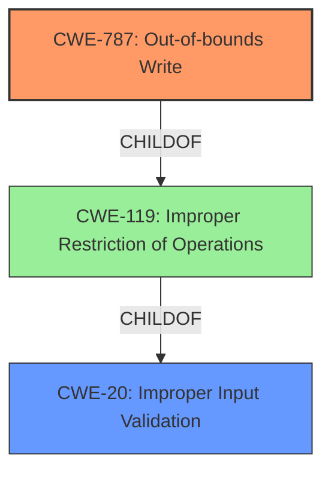

# Analysis Report for CVE-2022-24063

# Vulnerability Analysis Report: CVE-2022-24063

## Description


## Analysis (with Relationship Data)

# Summary
| CWE ID | CWE Name | Confidence | CWE Abstraction Level | CWE Vulnerability Mapping Label | CWE-Vulnerability Mapping Notes |
|---|---|---|---|---|---|
| CWE-787 | Out-of-bounds Write | 1.0 | Base | Primary | Allowed |
| CWE-20 | Improper Input Validation | 0.7 | Class | Secondary | Discouraged |

## Evidence and Confidence

*   **Confidence Score:** 0.9
*   **Evidence Strength:** HIGH

## Relationship Analysis
The primary CWE, CWE-787 **(Out-of-bounds Write)**, is a Base level CWE and a child of CWE-119 **(Improper Restriction of Operations within the Bounds of a Memory Buffer)**. CWE-20 **(Improper Input Validation)** is a Class level CWE, and a parent to more specific input validation issues. The vulnerability description clearly indicates a memory corruption issue due to a **lack of proper validation of user-supplied data**. Therefore, CWE-787 is the most specific and appropriate CWE.



## Vulnerability Chain
The vulnerability chain starts with the **lack of proper validation of user-supplied data**, leading to a **memory corruption** condition, and finally resulting in the ability to execute arbitrary code. The chain is:

1.  **Lack of Proper Validation (CWE-20)**
2.  **Memory Corruption (CWE-787)**
3.  Arbitrary Code Execution (Impact)

## Summary of Analysis
Initially, the analysis focused on identifying the root cause and the resulting weakness. The vulnerability description explicitly mentions the "**lack of proper validation of user-supplied data**" as the root cause and "**memory corruption**" as the weakness. The CVE Reference Links Content Summary reinforces this understanding.

The primary CWE match suggested by the similar CVE descriptions is CWE-787 **(Out-of-bounds Write)**, which aligns with the "**memory corruption**" aspect. The Retriever Results also list CWE-787 as the top candidate with a score of 1.0.

CWE-20 **(Improper Input Validation)** was considered as a secondary CWE because the vulnerability description mentions a "**lack of proper validation of user-supplied data**". However, CWE-20 is a high-level Class CWE and the guidance discourages its use when more specific CWEs are available. Since the **lack of validation** directly leads to "**memory corruption**" (CWE-787), focusing on CWE-787 as the primary weakness is more appropriate.

Therefore, the final decision is to assign CWE-787 **(Out-of-bounds Write)** as the primary CWE, representing the direct consequence of the vulnerability, and CWE-20 **(Improper Input Validation)** as the secondary CWE to highlight the root cause. This selection provides the optimal level of specificity based on the provided evidence and the CWE hierarchy.

Relevant CWE Information:

# Enhanced Context (25 CWEs)
The following CWEs were identified as potentially relevant to this vulnerability:

## CWE-367: Time-of-check Time-of-use (TOCTOU) Race Condition
**Abstraction Level**: Base
**Similarity Score**: 0.79
**Source**: dense

**Description**:
The product checks the state of a resource before using that resource, but the resource's state can change between the check and the use in a way that invalidates the results of the check. This can cause the product to perform invalid actions when the resource is in an unexpected state.

**Mapping Guidance**:
- Usage: Allowed
- Rationale: This CWE entry is at the Base level of abstraction, which is a preferred level of abstraction for mapping to the root causes of vulnerabilities.

*This CWE was considered but is not applicable, because the description makes no mention of timing issues or race conditions.*

## CWE-41: Improper Resolution of Path Equivalence
**Abstraction Level**: Base
**Similarity Score**: 0.77
**Source**: dense

**Description**:
The product is vulnerable to file system contents disclosure through path equivalence. Path equivalence involves the use of special characters in file and directory names. The associated manipulations are intended to generate multiple names for the same object.

**Mapping Guidance**:
- Usage: Allowed
- Rationale: This CWE entry is at the Base level of abstraction, which is a preferred level of abstraction for mapping to the root causes of vulnerabilities.

*This CWE was considered but is not applicable, because the description makes no mention of path equivalence or filesystem content disclosure.*

## CWE-667: Improper Locking
**Abstraction Level**: Class
**Similarity Score**: 0.77
**Source**: dense

**Description**:
The product does not properly acquire or release a lock on a resource, leading to unexpected resource state changes and behaviors.

**Mapping Guidance**:
- Usage: Allowed-with-Review
- Rationale: This CWE entry is a Class and might have Base-level children that would be more appropriate

*This CWE was considered but is not applicable, because the description makes no mention of locking or resource synchronization issues.*

## CWE-59: Improper Link Resolution Before File Access ('Link Following')
**Abstraction Level**: Base
**Similarity Score**: 0.76
**Source**: dense

**Description**:
The product attempts to access a file based on the filename, but it does not properly prevent that filename from identifying a link or shortcut that resolves to an unintended resource.

**Mapping Guidance**:
- Usage: Allowed
- Rationale: This CWE entry is at the Base level of abstraction, which is a preferred level of abstraction for mapping to the root causes of vulnerabilities.

*This CWE was considered but is not applicable, because the description makes no mention of symlinks or link following issues.*

## CWE-404: Improper Resource Shutdown or Release
**Abstraction Level**: Class
**Similarity Score**: 0.76
**Source**: dense

**Description**:
The product does not release or incorrectly releases a resource before it is made available for re-use.

**Mapping Guidance**:
- Usage: Allowed-with-Review
- Rationale: This CWE entry is a Class and might have Base-level children that would be more appropriate

*This CWE was considered but is not applicable, because the description makes no mention of resource shutdown or release issues.*

## CWE-362: Concurrent Execution using Shared Resource with Improper Synchronization ('Race Condition')
**Abstraction Level**: Class
**Similarity Score**: 0.76
**Source**: dense

**Description**:
The product contains a concurrent code sequence that requires temporary, exclusive access to a shared resource, but a timing window exists in which the shared resource can be modified by another code sequence operating concurrently.

**Mapping Guidance**:
- Usage: Allowed-with-Review
- Rationale: This CWE entry is a Class and might have Base-level children that would be more appropriate

*This CWE was considered but is not applicable, because the description makes no mention of concurrency or synchronization issues.*

## CWE-73: External Control of File Name or Path
**Abstraction Level**: Base
**Similarity Score**: 0.76
**Source**: dense

**Description**:
The product allows user input to control or influence paths or file names that are used in filesystem operations.

**Mapping Guidance**:
- Usage: Allowed
- Rationale: This CWE entry is at the Base level of abstraction, which is a preferred level of abstraction for mapping to the root causes of vulnerabilities.

*This CWE was considered but is not applicable, because the description makes no mention of external control of filenames or paths.*

## CWE-23: Relative Path Traversal
**Abstraction Level**: Base
**Similarity Score**: 0.76
**Source**: dense

**Description**:
The product uses external input to construct a pathname that should be within a restricted directory, but it does not properly neutralize sequences such as ".." that can resolve to a location that is outside of that directory.

**Mapping Guidance**:
- Usage: Allowed
- Rationale: This CWE entry is at the Base level of abstraction, which is a preferred level of abstraction for mapping to the root causes of vulnerabilities.

*This CWE was considered but is not applicable, because the description makes no mention of path traversal issues.*

## CWE-668: Exposure of Resource to Wrong Sphere
**Abstraction Level**: Class
**Similarity Score**: 0.76
**Source**: dense

**Description**:
The product exposes a resource to the wrong control sphere, providing unintended actors with inappropriate access to the resource.

**Mapping Guidance**:
- Usage: Discouraged
- Rationale: CWE-668 is high-level and is often misused as a catch


## CWE Relationship Analysis

Current CWEs represent these abstraction levels: .


### Vulnerability Chain Analysis

**Chain starting from CWE-41:**
- 41 (Improper Resolution of Path Equivalence) - ROOT


**Chain starting from CWE-668:**
- 668 (Exposure of Resource to Wrong Sphere) - ROOT


### CWE Relationship Diagram

```mermaid
graph TD
    classDef primary fill:#f96,stroke:#333,stroke-width:2px
    classDef secondary fill:#69f,stroke:#333
    classDef tertiary fill:#9e9,stroke:#333
```


*Report generated on 2025-03-30 22:21:32*
