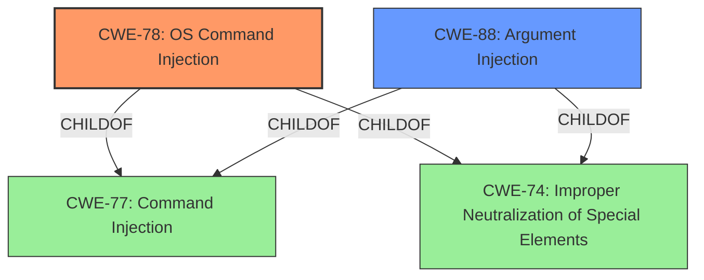

# Raw Analyzer Response for CVE-2022-24066

# Summary
| CWE ID | CWE Name | Confidence | CWE Abstraction Level | CWE Vulnerability Mapping Label | CWE-Vulnerability Mapping Notes |
|---|---|---|---|---|---|
| CWE-78 | Improper Neutralization of Special Elements used in an OS Command ('OS Command Injection') | 1.0 | Base | Allowed | Primary CWE |
| CWE-88 | Improper Neutralization of Argument Delimiters in a Command ('Argument Injection') | 0.8 | Base | Allowed | Secondary CWE |

## Evidence and Confidence

*   **Confidence Score:** 0.9
*   **Evidence Strength:** HIGH

## Relationship Analysis
The primary weakness is CWE-78, which is a base level CWE describing **Improper Neutralization of Special Elements used in an OS Command ('OS Command Injection')**. CWE-78 is a child of CWE-77 **('Command Injection')** and CWE-74 **(Improper Neutralization of Special Elements in Output Used by a Downstream Component ('Injection'))**. A secondary weakness is CWE-88, which is a base level CWE describing **Improper Neutralization of Argument Delimiters in a Command ('Argument Injection')**. CWE-88 is a child of CWE-77 **('Command Injection')** and CWE-74 **(Improper Neutralization of Special Elements in Output Used by a Downstream Component ('Injection'))**.

## Vulnerability Chain
The vulnerability chain begins with the **improper neutralization** of user-supplied arguments, specifically the `--upload-pack` option, when executing `git clone` commands. This leads to **argument injection (CWE-88)** and ultimately results in **OS command injection (CWE-78)**, allowing an attacker to execute arbitrary commands on the system.

## Summary of Analysis
The primary weakness is **CWE-78** because the root cause allows for the execution of OS commands. The vulnerability description clearly states that the package is vulnerable to **Command Injection**. The CVE Reference Links Content Summary provides more information, stating "The vulnerability is due to an incomplete fix for a previous command injection vulnerability (CVE-2022-24433). The initial fix only addressed the `git fetch` command but did not account for the `--upload-pack` option being used with the `git clone` command." and "This allows an attacker to inject malicious arguments, specifically using `--upload-pack` to execute arbitrary commands on the system."

The retriever results also suggest CWE-78 as a potential candidate. CWE-78 is a Base level CWE, which is the preferred level of abstraction. The mapping guidance for CWE-78 states that Usage is Allowed.

A secondary weakness is **CWE-88** because the root cause is an **improper neutralization** of argument delimiters. The CVE Reference Links Content Summary states "The vulnerability is a type of argument injection, specifically related to improper neutralization of argument delimiters."

I considered CWE-77 **(Improper Neutralization of Special Elements used in a Command ('Command Injection'))**, but it is a Class level CWE and the description notes that it is frequently misused when OS command injection (CWE-78) was intended instead. I also considered CWE-95 **(Improper Neutralization of Directives in Dynamically Evaluated Code ('Eval Injection'))**, but this CWE is more specific to dynamic evaluation calls and does not fit the vulnerability description as well as CWE-78. I also considered CWE-1321 **(Improperly Controlled Modification of Object Prototype Attributes ('Prototype Pollution'))**, but this CWE is specific to object prototype attributes and does not fit the vulnerability description. I also considered CWE-427 **(Uncontrolled Search Path Element)**, but the issue is with the sanitization of input, not with the search path.

# Relevant CWE Information:

# Enhanced Context (25 CWEs)

## CWE-1321: Improperly Controlled Modification of Object Prototype Attributes ('Prototype Pollution')
**Abstraction Level**: Variant
**Similarity Score**: 0.75
**Source**: dense

**Description**:
The product receives input from an upstream component that specifies attributes that are to be initialized or updated in an object, but it does not properly control modifications of attributes of the object prototype.

**Mapping Guidance**:
- Usage: Allowed
- Rationale: This CWE entry is at the Variant level of abstraction, which is a preferred level of abstraction for mapping to the root causes of vulnerabilities.

## CWE-41: Improper Resolution of Path Equivalence
**Abstraction Level**: Base
**Similarity Score**: 0.74
**Source**: dense

**Description**:
The product is vulnerable to file system contents disclosure through path equivalence. Path equivalence involves the use of special characters in file and directory names. The associated manipulations are intended to generate multiple names for the same object.

**Mapping Guidance**:
- Usage: Allowed
- Rationale: This CWE entry is at the Base level of abstraction, which is a preferred level of abstraction for mapping to the root causes of vulnerabilities.

## CWE-74: Improper Neutralization of Special Elements in Output Used by a Downstream Component ('Injection')
**Abstraction Level**: Class
**Similarity Score**: 0.74
**Source**: dense

**Description**:
The product constructs all or part of a command, data structure, or record using externally-influenced input from an upstream component, but it does not neutralize or incorrectly neutralizes special elements that could modify how it is parsed or interpreted when it is sent to a downstream component.

**Mapping Guidance**:
- Usage: Discouraged
- Rationale: CWE-74 is high-level and often misused when lower-level weaknesses are more appropriate.

## CWE-668: Exposure of Resource to Wrong Sphere
**Abstraction Level**: Class
**Similarity Score**: 0.74
**Source**: dense

**Description**:
The product exposes a resource to the wrong control sphere, providing unintended actors with inappropriate access to the resource.

**Mapping Guidance**:
- Usage: Discouraged
- Rationale: CWE-668 is high-level and is often misused as a catch-all when lower-level CWE IDs might be applicable. It is sometimes used for low-information vulnerability reports [REF-1287]. It is a level-1 Class (i.e., a child of a Pillar). It is not useful for trend analysis.

## CWE-138: Improper Neutralization of Special Elements
**Abstraction Level**: Class
**Similarity Score**: 0.74
**Source**: dense

**Description**:
The product receives input from an upstream component, but it does not neutralize or incorrectly neutralizes special elements that could be interpreted as control elements or syntactic markers when they are sent to a downstream component.

**Mapping Guidance**:
- Usage: Discouraged
- Rationale: This CWE entry is a level-1 Class (i.e., a child of a Pillar). It might have lower-level children that would be more appropriate

## CWE-59: Improper Link Resolution Before File Access ('Link Following')
**Abstraction Level**: Base
**Similarity Score**: 0.73
**Source**: dense

**Description**:
The product attempts to access a file based on the filename, but it does not properly prevent that filename from identifying a link or shortcut that resolves to an unintended resource.

**Mapping Guidance**:
- Usage: Allowed
- Rationale: This CWE entry is at the Base level of abstraction, which is a preferred level of abstraction for mapping to the root causes of vulnerabilities.

## CWE-664: Improper Control of a Resource Through its Lifetime
**Abstraction Level**: Pillar
**Similarity Score**: 0.73
**Source**: dense

**Description**:
The product does not maintain or incorrectly maintains control over a resource throughout its lifetime of creation, use, and release.

**Mapping Guidance**:
- Usage: Discouraged
- Rationale: This CWE entry is high-level when lower-level children are available.

## CWE-73: External Control of File Name or Path
**Abstraction Level**: Base
**Similarity Score**: 0.73
**Source**: dense

**Description**:
The product allows user input to control or influence paths or file names that are used in filesystem operations.

**Mapping Guidance**:
- Usage: Allowed
- Rationale: This CWE entry is at the Base level of abstraction, which is a preferred level of abstraction for mapping to the root causes of vulnerabilities.

## CWE-693: Protection Mechanism Failure
**Abstraction Level**: Pillar
**Similarity Score**: